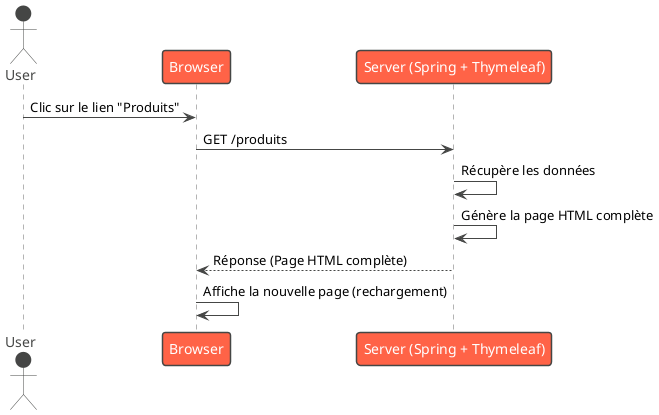
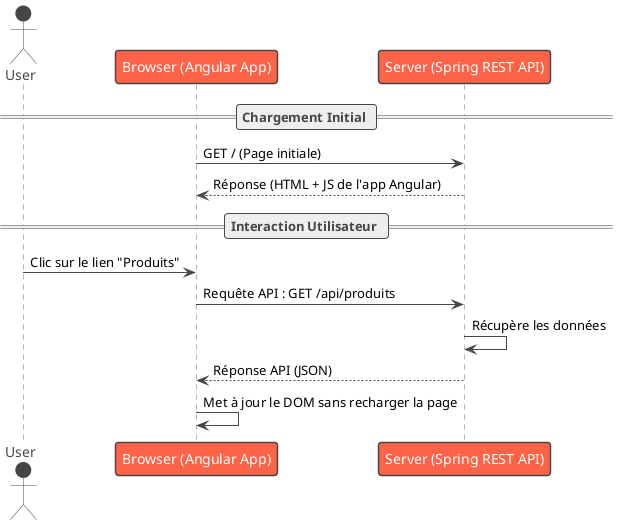
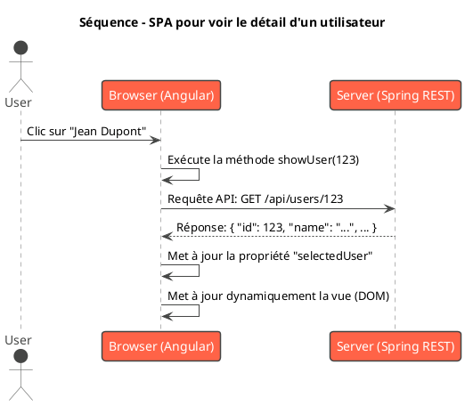

# Module 1 : L'essentiel - Introduction au Pont entre Java et Angular

### Objectifs pédagogiques

À la fin de ce chapitre, vous serez capable de :

* **Comprendre** l'intérêt stratégique d'apprendre Angular en tant que développeur Java.
* **Distinguer** clairement une application web traditionnelle (rendue côté serveur) d'une Single Page Application (
  SPA).
* **Saisir** le concept des composants "Standalone" et pourquoi ils représentent une évolution majeure qui va simplifier
  votre apprentissage.

### Introduction : D'un backend robuste à une expérience utilisateur exceptionnelle

Imaginez que vous venez de construire une magnifique API REST avec Spring Boot. Elle est performante, sécurisée, bien
architecturée... un véritable chef-d'œuvre de logique métier. Mais comment vos utilisateurs vont-ils interagir avec
elle ? Une simple interface HTML statique ? Des pages qui se rechargent à chaque clic ? Cela ne rendrait pas justice à
la puissance de votre backend.

C'est là qu'Angular entre en scène. Ce n'est pas juste une autre technologie à ajouter à votre CV ; c'est le **pont**
qui va connecter la robustesse de votre monde Java à une interface utilisateur moderne, dynamique et réactive. En
maîtrisant Angular, vous ne serez plus seulement un développeur backend, vous deviendrez un **développeur Full-Stack**,
capable de concevoir et de réaliser une application de bout en bout.

Ce premier module pose les fondations conceptuelles de ce voyage. Préparez-vous à voir le développement web sous un
nouvel angle !

### 1. Pourquoi Angular pour un développeur Java ?

En tant que développeur Java, vous possédez déjà, sans le savoir, une partie de l'ADN d'Angular. Les deux mondes
partagent une philosophie de conception qui rend la transition beaucoup plus naturelle que vous ne le pensez.

* **Devenir un développeur "Full-Stack" :** Le marché du travail valorise énormément les développeurs capables de
  travailler à la fois sur le backend (Java/Spring) et le frontend (Angular). Cette double compétence vous rend plus
  polyvalent et plus précieux.
* **Des interfaces riches pour des backends modernes :** Une API REST est conçue pour délivrer des données brutes (
  souvent au format JSON). Angular est conçu pour consommer ces données et les transformer en expériences interactives
  riches, sans avoir à recharger la page à chaque interaction.
* **Des synergies philosophiques :** C'est le point le plus important.

    * **Le Typage Fort :** Vous êtes habitué à la sécurité du typage de Java. Angular utilise **TypeScript**, un
      sur-ensemble de JavaScript qui ajoute... le typage statique ! Finies les erreurs de type à l'exécution, vous
      retrouverez un environnement de développement plus prédictible et robuste.
    * **L'Architecture en Composants :** Vous structurez vos applications Spring avec des `@Component`, `@Service`,
      `@RestController`. Angular fait de même ! Une application Angular est un arbre de **Composants**, chacun avec sa
      propre logique, sa vue et son style.
    * **L'Injection de Dépendances (DI) :** C'est le cœur de Spring, et c'est aussi un pilier d'Angular. Vous savez déjà
      comment injecter un `Service` dans un `Controller` en Java. Vous ferez exactement la même chose pour injecter un
      `Service` dans un `Component` en Angular.

<tip>
Pensez à Angular non pas comme un monde étranger, mais comme une extension de vos compétences Java dans le navigateur. Les concepts de base vous seront étonnamment familiers.
</tip>

### 2. Qu'est-ce qu'Angular ? Le concept de SPA

Angular est un **framework de développement frontend** open-source, maintenu par Google, pour construire des **Single
Page Applications (SPA)**.

Mais que signifie "Single Page Application" ?

Pour le comprendre, comparons avec l'approche "classique" que vous connaissez peut-être avec Spring MVC et Thymeleaf.

**Scénario 1 : Application "Multi-Page" (ex: Spring MVC + Thymeleaf)**

1. Vous cliquez sur un lien "Voir les produits".
2. Le navigateur envoie une requête complète au serveur.
3. Le serveur Spring traite la requête, récupère les données de la base de données.
4. **Thymeleaf génère la page HTML complète** avec la liste des produits sur le serveur.
5. Le serveur renvoie cette page HTML au navigateur.
6. Le navigateur affiche la nouvelle page (avec un rechargement visible).



**Scénario 2 : Single Page Application (ex: Angular + API REST Spring Boot)**

1. **Chargement initial :** Le navigateur charge une seule page HTML (la "coquille") et l'application Angular (un gros
   fichier JavaScript).
2. Vous cliquez sur le lien "Voir les produits".
3. **L'application Angular intercepte le clic.** Elle n'envoie PAS de requête pour une nouvelle page.
4. À la place, elle envoie une requête **asynchrone** (une requête API) à votre backend Spring Boot pour lui demander
   uniquement les données des produits.
5. Le serveur Spring Boot renvoie les **données brutes**, généralement en format **JSON**.
6. Angular reçoit ce JSON et met à jour dynamiquement la partie de la page concernée pour afficher la liste des
   produits. **Il n'y a aucun rechargement de page.**



Cette approche offre une expérience utilisateur beaucoup plus fluide et rapide, similaire à celle d'une application de
bureau ou mobile.

### 3. L'évolution d'Angular : La révolution "Standalone"

Historiquement, chaque morceau de votre application Angular devait être déclaré dans un module de gestion appelé
`NgModule`. C'était un peu comme avoir à déclarer tous vos beans dans un énorme fichier de configuration XML en Spring,
avant l'arrivée de Spring Boot. Cela ajoutait beaucoup de code "boilerplate" (répétitif et standard) et pouvait rendre
la structure du projet difficile à appréhender pour les débutants.

**L'analogie parfaite est l'évolution de Spring vers Spring Boot.**

| Avant (Spring XML / Angular NgModule) | Après (Spring Boot / Angular Standalone)            |
|---------------------------------------|-----------------------------------------------------|
| Configuration XML/Java complexe       | Auto-configuration, "convention over configuration" |
| Beaucoup de code de plomberie         | On se concentre sur le code métier                  |
| Déclarations explicites et verbeuses  | Dépendances et imports simplifiés, plus directs     |

Depuis la version 14, et de manière généralisée depuis la version 17, Angular a adopté une approche **"Standalone"**.

Qu'est-ce que ça veut dire pour vous ?

* **Moins de fichiers à gérer :** Plus besoin de `NgModule` pour chaque fonctionnalité.
* **Plus d'explicite :** Un composant déclare lui-même ce dont il a besoin (ses dépendances). C'est plus facile à lire
  et à comprendre.
* **Un apprentissage plus simple :** Vous pouvez vous concentrer directement sur la construction de composants, le cœur
  d'Angular, sans vous perdre dans la configuration.

Un composant Standalone se déclare très simplement avec `standalone: true` et liste ses dépendances dans un tableau
`imports`.

```typescript
// Un exemple simple de la structure d'un composant standalone
import {Component} from '@angular/core';
import {CommonModule} from '@angular/common'; // Une dépendance

@Component({
    selector: 'app-user-profile',
    standalone: true, // La magie est ici !
    imports: [CommonModule], // On déclare ce que ce composant utilise
    templateUrl: './user-profile.component.html',
})
export class UserProfileComponent {
    // La logique du composant vient ici
}
```

Grâce à cette évolution, votre entrée dans l'écosystème Angular sera beaucoup plus directe et productive.

### Exercice pratique

#### Exercice 1 : Analyse d'architecture

Vous devez concevoir une nouvelle fonctionnalité : "Afficher le détail d'un utilisateur". L'utilisateur clique sur un
nom dans une liste, et les détails (nom, email, date d'inscription) s'affichent sur la page.

Décrivez, étape par étape, comment cette interaction se déroulerait dans les deux architectures que nous avons vues :

1. **Architecture "Multi-Page"** avec Spring MVC et Thymeleaf.
2. **Architecture "Single Page Application"** avec Angular et une API REST Spring Boot.

Concentrez-vous sur le dialogue entre le client (navigateur) et le serveur.

#### Correction exercice 1 {collapsible='true'}

Voici une description détaillée des deux scénarios.

**1. Architecture "Multi-Page" (Spring MVC + Thymeleaf)**

1. **Action utilisateur :** L'utilisateur clique sur un lien hypertexte, par exemple
   `<a th:href="@{/users/123}">Jean Dupont</a>`.
2. **Requête Navigateur :** Le navigateur effectue une requête `GET` vers l'URL `http://votreserveur.com/users/123`.
3. **Côté Serveur (Spring MVC) :**
    * Un `UserController` intercepte la requête grâce à une méthode annotée `@GetMapping("/users/{id}")`.
    * Le contrôleur appelle un `UserService` pour récupérer les informations de l'utilisateur avec l'ID 123 depuis la
      base de données.
    * Le contrôleur place l'objet `User` dans le `Model`.
    * Il retourne le nom d'une vue, par exemple `"user-details"`.
4. **Rendu (Thymeleaf) :**
    * Le moteur de template Thymeleaf prend le fichier `user-details.html`.
    * Il traite les instructions `th:*`, remplace les placeholders par les données de l'objet `User` (ex:
      `<p th:text="${user.name}"></p>`).
    * Il génère une **chaîne de caractères HTML complète**.
5. **Réponse Serveur :** Le serveur envoie cette page HTML complète au navigateur avec un code de statut `200 OK`.
6. **Côté Navigateur :** Le navigateur reçoit la nouvelle page HTML et **remplace entièrement le contenu de l'onglet**
   par celle-ci. Un rechargement de page a eu lieu.

**2. Architecture "Single Page Application" (Angular + API REST Spring Boot)**

1. **Action utilisateur :** L'utilisateur clique sur un élément, par exemple
   `<li (click)="showUser(123)">Jean Dupont</li>`.
2. **Logique Côté Client (Angular) :**
    * L'événement `(click)` déclenche la méthode `showUser(123)` dans le composant Angular.
    * Cette méthode utilise le service `HttpClient` d'Angular pour envoyer une requête `GET` **asynchrone** à l'URL de
      l'API : `http://votreserveur.com/api/users/123`.
3. **Côté Serveur (Spring Boot REST API) :**
    * Un `UserRestController` intercepte la requête avec `@GetMapping("/api/users/{id}")`.
    * Le contrôleur appelle le `UserService` pour récupérer les données de l'utilisateur 123.
    * Il retourne directement l'objet `User`. Le framework Spring (via Jackson) le **sérialise automatiquement en JSON
      **.
4. **Réponse Serveur :** Le serveur renvoie une réponse avec un corps contenant uniquement le JSON, par exemple :
   `{"id": 123, "name": "Jean Dupont", "email": "jean.dupont@email.com", ...}`.
5. **Mise à jour Côté Client (Angular) :**
    * Angular reçoit la réponse JSON.
    * Il stocke ces données dans une propriété du composant (ex: `selectedUser`).
    * Grâce au *data binding*, le template HTML est **automatiquement mis à jour** pour afficher les nouvelles données.
      Par exemple, une section de la page qui était cachée devient visible et affiche les détails de `selectedUser`.
6. **Côté Navigateur :** L'utilisateur voit les détails apparaître **instantanément, sans aucun rechargement de page**.
   L'URL peut même être mise à jour de manière programmatique si le routeur Angular est utilisé, pour une meilleure
   expérience.



### Auto-évaluation

Prenez un moment pour vérifier votre compréhension. Notez vos réponses et comparez-les plus tard avec les corrections
qui seront fournies à la fin du cours.

1. **(Question ouverte)** Avec vos propres mots, expliquez la différence fondamentale de responsabilité du serveur entre
   une architecture "multi-page" avec Thymeleaf et une architecture SPA avec une API REST.
2. **(QCM)** Quel concept en Angular est l'analogie la plus proche de l'Injection de Dépendances de Spring ?
   a) Le Data Binding
   b) Les Composants
   c) Les Services et le système d'Injection de Dépendances
   d) Le Routage
3. **(QCM)** Qu'est-ce qui caractérise principalement une Single Page Application (SPA) du point de vue de
   l'utilisateur ?
   a) Elle ne fonctionne que sur une seule page et ne peut pas afficher d'autres contenus.
   b) Elle se recharge entièrement à chaque fois que l'utilisateur clique sur un lien.
   c) Les interactions semblent instantanées car le contenu est mis à jour dynamiquement sans rechargement de page.
   d) Elle est entièrement construite en Java.
4. **(Question ouverte)** Quel est, selon vous, le principal avantage des composants "Standalone" pour un développeur
   qui débute avec Angular ?
5. **(QCM)** Dans une architecture avec une SPA Angular, quel est le rôle principal du backend (par exemple, Spring
   Boot) après le chargement initial de l'application ?
   a) Générer et envoyer de nouvelles pages HTML complètes.
   b) Fournir des données brutes (généralement en JSON) via une API.
   c) Exécuter la logique de l'interface utilisateur.
   d) Gérer les animations et le style CSS.

### Conclusion de cette partie

Bravo ! Vous avez posé les bases conceptuelles indispensables pour aborder Angular avec la bonne perspective.

Vous savez maintenant **pourquoi** Angular est un excellent choix pour vous, développeur Java. Vous comprenez la
différence capitale entre le rendu côté serveur traditionnel et l'approche **SPA**, qui est au cœur de toutes les
applications web modernes. Enfin, vous savez que l'approche **Standalone** va vous simplifier la vie et vous permettre
d'être productif plus rapidement.

Dans le prochain module, nous allons quitter la théorie pour passer à la pratique : nous allons mettre en place votre
environnement de développement, installer les outils nécessaires et créer votre toute première application Angular. Il
est temps de mettre les mains dans le code 