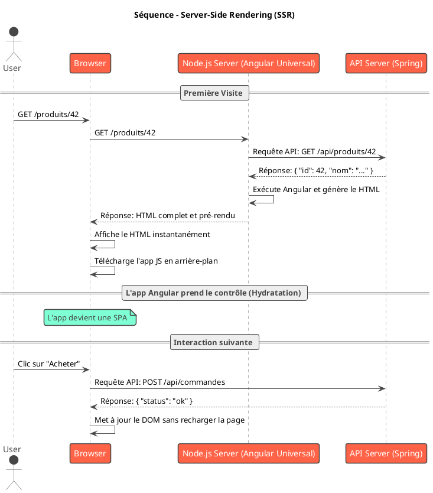

# Module 1 : Pour aller plus loin - L'écosystème et les architectures avancées

### Objectifs pédagogiques

À la fin de cette partie, vous serez en mesure de :

* **Situer** Angular par rapport à d'autres frameworks populaires comme React et Vue.
* **Comprendre** les concepts d'architectures avancées comme le Rendu Côté Serveur (SSR) et la Génération de Site
  Statique (SSG).
* **Avoir une vision d'ensemble** de l'écosystème Angular, incluant les bibliothèques et outils principaux.

### Introduction : Voir la forêt au-delà de l'arbre

Nous avons établi qu'Angular est un pont fantastique pour un développeur Java souhaitant maîtriser le développement
Full-Stack. Mais Angular ne vit pas en vase clos. C'est un géant dans un monde peuplé d'autres outils et d'autres
philosophies.

Imaginez que vous participez à une réunion d'architecture pour un nouveau projet. Quelqu'un demande : "Pourquoi Angular
et pas React ? Et comment allons-nous gérer le référencement naturel (SEO) de notre site public ?". Cette section a pour
but de vous donner les clés pour comprendre ces questions et y répondre avec assurance.

En comprenant l'écosystème et les différentes stratégies d'architecture, vous ne serez plus simplement un "codeur"
Angular, mais un véritable **concepteur d'applications** capable de faire des choix technologiques éclairés.

### 1. Angular vs. React vs. Vue : Le choix des armes

C'est un débat classique dans le monde du front-end. Plutôt que de parler de "guerre", voyons cela comme une boîte à
outils avec des instruments différents pour des besoins différents.

| Critère                    | **Angular (Le Framework d'Entreprise)**                                                                         | **React (La Bibliothèque Flexible)**                                                              | **Vue.js (Le Framework Progressif)**                                                                  |
|----------------------------|-----------------------------------------------------------------------------------------------------------------|---------------------------------------------------------------------------------------------------|-------------------------------------------------------------------------------------------------------|
| **Nature**                 | **Framework complet "tout inclus"** (opinionated). Il fournit un routeur, un client HTTP, des formulaires, etc. | **Bibliothèque UI**. Ne gère que la vue. Vous choisissez vos propres bibliothèques pour le reste. | **Framework progressif**. Commence de manière simple mais peut être étendu avec des outils officiels. |
| **Philosophie**            | Structure et conventions fortes. Idéal pour les grandes équipes et les applications complexes à long terme.     | Flexibilité et liberté maximale. L'écosystème est immense, mais demande plus de choix.            | Simplicité et facilité d'approche. Souvent considéré comme le juste milieu entre les deux autres.     |
| **Langage**                | **TypeScript** est au cœur de la philosophie.                                                                   | JavaScript (avec JSX). TypeScript est très populaire mais reste une option.                       | JavaScript. Le support de TypeScript est excellent et de plus en plus courant.                        |
| **Courbe d'apprentissage** | Plus abrupte au début à cause du nombre de concepts à apprendre (mais plus facile pour vous, Javanistes !).     | Plus facile pour la partie "vue", mais la complexité vient de l'écosystème à assembler.           | Considérée comme la plus facile à apprendre pour commencer.                                           |

**Pourquoi Angular est-il souvent un bon choix pour un développeur Java ?**
Sa nature structurée, son typage fort avec TypeScript et son système d'injection de dépendances créent un environnement
de travail qui valorise la rigueur et la maintenabilité, des principes qui vous sont chers en Java/Spring.

### 2. Au-delà de la SPA : SSR et SSG

Dans "L'essentiel", nous avons vanté les mérites de la SPA pour son expérience utilisateur fluide. Cependant, elle
présente deux défis potentiels :

1. **Référencement par les moteurs de recherche (SEO) :** Certains moteurs de recherche plus anciens peuvent avoir du
   mal à "lire" une page dont le contenu est entièrement généré par JavaScript après le chargement.
2. **Temps de premier affichage (First Contentful Paint) :** Sur une connexion lente, l'utilisateur peut voir une page
   blanche pendant quelques secondes, le temps que le JavaScript d'Angular se charge et s'exécute.

Pour résoudre ces problèmes, Angular propose des stratégies de rendu alternatives.

#### Le Rendu Côté Serveur (Server-Side Rendering - SSR)

Avec SSR (via un outil appelé **Angular Universal**), le processus pour le tout premier chargement de la page est
modifié.

1. L'utilisateur demande une page.
2. Le **serveur** (un serveur Node.js) exécute l'application Angular lui-même, génère la page HTML complète avec le
   contenu.
3. Il envoie cette page HTML pré-rendue au navigateur.
4. Le navigateur l'affiche **immédiatement**. L'utilisateur voit le contenu tout de suite !
5. En arrière-plan, le navigateur télécharge le JavaScript de l'application Angular.
6. Une fois chargé, Angular "prend le contrôle" de la page (un processus appelé *hydratation*) et l'application
   redevient une SPA normale pour toutes les interactions suivantes.

C'est le meilleur des deux mondes : un premier chargement ultra-rapide et bon pour le SEO, suivi d'une expérience SPA
fluide.

#### La Génération de Site Statique (Static Site Generation - SSG)

Le SSG pousse le concept encore plus loin. Au lieu de générer la page à la volée sur le serveur pour chaque visiteur, *
*toutes les pages sont pré-générées en fichiers HTML statiques au moment du *build*** (de la construction de
l'application).

C'est l'approche la plus performante possible. Elle est idéale pour les sites où le contenu ne change pas en temps réel,
comme :

* Les blogs
* Les sites de documentation
* Les sites vitrines (marketing)

<warning>
Le choix entre SPA, SSR et SSG est une **décision d'architecture fondamentale**. Il dépend entièrement des besoins de votre projet (SEO, performance, dynamicité du contenu).
</warning>

### 3. Un écosystème riche pour les professionnels

Angular n'est pas qu'un simple framework, c'est une plateforme complète soutenue par un écosystème d'outils et de
bibliothèques conçus pour fonctionner en harmonie.

* **Angular CLI :** Votre couteau suisse. Vous l'utiliserez pour créer des projets, des composants, des services, pour
  lancer votre serveur de développement, et pour construire l'application pour la production.
* **Angular Material :** Une bibliothèque de composants d'interface utilisateur (UI) de haute qualité, développée par
  l'équipe Angular de Google. Elle vous fournit des boutons, des formulaires, des tables, des boîtes de dialogue...
  prêts à l'emploi et respectant les standards du Material Design. C'est un gain de temps considérable.
* **RxJS :** C'est la bibliothèque de programmation réactive qui gère tous les événements asynchrones dans Angular (
  comme les appels HTTP). Vous apprendrez à l'aimer !
* **Gestion d'état (State Management) :** Pour les très grosses applications, il peut devenir complexe de savoir "qui
  détient quelle donnée". Des bibliothèques comme **NgRx** ou **Ngrx-signal-store** fournissent un patron de conception
  pour centraliser l'état de votre application en un seul endroit, le rendant plus prédictible et facile à déboguer.
* **Outils de test :** Angular est livré avec un support de premier ordre pour les tests. **Jasmine** et **Karma** sont
  généralement utilisés pour les tests unitaires, tandis que des outils comme **Cypress** ou **Playwright** sont
  populaires pour les tests de bout en bout (E2E), simulant un véritable utilisateur dans un navigateur.

### Exercice pratique

#### Exercice 2 : Choisir la bonne architecture

Votre entreprise de services a trois nouveaux clients avec des besoins très différents. En vous basant sur ce que vous
venez d'apprendre, quelle architecture ou quel framework recommanderiez-vous pour chaque projet ? Justifiez votre choix
en 1 ou 2 phrases.

1. **Projet "Le Gourmet Urbain" :** Un site vitrine pour un restaurant avec un blog de recettes. L'objectif principal
   est d'attirer de nouveaux clients via les moteurs de recherche comme Google. Le contenu change une fois par semaine.
2. **Projet "LogiCorp" :** Une application de gestion interne complexe pour suivre les stocks, les commandes et la
   logistique en temps réel. L'application ne sera utilisée que par les employés de l'entreprise et ne doit pas être
   accessible depuis l'extérieur. La robustesse et la maintenabilité à long terme sont cruciales.
3. **Projet "QuickEvent" :** Une petite application web pour l'organisation d'un événement unique. Le client a un budget
   serré et une équipe de 2 développeurs juniors qui viennent du monde JavaScript. Ils ont besoin de monter un prototype
   très rapidement.

#### Correction exercice 2 {collapsible='true'}

1. **Projet "Le Gourmet Urbain" :**
    * **Recommandation :** Angular avec **SSG (Static Site Generation)**.
    * **Justification :** Le besoin critique est le SEO, et le contenu est largement statique. Le SSG offrira les
      meilleures performances de chargement et une indexation parfaite par les moteurs de recherche, car le site sera
      composé de fichiers HTML purs.

2. **Projet "LogiCorp" :**
    * **Recommandation :** Angular en mode **SPA (Single Page Application)** pur.
    * **Justification :** Le SEO n'a aucune importance pour une application interne. La priorité est une interface
      riche, réactive et capable de gérer une grande complexité de données en temps réel, ce qui est le point fort de la
      SPA. La structure d'Angular assurera la maintenabilité du projet sur le long terme.

3. **Projet "QuickEvent" :**
    * **Recommandation :** **React ou Vue.js**.
    * **Justification :** Pour un projet rapide, avec une équipe venant de JavaScript et un besoin de flexibilité, React
      ou Vue pourraient être plus adaptés. Leur courbe d'apprentissage est souvent perçue comme plus douce pour démarrer
      et leur flexibilité permet de construire rapidement un prototype sans la structure plus formelle d'Angular.

### Auto-évaluation

1. **(QCM)** Quel est le principal avantage du Server-Side Rendering (SSR) par rapport à une SPA standard ?
   
   a) Il simplifie le code des composants.

   b) Il améliore le SEO et le temps de premier affichage.

   c) Il élimine le besoin d'une API backend.

   d) Il permet d'écrire l'application en Java.

2. **(Question ouverte)** Dans quel scénario concret serait-il préférable d'utiliser React plutôt qu'Angular ?

3. **(QCM)** Vous construisez un site de documentation pour une bibliothèque open-source. Quelle stratégie de rendu
   serait la plus performante et la plus appropriée ?

   a) SPA (Single Page Application)

   b) SSR (Server-Side Rendering)

   c) SSG (Static Site Generation)

   d) Aucune, un simple fichier HTML suffit.

4. **(Question ouverte)** Qu'est-ce que "l'hydratation" dans le contexte du SSR ?

5. **(QCM)** Si vous devez ajouter un ensemble de composants UI (boutons, tables, modales) cohérents à votre projet
   Angular sans vouloir tout réinventer, quelle bibliothèque officielle serait le choix le plus évident ?

   a) RxJS

   b) Angular CLI

   c) Angular Material

   d) NgRx

### Conclusion de ce chapitre

Félicitations ! Vous avez maintenant une vision à 360 degrés de ce qu'est Angular. Vous ne connaissez pas seulement son
fonctionnement de base, mais aussi sa place dans l'univers du web, ses différentes facettes architecturales (SPA, SSR,
SSG) et la richesse de son écosystème.

Cette connaissance est ce qui distingue un développeur qui applique des recettes d'un concepteur qui élabore des
stratégies. Vous êtes désormais armé pour comprendre les discussions techniques de haut niveau et pour justifier vos
futurs choix d'architecture.

Maintenant que le décor est planté, il est temps d'entrer en scène. Dans le prochain module, nous allons retrousser nos
manches, installer tout le nécessaire et enfin, créer et lancer notre première application Angular. La théorie cède la
place à l'action 