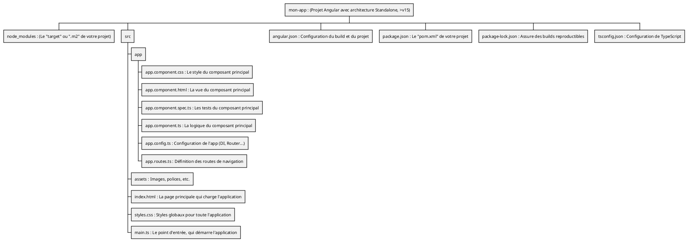
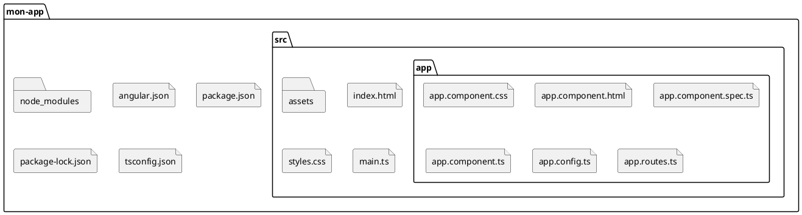
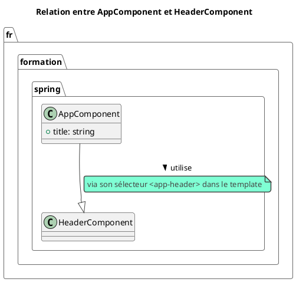

# Module 2 : L'essentiel - Bâtir Votre Atelier de Développement Angular

### Objectifs pédagogiques

À la fin de ce chapitre, vous serez capable de :

* **Installer** les outils fondamentaux de l'écosystème Angular : Node.js et Angular CLI.
* **Créer** un nouveau projet Angular en utilisant les bonnes pratiques (approche "standalone").
* **Lancer** le serveur de développement et voir votre application en direct.
* **Identifier** les fichiers et dossiers clés dans la structure d'un projet Angular.

### Introduction : De l'architecte au bâtisseur

Dans le module précédent, nous avons dessiné les plans de notre pont entre Java et Angular. Nous avons compris les
concepts et l'architecture. Il est maintenant temps de chausser vos bottes de sécurité, de mettre votre casque et de
commencer à construire !

Ce module est entièrement pratique. Nous allons mettre en place votre "atelier de développement" : les outils, les
machines, et la structure de base qui vous permettront de transformer vos idées en applications fonctionnelles. N'ayez
crainte, chaque outil a un équivalent dans votre monde Java, et je serai là pour faire le lien. À la fin de cette
session, vous n'aurez plus juste une idée, mais une véritable application Angular qui tourne sur votre machine.

### 1. Les Outils Indispensables

Tout bon artisan a besoin de bons outils. Dans le monde d'Angular, il y en a deux qui sont absolument non négociables.

#### Node.js et npm : Le Moteur et le Gestionnaire de Dépendances

Qu'est-ce que Node.js ? C'est un environnement qui permet d'exécuter du code JavaScript en dehors d'un navigateur.

**Analogie Java :** Pensez à **Node.js comme votre JVM**. C'est l'environnement d'exécution nécessaire pour faire
tourner vos outils de développement Angular.

Quand vous installez Node.js, vous obtenez également **npm** (Node Package Manager).

**Analogie Java :** Pensez à **npm comme votre Maven ou votre Gradle**. C'est le gestionnaire de dépendances et l'outil
de build du monde JavaScript/TypeScript. Le fichier qui décrit votre projet et ses dépendances s'appelle `package.json`,
c'est l'équivalent direct de votre `pom.xml`.

<tip>
Il existe des alternatives à `npm` comme `pnpm` ou `yarn`. Pour ce cours, nous utiliserons `npm` car il est fourni par défaut, mais `pnpm` est une excellente option plus performante que vous pourriez explorer plus tard.
</tip>

#### Angular CLI : Votre Couteau Suisse

L'**Angular CLI** (Command Line Interface) est l'outil le plus important que vous utiliserez au quotidien. C'est une
interface en ligne de commande qui vous simplifie la vie de manière spectaculaire.

**Analogie Java :** Pensez à l'Angular CLI comme à un mélange entre la **CLI de Spring Boot** et les **Archétypes Maven
**. Elle vous permet de :

* Créer un nouveau projet avec une structure standard (`ng new`).
* Générer des briques de code : composants, services, etc. (`ng generate`).
* Lancer un serveur de développement avec rechargement à chaud (`ng serve`).
* Construire votre application pour la production (`ng build`).

<procedure title="Installation de l'environnement" id="install-env">
    <step>
        <b>Installer Node.js :</b>
        <p>Rendez-vous sur le <a href="https://nodejs.org/">site officiel de Node.js</a>. Téléchargez et installez la version <b>LTS</b> (Long Term Support). C'est la version la plus stable, recommandée pour la plupart des utilisateurs.</p>
        <p>Pour vérifier que l'installation a réussi, ouvrez un terminal et tapez :</p>
        <code>
        node -v
        npm -v
        </code>
        <p>Vous devriez voir les numéros de version s'afficher.</p>
    </step>
    <step>
        <b>Installer Angular CLI :</b>
        <p>Une fois Node.js et npm installés, ouvrez un terminal et lancez la commande suivante :</p>
        <code>
        npm install -g @angular/cli
        </code>
        <p>L'option <code>-g</code> signifie "global", ce qui rend la commande <code>ng</code> disponible partout sur votre système.</p>
        <p>Pour vérifier l'installation, tapez :</p>
        <code>
        ng version
        </code>
        <p>Vous devriez voir un magnifique logo Angular et les versions de vos outils.</p>
    </step>
</procedure>

### 2. Création du Premier Projet : "Mon App"

Votre atelier est prêt ! Créons notre première pièce. Avec l'Angular CLI, c'est un jeu d'enfant.

Ouvrez votre terminal, naviguez vers le dossier où vous souhaitez créer votre projet, et lancez cette commande magique :

```bash
ng new mon-app --standalone
```

Analysons cette commande :

* `ng new mon-app` : Demande à l'Angular CLI de créer un nouveau projet nommé `mon-app`.
* `--standalone` : C'est ici que nous indiquons que nous voulons utiliser la nouvelle architecture basée sur les
  composants "Standalone". Cela crée un projet plus léger et plus moderne, comme nous l'avons vu au module 1.

La CLI va vous poser quelques questions :

* `Would you like to add Angular routing?` (Voulez-vous ajouter le routage Angular ?) -> Répondez **Yes**. C'est
  essentiel pour la navigation.
* `Which stylesheet format would you like to use?` -> Choisissez **CSS**. C'est le standard le plus simple pour
  commencer.

Une fois que la CLI a fini de travailler, naviguez dans votre nouveau projet et lancez le serveur de développement :

```bash
cd mon-app
ng serve
```

Cette commande compile votre application, démarre un serveur web local (généralement sur le port 4200) et, surtout,
surveille vos fichiers. **Dès que vous sauvegarderez une modification dans votre code, le navigateur se rechargera
automatiquement !** C'est une fonctionnalité extrêmement productive.

Ouvrez votre navigateur à l'adresse `http://localhost:4200`. Vous devriez voir la page d'accueil par défaut d'une
nouvelle application Angular. Félicitations !

### 3. Structure d'un Projet Angular

Ouvrez le dossier `mon-app` dans votre éditeur de code préféré (Visual Studio Code est fortement recommandé pour le
développement Angular). Vous y trouverez de nombreux fichiers. Ne soyez pas intimidé, concentrons-nous sur les plus
importants.





* `src/` : C'est là que vous passerez 99% de votre temps. C'est le cœur du code source de votre application.
* `app/` : Contient les composants de votre application. Pour l'instant, il n'y a que le composant racine,
  `AppComponent`.
* `main.ts` : **Le point d'entrée.** C'est l'équivalent de la classe avec la méthode `public static void main` dans une
  application Spring Boot. C'est le fichier qui "démarre" Angular.
* `styles.css` : Pour les styles qui s'appliquent à toute votre application.
* `angular.json` : Le fichier de configuration de l'Angular CLI. Il définit comment construire (`build`), servir (
  `serve`) et tester (`test`) votre projet. Vous le modifierez rarement au début.
* `package.json` : **Votre `pom.xml`.** Il liste les métadonnées de votre projet et, surtout, ses dépendances (Angular
  lui-même, et d'autres bibliothèques).
* `node_modules/` : Le dossier où npm télécharge et stocke toutes les dépendances listées dans `package.json`. *
  *Analogie Java :** C'est comme votre répertoire local Maven (`.m2/repository`) mais localisé à l'intérieur de votre
  projet. Vous ne devriez **jamais** modifier ce dossier manuellement.

### Exercice pratique

#### Exercice 1 : Créer un nouveau composant

Votre mission est de créer un nouveau composant "header" (en-tête) pour votre application et de l'afficher sur la page
principale.

1. Assurez-vous que votre serveur de développement (`ng serve`) est toujours en cours d'exécution dans un terminal.
2. Ouvrez un **second terminal** et naviguez dans le dossier de votre projet (`mon-app`).
3. Utilisez l'Angular CLI pour générer un nouveau composant nommé `Header`.
4. Modifiez le fichier HTML du composant `Header` pour qu'il affiche un simple titre, par exemple
   `<h1>Mon Super Site</h1>`.
5. Modifiez le composant principal (`AppComponent`) pour qu'il affiche votre nouveau composant `Header`.

#### Correction exercice 1 {collapsible='true'}

1. Le serveur de développement tourne déjà. Parfait.

2. Dans le second terminal, à la racine de `mon-app`, exécutez la commande de génération :

   ```bash
   ng generate component header
   # ou sa version courte :
   # ng g c header
   ```

   L'Angular CLI va créer un nouveau dossier `src/app/header/` contenant 4 fichiers : `header.component.ts`,
   `header.component.html`, `header.component.css` et `header.component.spec.ts`.

3. Ouvrez le fichier `src/app/header/header.component.html`. Remplacez son contenu par :

   ```html
   <h1>Mon Super Site</h1>
   ```

4. Maintenant, nous devons dire à notre composant principal d'afficher ce nouveau composant. Pour ce faire, nous allons
   utiliser le "sélecteur" du composant `Header`. Si vous ouvrez `src/app/header/header.component.ts`, vous verrez une
   ligne `selector: 'app-header'`. C'est le nom de la balise HTML pour notre composant.

   Ouvrez le fichier `src/app/app.component.ts`. Puisque le `HeaderComponent` est `standalone`, nous devons l'importer
   dans `AppComponent` pour pouvoir l'utiliser.

   ```typescript
   // Fichier : src/app/app.component.ts
   import { Component } from '@angular/core';
   import { CommonModule } from '@angular/common';
   import { RouterOutlet } from '@angular/router';
   // 1. Importer le nouveau composant
   import { HeaderComponent } from './header/header.component';

   @Component({
     selector: 'app-root',
     standalone: true,
     // 2. Ajouter le composant aux imports
     imports: [CommonModule, RouterOutlet, HeaderComponent],
     templateUrl: './app.component.html',
     styleUrl: './app.component.css'
   })
   export class AppComponent {
     title = 'mon-app';
   }
   ```

   Enfin, ouvrez `src/app/app.component.html`. Effacez tout le contenu de ce fichier (qui est un placeholder) et
   remplacez-le par :

   ```html
   <!-- On utilise la balise de notre composant header -->
   <app-header></app-header>

   <!-- Laisser ceci, c'est là que le contenu des pages s'affichera -->
   <router-outlet></router-outlet>
   ```

   Regardez votre navigateur. La page devrait s'être rechargée automatiquement pour afficher votre titre "Mon Super
   Site". Vous venez d'utiliser la CLI pour créer un composant et vous avez composé votre application en imbriquant un
   composant dans un autre. Bravo !



### Auto-évaluation

1. **(Question ouverte)** En utilisant une analogie avec l'écosystème Java/Maven, expliquez les rôles respectifs de
   `npm`, `package.json` et du dossier `node_modules`.
2. **(QCM)** Quelle commande de l'Angular CLI utiliseriez-vous pour démarrer le serveur de développement local ?
   a) `ng build`
   b) `ng start`
   c) `ng serve`
   d) `npm run dev`
3. **(QCM)** Dans quel fichier principal se trouve la liste des dépendances de votre projet (comme les bibliothèques
   tierces) ?
   a) `angular.json`
   b) `main.ts`
   c) `package.json`
   d) `app.config.ts`
4. **(Question ouverte)** Quel est l'avantage principal de la commande `ng serve` pendant le développement, par rapport
   à un cycle classique "compiler-déployer-rafraîchir" ?
5. **(QCM)** Si vous créez un composant avec le sélecteur `selector: 'app-user-card'`, quelle balise HTML
   utiliserez-vous pour l'afficher dans un autre composant ?
   a) `<component>app-user-card</component>`
   b) `<app-user-card></app-user-card>`
   c) `[app-user-card]`
   d) `{{ app-user-card }}`

### Conclusion de cette partie

Vous l'avez fait ! Votre atelier de développement est maintenant opérationnel. Ce n'est plus un concept abstrait : vous
avez installé les outils, créé un projet à partir de rien, lancé un serveur, et même ajouté votre propre brique de code
avec l'Angular CLI.

Vous maîtrisez maintenant le cycle de vie de base du développement Angular : `ng new` pour commencer, `ng generate` pour
construire, et `ng serve` pour visualiser. Vous avez également une carte mentale de la structure d'un projet, ce qui
vous permettra de naviguer dans votre code avec confiance.

Maintenant que l'atelier est prêt, il est temps de s'intéresser de plus près au matériau principal que nous allons
utiliser : **TypeScript**. Dans le prochain module, vous découvrirez pourquoi ce langage sera un allié précieux qui vous
rappellera le confort et la sécurité de Java.