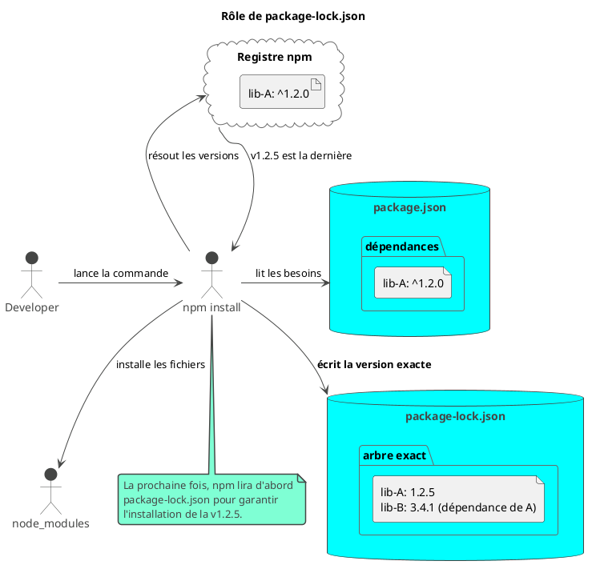

# Module 2 : Pour aller plus loin - Optimiser son Environnement de Développement

### Objectifs pédagogiques

À la fin de cette partie, vous serez en mesure de :

* **Configurer** votre environnement de développement (IDE) pour une productivité maximale avec Angular.
* **Comprendre et différencier** le rôle du "linting" (analyse de la qualité du code) et du "formatting" (mise en forme
  du code).
* **Saisir** l'importance capitale du fichier `package-lock.json` pour la stabilité de vos projets.
* **Connaître** l'existence d'alternatives au gestionnaire de paquets `npm`.

### Introduction : De l'atelier fonctionnel à l'usine de production

Vous avez bâti votre atelier. Les machines sont branchées (`ng serve` tourne) et vous avez produit votre première
pièce (le `HeaderComponent`). C'est fantastique ! Mais que se passe-t-il quand l'atelier grandit ? Quand plusieurs
artisans (développeurs) doivent y travailler ensemble ?

Sans organisation, c'est le chaos assuré. Chacun utilisera ses propres outils, rangera ses affaires à sa manière, et la
qualité des pièces finales sera inégale. Cette section a pour but de transformer votre atelier personnel en une
véritable ligne de production professionnelle. Nous allons affûter nos outils, mettre en place des standards de qualité
et nous assurer que chaque pièce qui sort de l'usine est identique, peu importe qui l'a fabriquée.

Ces concepts sont le secret des équipes qui livrent des applications robustes et maintenables.

### 1. Votre IDE : Préparer Visual Studio Code

Utiliser un bon IDE, c'est comme avoir des outils électriques au lieu d'outils manuels. Vous pouvez développer Angular
avec n'importe quel éditeur de texte, mais **Visual Studio Code (VS Code)** est le standard de facto, grâce à son
incroyable écosystème d'extensions.

Voici les extensions indispensables pour bien démarrer :

* **Angular Language Service :** Développée par l'équipe Angular elle-même, cette extension est magique. Elle fournit
  une auto-complétion surpuissante, une vérification d'erreurs en temps réel et des aides à la navigation directement
  dans vos fichiers HTML. Elle vous dira si vous utilisez une propriété qui n'existe pas dans votre composant, par
  exemple. **C'est non-négociable.**
* **ESLint :** Votre projet Angular est déjà configuré pour utiliser ESLint, un "linter". Cette extension intègre les
  rapports d'ESLint directement dans votre éditeur, soulignant les problèmes de qualité de code au fur et à mesure que
  vous tapez.
* **Prettier - Code formatter :** Prettier est un formateur de code très "opinionated". Son but est simple : arrêter
  tous les débats sur le style du code (espaces vs. tabulations, simple vs. double guillemets...). Il formate
  automatiquement votre code d'une manière cohérente à chaque sauvegarde.
* **Material Icon Theme :** Une extension purement cosmétique, mais incroyablement utile. Elle attribue des icônes
  spécifiques aux fichiers et dossiers de votre projet, vous permettant de repérer un composant, un service ou un
  fichier de style en un clin d'œil.

<tip>
Prenez le temps d'installer ces extensions dans VS Code. Elles représentent un investissement minime pour un gain de productivité énorme au quotidien.
</tip>

### 2. Qualité de Code : Linting et Formatage

Dans le monde Java, vous avez sûrement déjà croisé des outils comme Checkstyle ou PMD. Le monde JavaScript/TypeScript a
ses propres équivalents, et il est crucial de comprendre la différence entre les deux principaux types d'outils.

* **Le Linting (avec ESLint) : La Qualité du Code**
    * **Son rôle :** Un linter analyse votre code à la recherche de **problèmes potentiels** et de non-respect de *
      *bonnes pratiques**.
    * **Exemples de règles :** "Ne pas déclarer de variable que vous n'utilisez jamais", "Préférer `const` à `let` si la
      variable n'est pas réassignée", "Assurer que les méthodes d'un service sont bien typées".
    * **Analogie :** C'est l'inspecteur qualité qui vérifie que votre pièce est fonctionnelle et ne présente pas de
      défaut de conception.
    * Votre projet Angular créé avec la CLI est **déjà configuré avec ESLint**. Vous pouvez lancer l'analyse
      manuellement avec `ng lint`.

* **Le Formatage (avec Prettier) : Le Style du Code**
    * **Son rôle :** Un formateur se moque de la qualité de votre code. Son unique but est de s'assurer que sa **mise en
      forme est cohérente** partout.
    * **Exemples de règles :** "Toujours utiliser 2 espaces pour l'indentation", "Mettre un point-virgule à la fin de
      chaque ligne", "Limiter la longueur des lignes à 80 caractères".
    * **Analogie :** C'est l'ouvrier qui peint toutes les pièces de la même couleur et les emballe dans des boîtes
      identiques.
    * L'avantage de Prettier est qu'il est automatique. Une fois configuré, il reformate votre fichier à chaque
      sauvegarde. Fini les discussions sans fin en revue de code sur des sujets de style !

<warning>
**Linting ≠ Formatage.** Un linter se soucie de la **logique** et des **erreurs potentielles**. Un formateur se soucie de **l'apparence**. Les deux sont complémentaires et essentiels pour un projet professionnel.
</warning>

### 3. Le Garant de la Stabilité : `package-lock.json`

Vous avez remarqué ce fichier `package-lock.json` à côté de `package.json`. Quel est son rôle ? C'est le garant de la
stabilité de votre projet.

Imaginez ce scénario :

* Dans votre `package.json`, vous avez une dépendance comme `"une-lib": "^1.2.0"`.
* Le `^` signifie "accepter n'importe quelle version mineure supérieure ou égale à 1.2.0, mais inférieure à 2.0.0".
* Aujourd'hui, vous lancez `npm install`, et la dernière version est la `1.2.5`. Tout fonctionne.
* Demain, votre collègue clone le projet. Entre-temps, la version `1.3.0` est sortie, avec un bug. Il lance
  `npm install`, récupère la `1.3.0`... et l'application ne marche plus. C'est le fameux "ça marche sur ma machine !".

Le fichier `package-lock.json` empêche ce désastre.

* Quand vous lancez `npm install` pour la première fois, `npm` calcule l'arbre de dépendances exact, avec les versions
  précises de chaque paquet (y compris les dépendances des dépendances).
* Il enregistre cet "arbre figé" dans `package-lock.json`.
* Toutes les exécutions suivantes de `npm install` utiliseront ce fichier pour recréer **exactement le même
  dossier `node_modules`**, au bit près.

**Règle d'or :** Le fichier `package-lock.json` **DOIT** être versionné dans votre système de contrôle de version (Git).
C'est ce qui garantit que chaque développeur, et surtout votre serveur d'intégration continue, utilise la même base de
code.



### Exercice pratique

#### Exercice 2 : Mettre en place Prettier

Intégrons Prettier à notre projet `mon-app` pour garantir un formatage de code cohérent.

1. **Arrêtez** votre serveur de développement (`ng serve`).
2. **Installez** Prettier en tant que dépendance de développement.
3. **Créez** un fichier de configuration pour Prettier à la racine du projet.
4. **Créez** un fichier pour ignorer certains fichiers (comme le dossier `dist/`).
5. **Ajoutez** des "scripts" dans votre `package.json` pour pouvoir vérifier et corriger le formatage de tout le projet
   en ligne de commande.
6. **Testez** vos scripts.

#### Correction exercice 2 {collapsible='true'}

1. Le serveur est arrêté (Ctrl+C dans le terminal).

2. Dans le terminal, à la racine du projet, lancez la commande suivante. L'option `--save-dev` l'ajoute aux
   `devDependencies` dans `package.json`, car c'est un outil pour le développement, pas pour l'application en
   production.

   ```bash
   npm install --save-dev prettier
   ```

3. Créez un fichier nommé `.prettierrc.json` à la racine de `mon-app`. Ce fichier contiendra vos règles de style. Voici
   une configuration simple et populaire :

   ```json
   {
     "singleQuote": true,
     "useTabs": false,
     "tabWidth": 2,
     "semi": true,
     "trailingComma": "es5",
     "printWidth": 80
   }
   ```

4. Créez un fichier nommé `.prettierignore`. C'est comme un `.gitignore`, mais pour Prettier. Ajoutez-y au moins le
   dossier de build et les dépendances :

   ```
   # Ignorer le dossier de build
   dist/

   # Ignorer les dépendances
   node_modules/
   ```

5. Ouvrez le fichier `package.json`. Trouvez la section `"scripts"`. Ajoutez deux nouvelles lignes :

   ```json
   // Dans le fichier package.json
   "scripts": {
     "ng": "ng",
     "start": "ng serve",
     "build": "ng build",
     "watch": "ng build --watch --configuration development",
     "test": "ng test",
     "lint": "ng lint",
     "format:check": "prettier --check .",
     "format:write": "prettier --write ."
   },
   ```
    * `format:check` va vérifier si les fichiers sont bien formatés sans les modifier (utile pour l'intégration
      continue).
    * `format:write` va modifier tous les fichiers nécessaires pour qu'ils respectent les règles.

6. Testez les scripts dans votre terminal :
    * Pour vérifier (il trouvera sûrement des fichiers à corriger) : `npm run format:check`
    * Pour corriger automatiquement tous les fichiers : `npm run format:write`

   Maintenant, si vous avez l'extension Prettier dans VS Code, il formatera automatiquement vos fichiers à chaque
   sauvegarde selon ces règles !

### Auto-évaluation

1. **(QCM)** Quelle extension VS Code est considérée comme essentielle car elle fournit l'auto-complétion et la
   détection d'erreurs dans les templates HTML d'Angular ?

   a) Prettier

   b) ESLint

   c) Angular Language Service

   d) Material Icon Theme
   
2. **(Question ouverte)** Expliquez avec vos propres mots la différence fondamentale de responsabilité entre un linter
   comme ESLint et un formateur comme Prettier.

3. **(QCM)** Un collègue vous dit : "J'ai supprimé mon `package-lock.json` pour forcer la mise à jour des paquets, car
   mon projet ne marchait plus". Pourquoi est-ce une mauvaise idée ?

   a) Ce n'est pas une mauvaise idée, c'est la bonne procédure.
   
   b) Parce que ce fichier contient le code source des dépendances.
   
   c) Parce que cela rend le build non-reproductible et peut introduire des versions de paquets inattendues.

   d) Parce que cela supprime la configuration d'Angular CLI.

4. **(Question ouverte)** Vous rejoignez une nouvelle équipe. Quel est le premier avantage que vous obtiendrez d'un
   projet qui utilise déjà Prettier et ESLint de manière rigoureuse ?

5. **(QCM)** Dans quel fichier ajoutez-vous des raccourcis de commande comme `npm run format:check` ?

   a) `angular.json`

   b) `package.json`

   c) `tsconfig.json`

   d) `.prettierrc.json`

### Conclusion de ce chapitre

Excellent travail ! Vous avez transformé une installation de base en un environnement de développement professionnel,
robuste et prêt pour le travail d'équipe.

Vous savez maintenant comment outiller votre IDE pour être plus efficace, mais surtout, vous comprenez les piliers de la
qualité de code dans l'écosystème front-end : le **linting** pour la robustesse et le **formatage** pour la cohérence.
Vous avez également saisi le rôle crucial de `package-lock.json` comme garant de la stabilité, une leçon que beaucoup
apprennent à leurs dépens.

Avec un atelier aussi bien préparé, nous sommes prêts à nous attaquer à notre matière première : le langage **TypeScript
**. Dans le prochain module, vous allez découvrir un langage qui allie la flexibilité de JavaScript à la rigueur et la
sécurité du typage que vous connaissez et appréciez en Java.