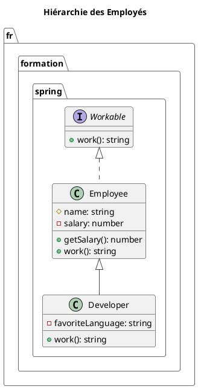

# Module 3 : L'essentiel - TypeScript, un Terrain Connu pour les dev Java

### Objectifs pédagogiques

À la fin de ce chapitre, vous serez capable de :

* **Comprendre** ce qu'est TypeScript et pourquoi il constitue un avantage majeur pour un développeur Java.
* **Utiliser** la syntaxe de base de TypeScript pour déclarer des variables et utiliser les types primitifs.
* **Mettre en œuvre** des concepts de programmation orientée objet (classes, interfaces, héritage) avec une syntaxe très
  familière.
* **Comparer** les Décorateurs TypeScript (`@`) avec les Annotations Java pour comprendre leur rôle commun.

### Introduction : Apprivoiser JavaScript avec la rigueur de Java

Vous entrez dans le monde du front-end et vous avez peut-être entendu des histoires sur JavaScript : un langage
dynamique, flexible, parfois un peu trop... où une variable peut être un nombre, puis une chaîne de caractères, puis un
objet, menant à des erreurs difficiles à traquer.

Si cette idée vous inquiète, j'ai une excellente nouvelle : vous n'allez pas écrire du JavaScript pur. Vous allez
utiliser **TypeScript**.

Imaginez que vous preniez toute la puissance et la flexibilité de JavaScript, mais que vous y ajoutiez un gilet de
sécurité, une boîte à outils complète et un plan de construction détaillé. Ce plan, c'est le **typage statique**, celui
que vous connaissez et appréciez en Java. TypeScript est ce langage : un "sur-ensemble" de JavaScript qui apporte la
rigueur et la sécurité dont vous avez l'habitude. Ce module va vous montrer à quel point vous êtes déjà chez vous.

### 1. Introduction à TypeScript

TypeScript (ou TS) est un langage open-source développé par Microsoft. Sa caractéristique principale est simple : **il
ajoute un système de typage statique optionnel à JavaScript.**

* **Un sur-ensemble (superset) :** Tout code JavaScript valide est déjà du code TypeScript valide. Vous pouvez prendre
  un fichier `.js`, le renommer en `.ts` et il fonctionnera.
* **La transpilation :** Le navigateur ne comprend pas TypeScript. Votre code TS est donc "transpilé" (un type de
  compilation) en code JavaScript standard que n'importe quel navigateur peut exécuter. L'Angular CLI s'occupe de ce
  processus pour vous automatiquement.

Pourquoi est-ce un avantage énorme pour vous ?

* **Détection d'erreurs en amont :** Les erreurs de type (ex: essayer d'utiliser une méthode de chaîne de caractères sur
  un nombre) sont détectées à la compilation, pas à l'exécution chez l'utilisateur.
* **Auto-complétion intelligente :** Votre IDE connaît le type de vos variables, il peut donc vous proposer les bonnes
  méthodes et propriétés.
* **Code plus lisible et maintenable :** Le type d'une variable ou le retour d'une fonction agit comme une
  auto-documentation.

### 2. Syntaxe de Base : Reprendre ses Marques

La syntaxe de base est très proche de Java, avec quelques spécificités.

#### Variables : `let` et `const`

En JavaScript moderne (et donc en TypeScript), on oublie `var`. On utilise `let` et `const`.

* `let` : Pour les variables dont la valeur peut changer. C'est l'équivalent de `String nom = "Jean";`.
* `const` : Pour les constantes, dont la valeur ne sera jamais réassignée. C'est l'équivalent de
  `final String PRENOM = "Paul";`.

```typescript
// Déclaration d'une variable avec son type
let age: number = 30;
age = 31; // OK

// Déclaration d'une constante
const birthDate: string = "1993-05-10";
// birthDate = "2000-01-01"; // Erreur ! Impossible de réassigner une constante.
```

#### Types de base

Les types primitifs sont en minuscules :

* `string` : Chaîne de caractères.
* `number` : Tout type de nombre (entier, flottant...). Pas de `int`, `double`, `float`.
* `boolean` : `true` ou `false`.
* `any` : Le type "joker". Une variable de type `any` peut contenir n'importe quoi. C'est une porte de sortie vers le
  monde JavaScript, mais **à utiliser avec une extrême prudence !**
* `void` : Pour les fonctions qui ne retournent rien, comme en Java.

#### Tableaux et Tuples

```typescript
// Un tableau de chaînes de caractères. Très similaire à Java.
let names: string[] = ["Alice", "Bob", "Charlie"];

// Une autre syntaxe qui rappelle les génériques Java (List<String>)
let userIds: Array<number> = [101, 102, 103];

// Un tuple : un tableau de taille fixe avec des types définis par position
let userRecord: [number, string, boolean];
userRecord = [1, "John Doe", true]; // OK
// userRecord = ["Jane Doe", 2, false]; // Erreur de type et d'ordre
```

### 3. Concepts Orientés Objet : Vous êtes en Terrain Connu !

C'est ici que TypeScript va vraiment vous séduire. La syntaxe est incroyablement proche de celle de Java.

#### Classes, Constructeurs et Modificateurs d'accès

```typescript
// Fichier : user.model.ts
// package fr.formation.spring.models;

export class User {
    // Propriétés déclarées comme en Java
    private id: number;
    public name: string;
    protected email: string;

    // Le constructeur
    constructor(id: number, name: string, email: string) {
        this.id = id;
        this.name = name;
        this.email = email;
    }

    // Une méthode
    public getInfo(): string {
        return `ID: ${this.id}, Name: ${this.name}`;
    }
}

// Utilisation de la classe
const user = new User(1, 'Jane Doe', 'jane.doe@email.com');
console.log(user.name); // OK
// console.log(user.id); // Erreur: 'id' is private.
```

<tip title="Le raccourci TypeScript">
TypeScript offre une syntaxe concise pour déclarer les propriétés directement dans le constructeur. Le code ci-dessus peut être simplifié ainsi :

```typescript
export class User {
    // Plus besoin de déclarer les propriétés ici !

    // En ajoutant les modificateurs d'accès (public, private, etc.)
    // aux paramètres du constructeur, TypeScript crée automatiquement
    // les propriétés correspondantes et les assigne.
    constructor(
        private id: number,
        public name: string,
        protected email: string
    ) {
    }

    public getInfo(): string {
        return `ID: ${this.id}, Name: ${this.name}`;
    }
}
```

C'est un gain de temps considérable que vous apprendrez à apprécier !
</tip>

#### Interfaces : Le Contrat, comme en Java

Une interface en TypeScript, tout comme en Java, définit un contrat qu'une classe doit respecter.

```typescript
// Fichier : printable.interface.ts
// package fr.formation.spring.interfaces;

export interface Printable {
    // Une méthode que les classes devront implémenter
    print(): void;
}

// Une classe qui implémente l'interface
export class Report implements Printable {
    constructor(private content: string) {
    }

    public print(): void {
        console.log("--- Printing Report ---");
        console.log(this.content);
    }
}
```

#### Décorateurs (`@...`) : L'Analogie Parfaite avec les Annotations

C'est peut-être le concept le plus important à saisir pour un développeur Spring. **Les décorateurs en TypeScript sont
l'équivalent direct des annotations en Java.**

Un décorateur est une fonction spéciale, préfixée par `@`, qui permet d'ajouter des métadonnées ou de modifier le
comportement d'une classe, d'une méthode ou d'une propriété.

Regardez cette comparaison frappante :

| **Spring (Java)**            | **Angular (TypeScript)**        | **Objectif commun**                                     |
|------------------------------|---------------------------------|---------------------------------------------------------|
| `@Component` <br> `@Service` | `@Component` <br> `@Injectable` | Déclarer une classe comme étant gérée par le framework. |
| `@Autowired`                 | Injection via le `constructor`  | Demander au framework d'injecter une dépendance.        |
| `@GetMapping("/{id}")`       | `@Input()`                      | Lier une valeur externe à une variable.                 |

Quand vous verrez `@Component({...})` en Angular, pensez immédiatement : "Ok, c'est comme `@Component` en Spring.
J'indique au framework qu'il s'agit d'une brique spéciale avec des métadonnées."

```typescript
// Un exemple de composant Angular que nous verrons en détail
import {Component} from '@angular/core';

@Component({ // <-- C'est un décorateur !
    selector: 'app-root',
    standalone: true,
    template: `<h1>Hello World</h1>`
})
export class AppComponent {
    // ...
}
```

### Exercice pratique

#### Exercice 1 : Modélisation Orientée Objet

Votre mission est de modéliser une hiérarchie d'employés pour une application de gestion des ressources humaines.

1. Créez une interface `Workable` avec une seule méthode `work()` qui retourne une chaîne de caractères (`string`).
2. Créez une classe de base `Employee` qui implémente l'interface `Workable`. Elle doit avoir :
    * Une propriété `protected` `name` (string).
    * Une propriété `private` `salary` (number).
    * Un constructeur pour initialiser ces propriétés.
    * Une implémentation de la méthode `work()` qui retourne `"Je fais un travail générique."`.
    * Une méthode publique `getSalary()` qui retourne le salaire.
3. Créez une classe `Developer` qui hérite de `Employee`.
    * Elle doit avoir une propriété `private` supplémentaire `favoriteLanguage` (string).
    * Son constructeur doit appeler celui de la classe mère (`super`).
    * Elle doit **surcharger** (`override`) la méthode `work()` pour qu'elle retourne `"J'écris du code en {langage}."`.
4. Instanciez un `Developer` et appelez ses méthodes pour vérifier que tout fonctionne.

#### Correction exercice 1 {collapsible='true'}

Voici une solution complète pour cet exercice.

```typescript
// package fr.formation.spring;

// 1. Interface
interface Workable {
    work(): string;
}

// 2. Classe de base
class Employee implements Workable {
    // Utilisons le raccourci TypeScript pour la clarté
    constructor(
        protected name: string,
        private salary: number
    ) {
    }

    public work(): string {
        return "Je fais un travail générique.";
    }

    public getSalary(): number {
        return this.salary;
    }
}

// 3. Classe dérivée
class Developer extends Employee {
    // Pas besoin de redéclarer 'name' ou 'salary'
    constructor(
        name: string, // Doit être passé au constructeur parent
        salary: number, // Doit être passé au constructeur parent
        private favoriteLanguage: string
    ) {
        // Appel du constructeur de la classe mère (Employee)
        super(name, salary);
    }

    // Surcharge de la méthode work()
    public override work(): string {
        // On peut même appeler la méthode du parent si besoin:
        // const parentWork = super.work(); 
        return `J'écris du code en ${this.favoriteLanguage}.`;
    }
}

// 4. Instanciation et test
const dev = new Developer("Alice", 90000, "TypeScript");

console.log(dev.name); // Affiche "Alice" (possible car on est dans le même "scope", mais 'protected' limite l'accès)
console.log(`Salaire: ${dev.getSalary()}`); // Affiche "Salaire: 90000"
console.log(dev.work()); // Affiche "J'écris du code en TypeScript."
// console.log(dev.favoriteLanguage); // Erreur: la propriété est privée
```



### Auto-évaluation

1. **(Question ouverte)** Quel est, selon vous, le principal bénéfice de TypeScript par rapport à JavaScript pour un
   développeur venant de l'écosystème Java ?
2. **(QCM)** Comment déclarez-vous une constante en TypeScript dont la valeur ne peut pas être réassignée ?
   a) `let PI = 3.14;`
   b) `var PI = 3.14;`
   c) `final PI = 3.14;`
   d) `const PI = 3.14;`
3. **(QCM)** Quelle est la manière la plus concise et idiomatique en TypeScript de déclarer une propriété de classe et
   de l'initialiser via le constructeur ?
   a) Déclarer la propriété dans la classe, puis l'assigner dans le constructeur avec `this.prop = prop;`.
   b) Utiliser un modificateur d'accès (`public`, `private`...) sur le paramètre du constructeur.
   c) Ne pas utiliser de constructeur et assigner la propriété directement.
   d) Utiliser une méthode `init()`.
4. **(Question ouverte)** Expliquez le rôle d'une interface en TypeScript et donnez un exemple de cas où vous en
   utiliseriez une.
5. **(QCM)** Quel concept en Java est l'analogue le plus direct d'un Décorateur (`@Component`, `@Injectable`) en
   TypeScript/Angular ?
   a) Une classe abstraite
   b) Une interface
   c) Une annotation (`@Service`, `@Controller`)
   d) Un `enum`

### Conclusion de cette partie

Félicitations ! Vous venez de faire un grand pas en démystifiant TypeScript. Vous avez vu que loin d'être un langage
exotique, il reprend des concepts qui vous sont chers : le **typage fort**, les **classes**, l'**héritage** et les *
*interfaces**. Vous avez même découvert son "arme secrète" : une syntaxe orientée objet concise et puissante.

Plus important encore, vous avez établi le parallèle fondamental entre les **Décorateurs** et les **Annotations**, une
clé de compréhension qui vous servira tout au long de votre apprentissage d'Angular.

Maintenant que vous maîtrisez le langage, vous êtes prêt à construire la pièce maîtresse d'une application Angular : le
**Composant**. Dans le prochain module, nous allons assembler tout ce que nous avons appris pour créer nos premières
briques d'interface utilisateur.