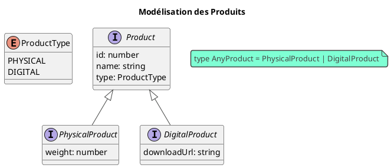

# Module 3 : Pour aller plus loin - La Puissance du Système de Types de TypeScript

### Objectifs pédagogiques

À la fin de cette partie, vous serez en mesure de :

* **Utiliser** les génériques (`<T>`) pour créer des fonctions et des classes réutilisables et typées.
* **Définir** et utiliser des types personnalisés avec les `enum`, les types unions (`|`) et les alias de type (`type`).
* **Mettre en œuvre** des "gardes de type" (type guards) pour travailler de manière sûre avec des types unions.
* **Exploiter** les "Utility Types" de TypeScript (`Partial`, `Readonly`) pour manipuler des types existants.

### Introduction : Au-delà des bases, la boîte à outils du maître artisan

Vous maîtrisez maintenant les outils de base de TypeScript, ceux qui ressemblent à votre atelier Java. Mais un maître
artisan ne se contente pas d'un marteau et d'un tournevis. Il possède des outils spécialisés, précis, qui lui permettent
de réaliser des pièces d'une complexité et d'une finesse supérieures.

Cette section vous ouvre les portes de cet atelier d'expert. Nous allons découvrir des fonctionnalités propres à
TypeScript qui vont vous permettre de modéliser des situations complexes de manière élégante et sûre. Les génériques
vous sembleront familiers, mais les types unions et les "utility types" vont vous ouvrir de nouvelles perspectives pour
écrire un code non seulement robuste, mais aussi incroyablement expressif. C'est ici que l'on passe de "faire
fonctionner" à "bien concevoir".

### 1. Les Génériques (`<T>`) : Un Air de Famille

Tout comme en Java, les génériques vous permettent d'écrire du code qui fonctionne avec une variété de types, tout en
conservant la sécurité de typage. Si vous avez déjà écrit `List<String>` en Java, vous êtes en terrain connu.

Imaginez une fonction qui récupère le premier élément d'un tableau. Sans générique, on pourrait utiliser `any`, mais on
perdrait toute information de type.

```typescript
// Mauvaise approche : on perd le type
function getFirstElementAny(arr: any[]): any {
    return arr[0];
}

// Bonne approche : avec les génériques
function getFirstElement<T>(arr: T[]): T | undefined {
    return arr[0];
}

// Utilisation
const numbers = [1, 2, 3];
const firstNumber = getFirstElement(numbers); // TypeScript sait que firstNumber est de type `number | undefined`

const strings = ["a", "b", "c"];
const firstString = getFirstElement(strings); // TypeScript sait que firstString est de type `string | undefined`
```

### 2. Énumérations (`enum`)

Comme en Java, les `enum` permettent de définir un ensemble de constantes nommées. C'est très utile pour des statuts,
des rôles, ou des catégories.

```typescript
// Fichier: order-status.enum.ts
// package fr.formation.spring.enums;

export enum OrderStatus {
    PENDING,    // Vaut 0 par défaut
    PROCESSING, // Vaut 1
    SHIPPED,    // Vaut 2
    DELIVERED,  // Vaut 3
    CANCELED    // Vaut 4
}

// On peut aussi assigner des valeurs (chaînes de caractères, c'est souvent plus lisible)
export enum UserRole {
    ADMIN = 'ADMIN',
    USER = 'USER',
    GUEST = 'GUEST'
}

// Utilisation
let myOrderStatus: OrderStatus = OrderStatus.PROCESSING;
let myRole: UserRole = UserRole.ADMIN;

console.log(myOrderStatus); // Affiche 1
console.log(myRole);      // Affiche "ADMIN"
```

### 3. Types Unions (`|`) et Alias de Type (`type`)

C'est une des fonctionnalités les plus puissantes de TypeScript. Un type union permet de déclarer qu'une variable peut
être de **plusieurs types différents**.

Imaginez une API REST qui retourne un ID utilisateur. Parfois, c'est un nombre (`123`), parfois c'est une chaîne de
caractères (un UUID comme `"abc-123"`). Comment modéliser cela en toute sécurité ?

Avec un **alias de type** (`type`), on peut donner un nom à cette union pour la réutiliser.

```typescript
// Fichier: api-types.d.ts
// package fr.formation.spring.types;

// Un alias de type pour notre ID polymorphe
export type UserId = string | number;

// Une interface qui utilise notre alias de type
export interface Product {
    id: UserId;
    name: string;
    price: number;
}

let productA: Product = {id: 101, name: "Livre", price: 15}; // OK
let productB: Product = {id: "a7b3c", name: "Stylo", price: 2}; // OK
// let productC: Product = { id: true, name: "Gomme", price: 1 }; // Erreur! boolean n'est ni string ni number
```

### 4. Gardes de Type (Type Guards) : Travailler avec les Unions

Très bien, nous avons une variable `id` qui peut être `string | number`. Mais comment savoir quelle opération effectuer
dessus ? On ne peut pas appeler une méthode de `string` (comme `toUpperCase()`) si la valeur est un `number`.

C'est là qu'interviennent les **gardes de type**. Ce sont des vérifications qui permettent à TypeScript de "réduire" le
type à l'intérieur d'un bloc `if`.

```typescript
function processUserId(id: UserId) {
    // Ici, 'id' est de type 'string | number'

    if (typeof id === "string") {
        // A l'intérieur de ce bloc, TypeScript est assez intelligent pour savoir
        // que 'id' est FORCEMENT un 'string'.
        console.log(id.toUpperCase());
    } else {
        // Et ici, il sait que c'est un 'number'.
        console.log(id.toFixed(2));
    }
}

processUserId("abc-123"); // Affiche "ABC-123"
processUserId(42);        // Affiche "42.00"
```

Pour les objets plus complexes, on utilise `instanceof` de la même manière.

### 5. Les "Utility Types" : Vos Assistants Personnels

TypeScript fournit des types utilitaires qui permettent de créer de nouveaux types à partir de types existants. C'est
extrêmement pratique.

#### `Partial<T>`

Rend toutes les propriétés d'un type `T` optionnelles. C'est parfait pour les formulaires de mise à jour, où
l'utilisateur ne modifie que certains champs.

```typescript
interface User {
    id: number;
    name: string;
    email: string;
}

// Cette fonction met à jour un utilisateur.
// L'utilisateur peut envoyer uniquement le nom, ou l'email, ou les deux.
function updateUser(id: number, data: Partial<User>): User {
    // data.id, data.name, data.email sont tous optionnels ici.
    // ... logique de mise à jour
    const updatedUser = {id: 1, name: 'new name', email: 'email@email.com'}; // exemple
    return updatedUser;
}

// On peut appeler la fonction avec un objet partiel
updateUser(1, {name: "Nouveau Nom"});
```

#### `Readonly<T>`

Rend toutes les propriétés d'un type `T` en lecture seule. Idéal pour les objets de configuration ou pour s'initier à la
programmation immuable.

```typescript
const config: Readonly<User> = {
    id: 0,
    name: 'admin',
    email: 'admin@system.com'
};

// config.name = "root"; // Erreur ! Impossible d'assigner à 'name' car c'est une propriété en lecture seule.
```

Il en existe beaucoup d'autres (`Pick`, `Omit`, `Required`...) que vous découvrirez au fil de vos besoins.

### Exercice pratique

#### Exercice 2 : Système de Commande Avancé

Vous devez modéliser un système de commande qui gère des produits physiques et numériques.

1. Créez un `enum` `ProductType` avec les valeurs `PHYSICAL` et `DIGITAL`.
2. Créez une interface de base `Product` avec `id` (`number`), `name` (`string`) et `type` (`ProductType`).
3. Créez deux interfaces qui étendent `Product` :
    * `PhysicalProduct` avec une propriété `weight` (`number`).
    * `DigitalProduct` avec une propriété `downloadUrl` (`string`).
4. Créez un alias de type `AnyProduct` qui est une union de `PhysicalProduct` et `DigitalProduct`.
5. Écrivez une fonction `getShippingInfo(product: AnyProduct): string`. Cette fonction doit :
    * Utiliser une garde de type pour vérifier si le produit est `PHYSICAL` ou `DIGITAL`.
    * Si c'est un produit physique, retourner `"Expédition du produit pesant {poids} kg."`.
    * Si c'est un produit numérique, retourner `"Lien de téléchargement : {url}"`.

#### Correction exercice 2 {collapsible='true'}

```typescript
// package fr.formation.spring;

// 1. Enum
enum ProductType {
    PHYSICAL = 'PHYSICAL',
    DIGITAL = 'DIGITAL',
}

// 2. Interface de base
interface Product {
    id: number;
    name: string;
    type: ProductType;
}

// 3. Interfaces étendues
interface PhysicalProduct extends Product {
    type: ProductType.PHYSICAL; // On restreint le type ici pour la garde
    weight: number;
}

interface DigitalProduct extends Product {
    type: ProductType.DIGITAL; // Idem
    downloadUrl: string;
}

// 4. Alias de type
type AnyProduct = PhysicalProduct | DigitalProduct;

// 5. Fonction avec garde de type
function getShippingInfo(product: AnyProduct): string {
    // On utilise le champ "type" comme discriminant pour notre garde de type.
    // C'est un pattern très courant et robuste en TypeScript.
    switch (product.type) {
        case ProductType.PHYSICAL:
            // TypeScript sait ici que 'product' est de type PhysicalProduct
            return `Expédition du produit pesant ${product.weight} kg.`;

        case ProductType.DIGITAL:
            // TypeScript sait ici que 'product' est de type DigitalProduct
            return `Lien de téléchargement : ${product.downloadUrl}`;

        default:
            // Pour la robustesse, au cas où de nouveaux types seraient ajoutés
            const _exhaustiveCheck: never = product;
            return "Type de produit inconnu";
    }
}

// Test
const book: PhysicalProduct = {
    id: 1,
    name: "Le Guide d'Angular",
    type: ProductType.PHYSICAL,
    weight: 1.2
};

const ebook: DigitalProduct = {
    id: 2,
    name: "Le Guide de TypeScript",
    type: ProductType.DIGITAL,
    downloadUrl: "https://monsite.com/ebook.pdf"
};

console.log(getShippingInfo(book));
console.log(getShippingInfo(ebook));
```



### Auto-évaluation

1. **(QCM)** Vous avez une variable `data` qui peut être soit un `User` soit `null`. Comment typeriez-vous cette
   variable ?
   a) `let data: User;`
   b) `let data: any;`
   c) `let data: User | null;`
   d) `let data: Partial<User>;`
2. **(Question ouverte)** Expliquez la différence entre le type `any` et le type `unknown`. Pourquoi `unknown` est-il
   considéré comme plus sûr ?
3. **(QCM)** Vous voulez créer une fonction générique `wrapInObject` qui prend une valeur de n'importe quel type et la
   retourne dans un objet `{ value: T }`. Quelle est la bonne signature ?
   a) `function wrapInObject(val: any): { value: any }`
   b) `function wrapInObject<T>(val: T): { value: T }`
   c) `function wrapInObject<T>(val: any): { value: T }`
   d) `function wrapInObject(val: T): { value: T }`
4. **(Question ouverte)** Donnez un cas d'utilisation concret pour le "Utility Type" `Partial<T>` dans une application
   Angular.
5. **(QCM)** Dans une fonction qui accepte un paramètre de type `string | number`, quelle est la garde de type la plus
   appropriée pour différencier les deux cas ?
   a) `if (param instanceof string)`
   b) `if (param.toUpperCase)`
   c) `if (typeof param === "string")`
   d) `if (param.length)`

### Conclusion de ce chapitre

Félicitations, vous avez exploré les recoins les plus puissants et les plus utiles du système de types de TypeScript !
Vous savez désormais comment créer du code flexible et réutilisable avec les **génériques**, et comment modéliser des
données complexes et du monde réel grâce aux **enums**, aux **unions** et aux **alias de type**. Vous avez également
appris à manipuler ces types en toute sécurité avec les **gardes de type**.

Ces outils ne sont pas des gadgets. Ils sont au cœur de l'écriture d'applications Angular modernes, propres et robustes.
Cette maîtrise du typage avancé va vous permettre de comprendre en profondeur le code d'Angular lui-même et d'écrire des
composants et des services beaucoup plus fiables.

Vous êtes maintenant parfaitement équipé sur le plan du langage. Il est temps de mettre tout cela en pratique et de
construire la véritable unité de base de toute application Angular : le **Composant**. Le prochain module est au cœur de
l'action 