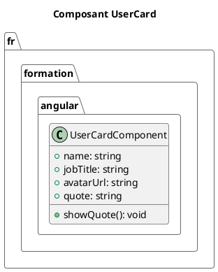

# Module 4 : L'essentiel - Le Cœur d'Angular, les Composants

### Objectifs pédagogiques

À la fin de ce chapitre, vous serez capable de :

* **Décrire** l'anatomie d'un composant Angular Standalone (ses fichiers et son décorateur).
* **Afficher** des données dynamiques de votre logique dans le template HTML grâce à l'interpolation.
* **Maîtriser** le data binding pour lier la logique et la vue :
    * Le "Property Binding" (`[]`) pour passer des données au DOM.
    * L'"Event Binding" (`()`) pour réagir aux actions de l'utilisateur.
    * Le "Two-Way Binding" (`[()]`) pour synchroniser les données, notamment dans les formulaires.
* **Créer** et **utiliser** votre premier composant fonctionnel.

### Introduction : La Brique Élémentaire de votre Application

Jusqu'à présent, nous avons été des architectes et des ingénieurs en matériaux : nous avons défini des plans
d'architecture et étudié notre matériau principal, TypeScript. Il est maintenant temps de devenir des bâtisseurs. La
brique fondamentale, l'unité de base de toute construction Angular, s'appelle le **Composant**.

Une application Angular n'est rien de plus qu'un arbre de composants qui s'emboîtent les uns dans les autres. Un
composant pour l'en-tête, un pour le menu, un pour la liste d'articles, un pour chaque article de la liste... Vous allez
voir que cette approche est incroyablement intuitive. Chaque composant est une petite unité autonome et réutilisable,
avec sa propre logique, sa propre vue et son propre style.

Ce module est le plus important de tous. Une fois que vous aurez compris comment fonctionne un composant, vous aurez
compris 80% de la philosophie d'Angular.

### 1. Anatomie d'un Composant Standalone

Quand vous avez généré le `HeaderComponent` dans le module 2, l'Angular CLI a créé plusieurs fichiers pour vous. Chaque
composant est une combinaison de ces trois fichiers principaux, liés par un décorateur.

* **Le fichier `.ts` (La Logique) :** C'est le cerveau du composant. Il s'agit d'une classe TypeScript qui contient les
  données (les propriétés) et le comportement (les méthodes).
    * **Analogie Java :** C'est votre **`@Controller`** ou votre **`Bean` Spring**. C'est là que réside la logique.

* **Le fichier `.html` (La Vue) :** C'est le visage du composant. Il s'agit d'un template HTML qui définit la structure
  de ce que l'utilisateur verra.
    * **Analogie Java :** C'est votre fichier **`Thymeleaf`** ou **`JSP`**. C'est la couche de présentation.

* **Le fichier `.css` (Le Style) :** C'est l'habillage du composant. Les styles définis dans ce fichier sont *
  *encapsulés**, c'est-à-dire qu'ils ne s'appliquent qu'à ce composant spécifique et ne "déborderont" pas sur le reste
  de l'application.

Et qu'est-ce qui lie tout cela ensemble ? Le décorateur `@Component`.

```typescript
// Fichier : src/app/some-component/some.component.ts

import {Component} from '@angular/core';

@Component({ // Le décorateur qui définit les métadonnées
    selector: 'app-some', // Le nom de la balise HTML pour utiliser ce composant: <app-some></app-some>
    standalone: true, // Indique que c'est un composant autonome
    imports: [], // Liste les autres composants/modules qu'il utilise
    templateUrl: './some.component.html', // Le lien vers le fichier de la vue
    styleUrl: './some.component.css' // Le lien vers le fichier de style
})
export class SomeComponent {
    // C'est ici que l'on écrit la logique
    // Propriétés et méthodes
}
```

### 2. Le Template et l'Interpolation `{{ }}`

La première chose que l'on veut faire, c'est afficher une donnée de notre classe TypeScript dans notre HTML. C'est ce
qu'on appelle l'interpolation. La syntaxe est simple : les doubles accolades `{{ }}`.

Voyons cela dans notre `AppComponent`.

```typescript
// Fichier : src/app/app.component.ts

import {Component} from '@angular/core';

// ... autres imports

@Component({ /* ... */})
export class AppComponent {
    // Une propriété dans notre classe
    public appTitle: string = 'Gestionnaire de Projets';
    private currentYear: number = 2024;

    // Une méthode
    public getFooterText(): string {
        return `© ${this.currentYear} - Tous droits réservés`;
    }
}
```

```html
<!-- Fichier : src/app/app.component.html -->

<!-- On affiche la valeur de la propriété 'appTitle' -->
<h1>Bienvenue sur {{ appTitle }} !</h1>

<!-- On peut aussi appeler une méthode qui retourne une valeur -->
<footer>{{ getFooterText() }}</footer>
```

C'est simple, direct et très lisible. Le pont entre votre logique et votre vue est créé !

### 3. Data Binding : Lier la Vue et la Logique

L'interpolation est super, mais limitée. Le data binding nous donne un contrôle total sur la communication entre le
template et la classe. Il y a trois directions principales de communication.

#### A. Property Binding `[property]="data"` : De la classe vers la vue

Le "Property Binding" vous permet de contrôler un attribut d'un élément HTML (comme `src`, `href`, `disabled`,
`class`...) avec une propriété de votre composant. La syntaxe utilise des crochets `[]`.

**Pensez aux `[]` comme un flux de données qui *entre* dans l'élément HTML.**

Imaginez que nous voulons afficher une image et désactiver un bouton dynamiquement.

```typescript
// Fichier : src/app/app.component.ts
export class AppComponent {
    public logoUrl: string = 'assets/images/angular-logo.png';
    public isButtonDisabled: boolean = true;
}
```

```html
<!-- Fichier : src/app/app.component.html -->

<!-- La propriété 'src' de l'image est liée à 'logoUrl' -->


<!-- La propriété 'disabled' du bouton est liée à 'isButtonDisabled' -->
<button [disabled]="isButtonDisabled">Cliquez ici (si vous pouvez)</button>
```

#### B. Event Binding `(event)="handler()"` : De la vue vers la classe

L'"Event Binding" vous permet de déclencher une méthode de votre composant lorsqu'un événement se produit sur un élément
HTML (un clic `(click)`, une soumission de formulaire `(ngSubmit)`, un passage de souris `(mouseover)`...). La syntaxe
utilise des parenthèses `()`.

**Pensez aux `()` comme un événement qui *sort* de l'élément HTML pour appeler votre code.**

Créons un compteur simple.

```typescript
// Fichier : src/app/app.component.ts
export class AppComponent {
    public counter: number = 0;

    public incrementCounter(): void {
        this.counter++;
        console.log(`Le compteur est maintenant à : ${this.counter}`);
    }
}
```

```html
<!-- Fichier : src/app/app.component.html -->

<h2>Compteur : {{ counter }}</h2>

<!-- Quand l'utilisateur clique sur le bouton, on appelle la méthode 'incrementCounter' -->
<button (click)="incrementCounter()">Incrémenter</button>
```

#### C. Two-Way Binding `[(ngModel)]="data"` : La synchronisation parfaite

Et si on voulait faire les deux en même temps ? Par exemple, avec un champ de saisie (`<input>`) :

1. Afficher une valeur initiale depuis la classe dans l'input (`[]`).
2. Mettre à jour la propriété de la classe dès que l'utilisateur tape dans l'input (`()`).

C'est le "Two-Way Binding". Angular fournit une directive spéciale pour cela, `ngModel`, dont la syntaxe combine les
deux précédentes : `[()]`. On l'appelle souvent *"banana in a box"* pour s'en souvenir.

<warning title="Prérequis pour ngModel">
Pour utiliser `[(ngModel)]`, vous devez importer le `FormsModule` dans votre composant (ou dans `app.config.ts` pour qu'il soit disponible partout). C'est une étape que l'on oublie souvent au début !

Dans `app.component.ts` : `imports: [..., FormsModule]`
Et n'oubliez pas d'importer `FormsModule` depuis `@angular/forms`.
</warning>

```typescript
// Fichier : src/app/app.component.ts
import {FormsModule} from '@angular/forms'; // N'oubliez pas l'import !

@Component({
    // ...
    imports: [..., FormsModule] // Et de l'ajouter ici !
})

export class AppComponent {
    public username: string = "John Doe";
}
```

```html
<!-- Fichier : src/app/app.component.html -->

<!-- Champ de saisie avec Two-Way Binding -->
<input [(ngModel)]="username" type="text">

<!-- Ce paragraphe se mettra à jour en temps réel quand vous tapez ! -->
<p>Bonjour, {{ username }} !</p>
```

### Exercice pratique

#### Exercice 1 : Créer une Carte Utilisateur

Créez un nouveau composant `UserCardComponent`. Ce composant devra afficher les informations d'un utilisateur et
permettre une interaction simple.

1. Générez un nouveau composant `user-card` avec l'Angular CLI.
2. Dans la classe `UserCardComponent` (`.ts`), créez les propriétés suivantes :
    * `name` (string) : "Jeanne Martin"
    * `jobTitle` (string) : "Développeuse Full-Stack"
    * `avatarUrl` (string) : `https://i.pravatar.cc/150` (un service qui génère des avatars aléatoires)
    * `quote` (string) : "" (une chaîne vide pour l'instant)
3. Dans le template (`.html`) du composant :
    * Affichez l'image de l'avatar en utilisant le **Property Binding** sur l'attribut `src`.
    * Affichez le nom et le poste en utilisant l'**Interpolation**.
    * Ajoutez un champ de saisie (`<input>`) pour que l'utilisateur puisse taper une citation. Utilisez le **Two-Way
      Binding** avec `ngModel` sur la propriété `quote`.
    * Ajoutez un bouton "Afficher la citation".
    * Quand on clique sur ce bouton, une méthode dans le composant doit afficher la valeur de `quote` dans une alerte (
      `alert()`). Utilisez l'**Event Binding**.
4. Enfin, affichez votre nouveau composant `<app-user-card>` dans le template de `AppComponent` (`app.component.html`).

#### Correction exercice 1 {collapsible='true'}

1. **Génération du composant :**
   Dans votre terminal, à la racine du projet :
   ```bash
   ng generate component user-card
   ```

2. **Logique du composant (`user-card.component.ts`) :**

   ```typescript
   // Fichier: src/app/user-card/user-card.component.ts
   import { Component } from '@angular/core';
   import { CommonModule } from '@angular/common';
   import { FormsModule } from '@angular/forms'; // Important pour ngModel !

   @Component({
     selector: 'app-user-card',
     standalone: true,
     imports: [CommonModule, FormsModule], // Ne pas oublier FormsModule
     templateUrl: './user-card.component.html',
     styleUrl: './user-card.component.css'
   })
   export class UserCardComponent {
     // Propriétés de l'utilisateur
     public name: string = "Jeanne Martin";
     public jobTitle: string = "Développeuse Full-Stack";
     public avatarUrl: string = 'https://i.pravatar.cc/150';
     
     // Propriété pour le Two-Way Binding
     public quote: string = "";

     // Méthode appelée par l'Event Binding
     public showQuote(): void {
       if (this.quote) {
         alert(this.quote);
       } else {
         alert("Veuillez entrer une citation !");
       }
     }
   }
   ```

3. **Vue du composant (`user-card.component.html`) :**

   ```html
   <!-- Fichier: src/app/user-card/user-card.component.html -->
   <div class="user-card">
     <!-- Property Binding pour l'image -->
     
     
     <div class="user-info">
       <!-- Interpolation pour le texte -->
       <h2>{{ name }}</h2>
       <p>{{ jobTitle }}</p>
       
       <!-- Two-Way Binding pour le champ de saisie -->
       <input 
         type="text" 
         [(ngModel)]="quote" 
         placeholder="Entrez votre citation favorite...">
       
       <!-- Event Binding pour le bouton -->
       <button (click)="showQuote()">Afficher la citation</button>
     </div>
   </div>
   ```

4. **Affichage dans `AppComponent` (`app.component.html`) :**

   N'oubliez pas d'importer `UserCardComponent` dans `app.component.ts` !

   ```typescript
   // Fichier: src/app/app.component.ts
   // ...
   import { UserCardComponent } from './user-card/user-card.component';
   
   @Component({
     // ...
     imports: [..., UserCardComponent], // Ajoutez-le ici
     // ...
   })
   export class AppComponent { /* ... */ }
   ```

   ```html
   <!-- Fichier: src/app/app.component.html -->
   <main>
     <h1>Mon Application</h1>
     <app-user-card></app-user-card>
   </main>
   <router-outlet></router-outlet>
   ```



### Auto-évaluation

1. **(Question ouverte)** Quelle est la différence fondamentale entre l'interpolation `{{ }}` et le property binding
   `[]` ? Quand utiliseriez-vous l'un plutôt que l'autre ?

2. **(QCM)** Vous voulez appeler une méthode `saveData()` de votre composant quand un formulaire est soumis. Quelle est
   la syntaxe correcte ?

   a) `<form [submit]="saveData()">`

   b) `<form (ngSubmit)="saveData()">`

   c) `<form [(submit)]="saveData()">`

   d) `<form>{{ saveData() }}</form>`

3. **(QCM)** Quel `import` est nécessaire dans votre composant ou votre configuration pour utiliser `[(ngModel)]` ?

   a) `CommonModule`

   b) `HttpClientModule`

   c) `RouterModule`

   d) `FormsModule`

4. **(Question ouverte)** Expliquez ce que signifie "l'encapsulation de style" pour un composant Angular.

5. **(QCM)** Si le décorateur d'un composant contient `selector: 'app-login-form'`, comment l'utiliseriez-vous dans un
   autre template ?

   a) `[app-login-form]`

   b) `(app-login-form)`

   c) `<app-login-form></app-login-form>`

   d) `{{ app-login-form }}`

### Conclusion de cette partie

Un immense bravo ! Vous venez de maîtriser le concept le plus fondamental d'Angular. Vous savez maintenant créer des *
*composants autonomes**, leur donner une **logique** et une **vue**, et surtout, faire communiquer ces deux mondes de
manière fluide et puissante grâce au **Data Binding**.

Vous avez appris à :

- **Pousser** des données dans la vue avec `{{ }}` et `[]`.
- **Écouter** les événements de la vue avec `()`.
- **Synchroniser** les données avec `[()]`.

C'est une compétence absolument centrale. Dans le prochain module, nous allons nous appuyer sur ces connaissances pour
apprendre à manipuler la structure même de notre HTML : comment afficher des éléments sous condition, comment répéter un
composant pour chaque élément d'une liste, et comment transformer l'affichage de nos données directement dans la vue.
Préparez-vous à découvrir les Directives et les Pipes 