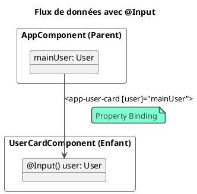

# Module 4 : Pour aller plus loin - Composants Avancés : Communication et Réutilisabilité

### Objectifs pédagogiques

À la fin de cette partie, vous serez en mesure de :

* **Créer** des composants réutilisables en leur passant des données depuis un parent avec le décorateur `@Input()`.
* **Permettre** à un composant enfant de notifier son parent d'un événement avec le décorateur `@Output()` et
  `EventEmitter`.
* **Comprendre** le flux de données unidirectionnel et le principe de "props down, events up".
* **Utiliser** la projection de contenu avec `<ng-content>` pour créer des composants "wrapper" flexibles.

### Introduction : Des briques isolées à un mur communicant

Dans la partie "L'essentiel", nous avons créé une `UserCardComponent`. C'était une excellente première étape, mais elle
avait un défaut majeur : toutes ses données étaient "en dur" à l'intérieur de la classe. Si nous voulions afficher dix
utilisateurs différents, nous devrions créer dix composants différents. Ce n'est absolument pas viable !

Un composant ne révèle sa vraie puissance que lorsqu'il devient une **boîte noire réutilisable**. Il doit pouvoir
recevoir des instructions (des données) et notifier l'extérieur lorsque quelque chose d'important se produit à
l'intérieur.

Cette section va vous apprendre à faire communiquer les composants entre eux. Nous allons transformer notre `UserCard`
statique en un composant dynamique et réutilisable que nous pourrons configurer de l'extérieur. C'est la compétence clé
qui vous permettra de passer de la création de "widgets" à la conception d'applications complexes et bien structurées.

### 1. `@Input()` : Rendre les Composants Configurables

Le décorateur `@Input()` permet de marquer une propriété d'un composant comme étant une "entrée". Cela signifie que sa
valeur peut être fournie par le composant parent qui l'utilise.

C'est le mécanisme pour **faire passer des données du parent vers l'enfant**.

Reprenons notre `UserCardComponent`. Au lieu de contenir les données, il va les *recevoir*.

```typescript
// Fichier : src/app/shared/models/user.model.ts
// Créons un modèle pour représenter un utilisateur
export interface User {
    id: number;
    name: string;
    jobTitle: string;
    avatarUrl: string;
}
```

```typescript
// Fichier : src/app/user-card/user-card.component.ts
import {Component, Input} from '@angular/core'; // 1. Importer Input
import {User} from '../shared/models/user.model'; // Importer notre modèle

@Component({ /* ... */})
export class UserCardComponent {
    // 2. Déclarer une propriété comme étant une entrée
    // On utilise '!' pour dire à TypeScript: "fais-moi confiance, 
    // cette propriété sera initialisée par le parent".
    @Input() public user!: User;
}
```

Maintenant, le composant parent (`AppComponent`) peut créer des données et les "passer" au `UserCardComponent` via le
property binding `[]` que nous connaissons déjà.

```typescript
// Fichier : src/app/app.component.ts
import {Component} from '@angular/core';
import {User} from './shared/models/user.model';

// ...

@Component({ /* ... */})
export class AppComponent {
    public mainUser: User = {
        id: 1,
        name: 'Jeanne Martin',
        jobTitle: 'Développeuse Full-Stack',
        avatarUrl: 'https://i.pravatar.cc/150?u=jeanne'
    };
}
```

```html
<!-- Fichier : src/app/app.component.html -->

<!-- On utilise le property binding pour passer l'objet 'mainUser'
     à la propriété 'user' de notre composant enfant. -->
<app-user-card [user]="mainUser"></app-user-card>
```

Le template `user-card.component.html` doit bien sûr être mis à jour pour utiliser l'objet `user` :

```html
<!-- Fichier : src/app/user-card/user-card.component.html -->

<h2>{{ user.name }}</h2>
<p>{{ user.jobTitle }}</p>
```



### 2. `@Output()` : Notifier le Parent d'un Événement

Ok, l'enfant peut recevoir des données. Mais comment peut-il communiquer en retour ? Par exemple, si l'on ajoute un
bouton "Supprimer" sur la carte utilisateur, ce n'est pas au composant `UserCard` de gérer la suppression de la liste (
qui se trouve dans le parent). Il doit simplement **émettre un événement** pour dire : "Hé parent, on m'a demandé de me
supprimer ! Mon ID est le X."

C'est le rôle de `@Output()`, qui est presque toujours utilisé avec `EventEmitter`.

* `@Output()` marque une propriété comme une "sortie", un canal d'événement.
* `EventEmitter` est une classe qui permet de créer et d'émettre des événements personnalisés.

C'est le mécanisme pour **faire remonter des événements de l'enfant vers le parent**.

Ajoutons cette fonctionnalité à `UserCardComponent`.

```typescript
// Fichier : src/app/user-card/user-card.component.ts
import {Component, Input, Output, EventEmitter} from '@angular/core'; // 1. Importer Output et EventEmitter

@Component({ /* ... */})
export class UserCardComponent {
    @Input() public user!: User;

    // 2. Déclarer une sortie. Le type générique <number> indique
    //    que nous allons émettre un nombre (l'ID de l'utilisateur).
    @Output() public deleteRequest = new EventEmitter<number>();

    // 3. Une méthode qui sera appelée par un clic
    public onDeleteClick(): void {
        console.log(`Demande de suppression pour l'utilisateur ${this.user.id}`);
        // 4. Émettre l'événement avec l'ID de l'utilisateur comme "payload"
        this.deleteRequest.emit(this.user.id);
    }
}
```

Dans le template de l'enfant, on lie le clic du bouton à cette nouvelle méthode.

```html
<!-- Fichier : src/app/user-card/user-card.component.html -->
<!-- ... reste du template ... -->
<button (click)="onDeleteClick()">Supprimer</button>
```

Maintenant, le parent peut écouter cet événement personnalisé `deleteRequest` avec la syntaxe d'event binding `()` que
nous connaissons. La donnée émise est accessible via la variable magique `$event`.

```html
<!-- Fichier : src/app/app.component.html -->
<app-user-card
        [user]="mainUser"
        (deleteRequest)="handleUserDelete($event)">
</app-user-card>
```

```typescript
// Fichier : src/app/app.component.ts
@Component({ /* ... */})
export class AppComponent {
    public mainUser: User = { /* ... */};

    public handleUserDelete(userId: number): void {
        alert(`Le parent a reçu une demande de suppression pour l'utilisateur avec l'ID : ${userId}`);
        // Ici, on mettrait la logique pour supprimer l'utilisateur de notre liste.
    }
}
```

<tip title="Props down, Events up !">
C'est le mantra de la communication entre composants. Les propriétés (props) descendent du parent vers l'enfant via `[input]`. Les événements (events) remontent de l'enfant vers le parent via `(output)`. Ce flux de données unidirectionnel rend les applications beaucoup plus prédictibles et faciles à déboguer.
</tip>

### 3. Projection de Contenu avec `<ng-content>`

Et si l'on voulait créer un composant "cadre" ou "panneau" et laisser le parent décider de ce qu'il y a *à
l'intérieur* ? C'est ce qu'on appelle la **projection de contenu** (ou transclusion).

Le tag `<ng-content>` agit comme une fente dans le template de votre composant, où le HTML fourni par le parent sera
inséré.

Créons un composant `PanelComponent` très simple.

```typescript
// Fichier: src/app/panel/panel.component.ts
@Component({
    selector: 'app-panel',
    standalone: true,
    template: `
    <div class="panel">
      <div class="panel-header">Titre du Panneau</div>
      <div class="panel-body">
        <ng-content></ng-content> <!-- C'est ici que le contenu sera projeté -->
      </div>
    </div>
  `,
    styles: [`.panel { border: 1px solid #ccc; border-radius: 5px; margin: 10px; } 
           .panel-header { background: #f0f0f0; padding: 10px; }
           .panel-body { padding: 10px; }`]
})
export class PanelComponent {
}
```

Maintenant, dans `AppComponent`, on peut utiliser `<app-panel>` et mettre n'importe quoi entre les balises. Ce contenu
sera injecté à la place de `<ng-content>`.

```html
<!-- Fichier: src/app/app.component.html -->
<app-panel>
    <!-- Tout ce qui se trouve ici sera projeté -->
    <h4>Contenu Personnalisé</h4>
    <p>On peut même y mettre un autre composant !</p>
    <app-user-card [user]="mainUser"></app-user-card>
</app-panel>
```

### Exercice pratique

#### Exercice 2 : La To-Do List Interactive

Vous allez construire une petite application de liste de tâches qui met en pratique `@Input` et `@Output`.

1. **Le modèle :** Créez une interface `Todo` avec `id` (number), `title` (string) et `isCompleted` (boolean).
2. **Le composant enfant `TodoItemComponent` :**
    * Il doit recevoir un objet `Todo` via un `@Input`.
    * Il doit afficher le titre de la tâche et une case à cocher (`<input type="checkbox">`).
    * La case à cocher doit être liée à la propriété `isCompleted` de la tâche.
    * Il doit avoir un bouton "Supprimer".
    * Il doit avoir deux `@Output` :
        * `toggleCompletion` qui émet l'objet `Todo` complet quand on coche/décoche la case.
        * `deleteTodo` qui émet l'ID (`number`) de la tâche quand on clique sur "Supprimer".
3. **Le composant parent `TodoListComponent` :**
    * Il doit avoir une liste (un tableau) d'objets `Todo`.
    * Il doit utiliser `*ngFor` (nous verrons le détail au prochain module, mais la syntaxe est simple :
      `<app-todo-item *ngFor="let todo of todos" ...>`) pour afficher un `TodoItemComponent` pour chaque tâche de sa
      liste.
    * Il doit passer chaque `todo` à l'input du `TodoItemComponent`.
    * Il doit écouter les événements `toggleCompletion` et `deleteTodo` et implémenter les méthodes pour mettre à jour
      ou supprimer la tâche de son tableau.

#### Correction exercice 2 {collapsible='true'}

1. **Génération et Modèle :**
   ```bash
   ng g c todo-list
   ng g c todo-item
   ```
   ```typescript
   // Fichier: src/app/shared/models/todo.model.ts
   export interface Todo {
     id: number;
     title: string;
     isCompleted: boolean;
   }
   ```

2. **`TodoItemComponent.ts`**
   ```typescript
   import { Component, Input, Output, EventEmitter } from '@angular/core';
   import { CommonModule } from '@angular/common';
   import { Todo } from '../shared/models/todo.model';

   @Component({
     selector: 'app-todo-item',
     standalone: true,
     imports: [CommonModule],
     templateUrl: './todo-item.component.html',
     styleUrl: './todo-item.component.css'
   })
   export class TodoItemComponent {
     @Input() public todo!: Todo;
     @Output() public toggleCompletion = new EventEmitter<Todo>();
     @Output() public deleteTodo = new EventEmitter<number>();

     public onToggle(): void {
       this.toggleCompletion.emit(this.todo);
     }

     public onDelete(): void {
       this.deleteTodo.emit(this.todo.id);
     }
   }
   ```
   **`TodoItemComponent.html`**
   ```html
   <div>
     <input 
       type="checkbox" 
       [checked]="todo.isCompleted" 
       (change)="onToggle()">
     <span [class.completed]="todo.isCompleted">{{ todo.title }}</span>
     <button (click)="onDelete()">X</button>
   </div>
   ```
   (N'oubliez pas d'ajouter une classe `.completed { text-decoration: line-through; }` dans le CSS)

3. **`TodoListComponent.ts`**
                
```typescript
   import { Component } from '@angular/core';
   import { CommonModule } from '@angular/common';
   import { Todo } from '../shared/models/todo.model';
   import { TodoItemComponent } from '../todo-item/todo-item.component';

   @Component({
     selector: 'app-todo-list',
     standalone: true,
     imports: [CommonModule, TodoItemComponent],
     templateUrl: './todo-list.component.html'
   })
   export class TodoListComponent {
     public todos: Todo[] = [
       { id: 1, title: 'Apprendre Angular', isCompleted: true },
       { id: 2, title: 'Faire les exercices', isCompleted: false },
       { id: 3, title: 'Boire un café', isCompleted: false },
     ];

     public handleToggle(toggledTodo: Todo): void {
       const todo = this.todos.find(t => t.id === toggledTodo.id);
       if (todo) {
         todo.isCompleted = !todo.isCompleted;
       }
     }

     public handleDelete(todoId: number): void {
       this.todos = this.todos.filter(t => t.id !== todoId);
     }
   }
```

**`TodoListComponent.html`**

```html
   <h2>Ma Liste de Tâches</h2>
   <app-todo-item 
     *ngFor="let todo of todos" 
     [todo]="todo" 
     (toggleCompletion)="handleToggle($event)" 
     (deleteTodo)="handleDelete($event)">
   </app-todo-item>
```

```plantuml
@startuml
!theme vibrant
title "Communication dans la To-Do List"

rectangle "TodoListComponent" as Parent {
  collections "todos: Todo[]" as List
  --
  + handleToggle(todo)
  + handleDelete(id)
}

rectangle "TodoItemComponent" as Child {
  object "@Input() todo: Todo" as In
  --
  object "@Output() toggleCompletion" as Out1
  object "@Output() deleteTodo" as Out2
}

List --> In : *ngFor="let todo of todos" [todo]="todo"
Out1 --> Parent : (toggleCompletion)="handleToggle($event)"
Out2 --> Parent : (deleteTodo)="handleDelete($event)"

@enduml
```

### Auto-évaluation

1. **(QCM)** Pour permettre à un composant parent de passer un objet `product` à un composant enfant
   `ProductDetailComponent`, quelle est la syntaxe correcte dans le `ProductDetailComponent` ?
   a) `@Output() product: Product;`
   b) `product: Product;`
   c) `@Input() product: Product;`
   d) `@Injectable() product: Product;`
2. **(Question ouverte)** Expliquez avec vos propres mots le principe de "props down, events up". Pourquoi est-ce une
   bonne pratique ?
3. **(QCM)** Dans le template du parent, comment écoutez-vous un `@Output()` nommé `itemSelected` et appelez-vous une
   méthode `onItemSelect` en lui passant la donnée émise ?
   a) `[itemSelected]="onItemSelect()"`
   b) `(itemSelected)="onItemSelect($event)"`
   c) `{{ itemSelected }}`
   d) `<itemSelected (event)="onItemSelect()"/>`
4. **(Question ouverte)** Donnez un exemple concret de cas d'utilisation pour la projection de contenu avec
   `<ng-content>`.
5. **(QCM)** Quelle classe Angular est utilisée avec `@Output()` pour émettre des événements personnalisés ?
   a) `Event`
   b) `Subject`
   c) `EventEmitter`
   d) `OutputManager`

### Conclusion de ce chapitre

Fantastique ! Vous avez fait un bond de géant. Vous ne construisez plus seulement des composants, vous orchestrez leur
collaboration. Vous savez maintenant créer des composants **réutilisables** et **configurables** grâce à `@Input()`, et
leur permettre de **communiquer avec leur environnement** grâce à `@Output()`.

Cette maîtrise de la communication parent-enfant est la pierre angulaire de la création d'applications Angular complexes
et bien architecturées. Vous avez également découvert avec `<ng-content>` une technique puissante pour créer des layouts
génériques.

Dans le prochain module, nous allons explorer les outils qui nous permettent de donner vie à nos templates : les *
*directives structurelles** (`*ngIf`, `*ngFor`) pour manipuler le DOM, et les **Pipes** pour formater nos données
directement dans la vue. Vous avez déjà aperçu `*ngFor` dans l'exercice, il est temps de le maîtriser 