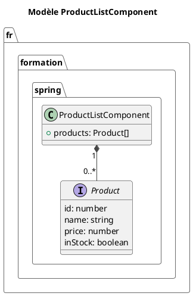

# Module 5 : L'essentiel - Donner vie à vos vues avec les Directives et les Pipes

### Objectifs pédagogiques

À la fin de ce chapitre, vous serez capable de :

* **Utiliser** les directives structurelles pour manipuler le DOM : `@if` (conditionnel), `@for` (boucle), et
  `@switch` (cas multiples).
* **Comprendre** l'importance du `track` dans une boucle `@for` pour optimiser les performances.
* **Modifier** l'apparence d'éléments avec les directives d'attributs comme `[ngClass]` et `[ngStyle]`.
* **Formater** des données directement dans vos templates avec les pipes intégrés d'Angular (`date`, `uppercase`,
  `currency`...).

### Introduction : Les plans de montage de votre interface

Imaginez que vos composants sont des briques LEGO. Vous savez en créer de toutes les formes et de toutes les couleurs.
Mais comment les assembler pour construire le château de vos rêves ? Vous avez besoin d'un plan de montage.

Les **directives** sont ce plan. Ce sont des instructions que vous placez dans votre HTML pour dire à Angular comment
construire la vue. "Ne pose cette brique *que si* elle est rouge" (`@if`). "Prends toutes les briques bleues et
aligne-les pour faire un mur" (`@for`).

Les **pipes**, quant à eux, sont vos outils de finition. "Prends cette date brute et polis-la pour qu'elle soit
lisible" (`date` pipe). "Prends ce titre et grave-le en majuscules" (`uppercase` pipe).

Maîtriser ces deux outils vous donnera un contrôle total sur l'affichage dynamique de vos données, rendant vos
interfaces vivantes et intelligentes.

### 1. Directives Structurelles : Modifier la structure du DOM

Les directives structurelles sont faciles à reconnaître : dans la syntaxe moderne, elles commencent par un `@`. Elles
ont le pouvoir d'ajouter, de supprimer ou de manipuler des éléments du DOM.

#### Affichage conditionnel : `@if`

La directive `@if` est l'équivalent d'un `if-else` en programmation. Elle affiche un bloc HTML uniquement si une
condition est vraie.

<tabs>
<tab title="Nouvelle Syntaxe (@if)">
La nouvelle syntaxe de "control flow" est plus lisible et plus performante. Elle est recommandée pour tous les nouveaux projets.

```typescript
// Fichier: auth-status.component.ts
@Component({ /* ... */})
export class AuthStatusComponent {
    isLoggedIn: boolean = true;
    username: string = 'Alice';
}
```

```html
<!-- Fichier: auth-status.component.html -->

@if (isLoggedIn) {
<p>Bienvenue, {{ username }} !</p>
} @else {
<p>Veuillez vous connecter.</p>
}
```

</tab>
<tab title="Syntaxe Classique (*ngIf)">
Vous la rencontrerez dans la plupart des projets existants. Elle utilise une syntaxe avec un astérisque `*`.

```html
<!-- Fichier: auth-status.component.html -->

<p *ngIf="isLoggedIn; else notLoggedInBlock">
    Bienvenue, {{ username }} !
</p>

<ng-template #notLoggedInBlock>
    <p>Veuillez vous connecter.</p>
</ng-template>
```

**Analogie Java :** Pensez à `th:if` en Thymeleaf. C'est exactement le même principe.
</tab>
</tabs>

#### Itérer sur une collection : `@for`

La directive `@for` est votre boucle `for-each`. Elle prend une collection (un tableau) et répète un bloc de HTML pour
chaque élément de cette collection.

Ici aussi, la nouvelle syntaxe avec `@for` est bien supérieure, notamment grâce à sa gestion du `track`.

<tabs>
<tab title="Nouvelle Syntaxe (@for)">

```typescript
// Fichier: user-list.component.ts
import { Component } from '@angular/core';
import { User } from '../shared/models/user.model'; // notre interface User

@Component({ /* ... */ })
export class UserListComponent {
users: User[] = [
{ id: 1, name: 'Alice', jobTitle: 'Dev', avatarUrl: '' },
{ id: 2, name: 'Bob', jobTitle: 'Product Owner', avatarUrl: '' },
{ id: 3, name: 'Charlie', jobTitle: 'UX Designer', avatarUrl: '' }
];
}

```

```html
<!-- Fichier: user-list.component.html -->
<ul>
  @for (user of users; track user.id; let i = $index, f = $first) {
    <li>
      ({{ i }}) {{ user.name }} 
      @if(f) { <span>(Premier)</span> }
    </li>
  } @empty {
    <li>Aucun utilisateur à afficher.</li>
  }
</ul>
```

**Points clés :**

* `track user.id` : C'est **crucial** pour la performance. Cela dit à Angular comment identifier chaque élément de
  manière unique. Quand la liste change, Angular peut ainsi déplacer ou modifier les éléments existants au lieu de tout
  détruire et reconstruire. **Pensez-y comme l'équivalent de `equals()` et `hashCode()` en Java pour identifier des
  objets.**
* `$index`, `$first`, `$last`, `$even`, `$odd` : Des variables d'itération magiques et très utiles.
* `@empty` : Un bloc qui s'affiche si la collection est vide. Très pratique !

</tab>
<tab title="Syntaxe Classique (*ngFor)">

```html
<!-- Fichier: user-list.component.html -->
<ul>
  <li *ngFor="let user of users; let i = index; let f = first; trackBy: trackByUserId">
    ({{ i }}) {{ user.name }}
    <span *ngIf="f">(Premier)</span>
  </li>
  <p *ngIf="users.length === 0">Aucun utilisateur à afficher.</p>
</ul>
```

Ici, le `trackBy` demande d'appeler une méthode dans le composant `.ts` qui retourne l'identifiant unique. C'est plus verbeux.
</tab>
</tabs>

#### Conditions multiples : `@switch`

Moins fréquent, `@switch` permet de choisir un bloc à afficher parmi plusieurs, en fonction de la valeur d'une
expression.

```typescript
// Fichier: user-status.component.ts
@Component({ /* ... */})
export class UserStatusComponent {
    // Supposons que status peut être 'active', 'inactive', ou 'pending'
    status: 'active' | 'inactive' | 'pending' = 'active';
}
```

```html
<!-- Fichier: user-status.component.html -->
@switch (status) {
@case ('active') { <p>L'utilisateur est en ligne.</p> }
@case ('inactive') { <p>L'utilisateur est hors ligne.</p> }
@default { <p>Statut en attente de validation.</p> }
}
```

### Exercice 1 : Afficher une liste de produits

Vous gérez un site e-commerce. Affichez une liste de produits en utilisant `@for` et `@if`.

1. Dans un composant `ProductListComponent`, créez un tableau `products` d'objets. Chaque produit doit avoir `id` (
   number), `name` (string), `price` (number), et `inStock` (boolean).
2. Dans le template, utilisez `@for` pour itérer sur le tableau `products`. N'oubliez pas le `track`.
3. Pour chaque produit, affichez son nom et son prix.
4. Utilisez `@if` : si le produit est en stock (`inStock` est `true`), affichez "En stock" en vert. Sinon, affichez "
   Épuisé" en rouge.

#### Correction exercice 1 {collapsible='true'}

**`product-list.component.ts`**

```typescript
// package fr.formation.spring;
import {Component} from '@angular/core';
import {CommonModule} from '@angular/common';

interface Product {
    id: number;
    name: string;
    price: number;
    inStock: boolean;
}

@Component({
    selector: 'app-product-list',
    standalone: true,
    imports: [CommonModule],
    templateUrl: './product-list.component.html',
    styleUrl: './product-list.component.css'
})
export class ProductListComponent {
    public products: Product[] = [
        {id: 101, name: 'Souris Gamer', price: 49.99, inStock: true},
        {id: 102, name: 'Clavier Mécanique', price: 120.50, inStock: false},
        {id: 103, name: 'Tapis de Souris XXL', price: 25.00, inStock: true},
        {id: 104, name: 'Casque Audio', price: 89.90, inStock: false},
    ];
}
```

**`product-list.component.html`**

```html
<h2>Nos Produits</h2>
<ul class="product-list">
    @for (product of products; track product.id) {
    <li>
        <span>{{ product.name }} - {{ product.price }} €</span>

        @if (product.inStock) {
        <span class="stock-ok">En stock</span>
        } @else {
        <span class="stock-ko">Épuisé</span>
        }
    </li>
    } @empty {
    <li>Désolé, aucun produit n'est disponible pour le moment.</li>
    }
</ul>
```

**`product-list.component.css`** (pour la couleur)

```css
.stock-ok {
    color: green;
}

.stock-ko {
    color: red;
}

.product-list {
    list-style: none;
    padding: 0;
}

.product-list li {
    border: 1px solid #eee;
    padding: 10px;
    margin-bottom: 5px;
    display: flex;
    justify-content: space-between;
}
```



### 2. Directives d'Attributs : Modifier l'apparence ou le comportement

Contrairement aux directives structurelles, celles-ci ne modifient pas la structure du DOM, mais changent l'apparence ou
le comportement d'un élément existant. On les utilise souvent avec la syntaxe de *property binding* `[]`.

* `[ngClass]` : Pour ajouter ou supprimer des classes CSS dynamiquement.
* `[ngStyle]` : Pour appliquer des styles CSS "inline" dynamiquement.

```typescript
// Fichier: message.component.ts
@Component({ /* ... */})
export class MessageComponent {
    isUrgent: boolean = true;
    messageType: 'error' | 'success' = 'error';
    fontSize: number = 16;
}
```

```html
<!-- Fichier: message.component.html -->

<!-- ngClass avec un objet : la classe 'urgent-message' est ajoutée
     uniquement si la variable 'isUrgent' est vraie. -->
<div [ngClass]="{ 'urgent-message': isUrgent, 'error-box': messageType === 'error' }">
    Ceci est un message.
</div>

<!-- ngStyle permet de lier des styles directement.
     Notez la syntaxe pour les unités comme 'px'. -->
<p [ngStyle]="{ 'font-size.px': fontSize, 'font-weight': isUrgent ? 'bold' : 'normal' }">
    Le contenu du message...
</p>
```

### 3. Pipes : Transformer les données dans le template

Un pipe prend une donnée en entrée, la transforme, et la retourne. On l'utilise avec le symbole `|`.

**Analogie Java :** Pensez à des classes utilitaires comme `SimpleDateFormat` ou `NumberFormat`. Le pipe est un
*formatter* que vous pouvez appliquer directement dans votre HTML.

```typescript
// Fichier: event.component.ts
@Component({ /* ... */})
export class EventComponent {
    eventName: string = "angular developers conference";
    eventDate: Date = new Date(); // Date et heure actuelles
    ticketPrice: number = 150.75;
    eventDetails: object = {location: "Paris", capacity: 500};
}
```

```html
<!-- Fichier: event.component.html -->
<ul>
    <!-- Mettre en majuscules -->
    <li>Nom: {{ eventName | uppercase }}</li>

    <!-- Formater une date (avec un paramètre) -->
    <li>Date: {{ eventDate | date:'dd/MM/yyyy HH:mm' }}</li>

    <!-- Formater un nombre en devise (avec plusieurs paramètres) -->
    <li>Prix: {{ ticketPrice | currency:'EUR':'symbol':'1.2-2' }}</li>

    <!-- Afficher un objet pour le débogage -->
    <li>Détails:
        <pre>{{ eventDetails | json }}</pre>
    </li>
</ul>
```

### Exercice 2 : Mettre en forme les produits

Reprenez l'exercice 1.

1. Ajoutez une propriété `releaseDate` (de type `Date`) à vos produits.
2. Dans le template, affichez cette date de sortie formatée en `jour/mois/année`.
3. Affichez le nom du produit en `TitleCase` (chaque mot commence par une majuscule).
4. Affichez le prix en utilisant le pipe `currency`.

#### Correction exercice 2 {collapsible='true'}

**`product-list.component.ts`** (mis à jour)

```typescript
// ...
export class ProductListComponent {
    public products: Product[] = [
        {id: 101, name: 'souris gamer', price: 49.99, inStock: true, releaseDate: new Date(2023, 5, 15)},
        {id: 102, name: 'clavier mécanique', price: 120.50, inStock: false, releaseDate: new Date(2022, 11, 1)},
        {id: 103, name: 'tapis de souris xxl', price: 25.00, inStock: true, releaseDate: new Date(2023, 8, 20)}
    ];
}
```

**`product-list.component.html`** (mis à jour)

```html
<h2>Nos Produits</h2>
<ul class="product-list">
    @for (product of products; track product.id) {
    <li [ngClass]="{ 'out-of-stock': !product.inStock }">
        <div class="product-info">
            <!-- Pipes appliqués ici -->
            <h4>{{ product.name | titlecase }}</h4>
            <p>Prix : {{ product.price | currency:'EUR' }}</p>
            <p>Sortie : {{ product.releaseDate | date:'dd/MM/yyyy' }}</p>
        </div>

        @if (product.inStock) {
        <span class="stock-ok">En stock</span>
        } @else {
        <span class="stock-ko">Épuisé</span>
        }
    </li>
    }
</ul>
```

### Auto-évaluation

1. **(Question ouverte)** Quelle est la différence fondamentale entre `*ngIf="false"` et l'utilisation de CSS
   `display: none;` sur un élément ?

2. **(QCM)** Dans la directive `@for`, à quoi sert la partie `track` ?

   a) À suivre le nombre de clics sur un élément.

   b) À fournir un identifiant unique pour chaque élément afin d'optimiser les mises à jour du DOM.
   
   c) À définir la vitesse de l'animation de la boucle.

   d) À lier un événement de tracking.

3. **(QCM)** Quelle est la syntaxe correcte pour afficher une date de naissance (`birthDate`) au format "10 Mai 1990" ?

   a) `{{ birthDate | 'dd MMMM yyyy' }}`

   b) `{{ date: 'dd MMMM yyyy' | birthDate }}`

   c) `{{ birthDate | date:'dd MMMM yyyy' }}`

   d) `{{ birthDate.format('dd MMMM yyyy') }}`

4. **(Question ouverte)** Qu'est-ce qu'un pipe ? Donnez deux exemples de cas d'utilisation où un pipe est plus approprié
   qu'une méthode dans le composant.

5. **(QCM)** Comment appliquer dynamiquement la classe CSS `"highlight"` à un `<div>` si la variable `isSelected` est
`true` ?

   a) `<div class.highlight="isSelected">`

   b) `<div [ngClass]="{ 'highlight': isSelected }">`

   c) `<div class="@highlight: isSelected;">`

   d) `<div ngClass="if isSelected then 'highlight'">`

### Conclusion de cette partie

Vous venez d'acquérir une puissance d'expression phénoménale pour vos vues ! Vous savez désormais manipuler la structure
même de vos pages avec les directives `@if`, `@for` et `@switch`, en gardant toujours à l'esprit l'optimisation des
performances avec `track`. Vous pouvez également altérer l'apparence des éléments avec `[ngClass]` et `[ngStyle]`.

Enfin, vous avez appris à nettoyer et formater vos données là où elles sont affichées, grâce aux pipes. Cela rend vos
composants plus propres et votre code HTML plus lisible.

Maintenant, une question se pose : toutes nos données sont pour l'instant "en dur" dans nos composants. Comment faire
pour que plusieurs composants partagent les mêmes données ? Comment aller chercher ces données sur un serveur distant ?
C'est précisément le rôle des **Services** et de l'**Injection de Dépendances**, un sujet où vos compétences en Spring
vont vous donner un avantage considérable. C'est ce que nous verrons dans le prochain module.