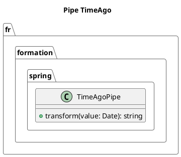

# Module 5 : Pour aller plus loin - Créer vos Propres Pipes et Directives

### Objectifs pédagogiques

À la fin de cette partie, vous serez en mesure de :

* **Créer** un pipe personnalisé pour encapsuler une logique de transformation de données réutilisable.
* **Utiliser** des paramètres dans un pipe personnalisé pour le rendre plus flexible.
* **Comprendre** la différence entre un pipe "pur" (pure) et "impur" (impure) et leurs impacts sur la performance.
* **Créer** une directive d'attribut personnalisée pour encapsuler un comportement DOM complexe.

### Introduction : Devenir un artisan-outilleur

Vous avez appris à utiliser les outils fournis dans la boîte à outils d'Angular : des pipes pour formater, des
directives pour structurer. C'est très bien, mais que se passe-t-il lorsque vous avez un besoin très spécifique que les
outils de base ne couvrent pas ? Faut-il répéter la même logique complexe dans plusieurs composants ? Certainement pas.

Un véritable artisan ne se contente pas d'utiliser les outils qu'on lui donne ; il est capable de forger les siens.
Cette section vous apprendra à devenir cet artisan. Vous allez créer vos propres pipes pour des transformations de
données uniques à votre application, et vos propres directives pour des manipulations du DOM réutilisables.

C'est une étape cruciale pour écrire un code DRY (Don't Repeat Yourself), propre et maintenable. Vous allez créer des "
briques de comportement" que vous et votre équipe pourrez réutiliser dans toute l'application.

### 1. Créer un Pipe Personnalisé

Un pipe n'est rien de plus qu'une classe TypeScript qui implémente l'interface `PipeTransform` et qui est décorée avec
`@Pipe`.

L'interface `PipeTransform` vous oblige à implémenter une seule méthode : `transform(value: any, ...args: any[]): any`.

**Scénario :** Dans notre application, nous devons souvent tronquer des textes longs pour les afficher dans des cartes.
Créons un pipe `truncate`.

<procedure title="Création du Pipe 'truncate'" id="create-truncate-pipe">
<step>
    <b>Générer le pipe avec la CLI :</b>
    <p>L'Angular CLI a, bien sûr, une commande pour ça.</p>
    <code>
    ng generate pipe shared/pipes/truncate
    # Ou en version courte : ng g p shared/pipes/truncate
    </code>
    <p>Cela crée le fichier <code>truncate.pipe.ts</code> et son fichier de test dans un dossier bien organisé.</p>
</step>

<step>
        <b>Implémenter la logique de transformation :</b>
        <p>Ouvrez le fichier <code>truncate.pipe.ts</code> et modifiez-le.</p>

```typescript
// Fichier: src/app/shared/pipes/truncate.pipe.ts
import { Pipe, PipeTransform } from '@angular/core';

@Pipe({
  name: 'truncate', // Le nom qu'on utilisera dans le template
  standalone: true // Les pipes aussi peuvent être standalone !
})
export class TruncatePipe implements PipeTransform {

  // 'value' est la donnée à gauche du pipe |
  // 'args' sont les paramètres passés après :
  transform(value: string, limit: number = 20, trail: string = '...'): string {
    if (!value) {
      return '';
    }
    
    return value.length > limit ? value.substring(0, limit) + trail : value;
  }
}
```

</step>
    <step>
        <b>Utiliser le pipe dans un composant :</b>
        <p>Pour utiliser notre pipe, il suffit de l'importer dans le composant qui en a besoin.</p>
        
```typescript
// Fichier: article-preview.component.ts
import { Component } from '@angular/core';
import { TruncatePipe } from '../shared/pipes/truncate.pipe'; // Importer

@Component({
  selector: 'app-article-preview',
  standalone: true,
  imports: [TruncatePipe], // Et ajouter aux imports
  template: `
    <h2>{{ articleTitle }}</h2>
    <!-- Utilisation simple -->
    <p>{{ longDescription | truncate }}</p>

    <!-- Utilisation avec un paramètre pour la limite -->
    <p>{{ longDescription | truncate:50 }}</p>

    <!-- Utilisation avec deux paramètres (limite et suffixe) -->
    <p>{{ longDescription | truncate:50:' ->' }}</p>
  `
})
export class ArticlePreviewComponent {
  articleTitle = "Mon super article";
  longDescription = "Ceci est une très longue description qui a besoin d'être tronquée pour ne pas prendre trop de place dans la prévisualisation de l'article sur la page d'accueil.";
}
```
</step>

</procedure>

### 2. Pipes Purs (Pure) vs. Impurs (Impure)

Par défaut, tous les pipes que vous créez sont **purs** (`pure: true`). C'est un concept d'optimisation très important.

* **Pipe Pur :** Angular n'exécute le pipe **que si ses entrées (la valeur ou les paramètres) changent**. Si vous passez
  une chaîne de caractères, Angular exécute le pipe. Si vous passez la même chaîne de caractères, Angular ne le
  ré-exécute pas, il réutilise le résultat précédent. C'est très performant.
    * **Analogie :** Une fonction mathématique pure comme `add(2, 3)`. Le résultat sera toujours 5. Inutile de
      recalculer.

* **Pipe Impur :** Un pipe impur (`pure: false`) est ré-exécuté **à chaque cycle de détection de changement d'Angular**,
  que les entrées aient changé ou non. C'est beaucoup plus coûteux en performance.
    * **Analogie :** Une fonction qui dépend de l'heure actuelle, comme `getCurrentTime()`. Le résultat change tout le
      temps, même avec les mêmes entrées.

<warning>
**Quand utiliser un pipe impur ?** Très rarement. Un cas d'usage est un pipe qui dépend d'un état global non passé en paramètre (comme une traduction qui dépend de la langue sélectionnée dans un service). Le pipe `async` d'Angular est l'exemple le plus connu de pipe impur, car il doit "écouter" en permanence si un Observable émet une nouvelle valeur.
**Règle d'or :** Ne rendez un pipe impur que si vous avez une excellente raison de le faire et que vous comprenez les implications sur les performances.
</warning>

### 3. Créer une Directive d'Attribut Personnalisée

Une directive est comme un composant, mais sans template. C'est une classe qui peut écouter les événements de l'élément
auquel elle est attachée et le manipuler.

**Scénario :** Nous voulons créer une directive `appHighlight` qui surligne le fond d'un élément quand la souris passe
dessus.

<procedure title="Création de la Directive 'highlight'" id="create-highlight-directive">
    <step>
        <b>Générer la directive avec la CLI :</b>
        <code>
        ng generate directive shared/directives/highlight
        # Ou : ng g d shared/directives/highlight
        </code>
    </step>
    <step>
        <b>Implémenter la logique de la directive :</b>
        <p>Une directive a besoin d'accéder à l'élément du DOM auquel elle est attachée. Pour cela, on injecte <code>ElementRef</code>. Pour écouter les événements du DOM, on utilise le décorateur <code>@HostListener</code>.</p>

```typescript
// Fichier: src/app/shared/directives/highlight.directive.ts
import { Directive, ElementRef, HostListener, Input } from '@angular/core';

@Directive({
  selector: '[appHighlight]', // On l'utilisera comme un attribut
  standalone: true,
})
export class HighlightDirective {
  // On injecte une référence à l'élément du DOM hôte
  constructor(private el: ElementRef) {}

  // On peut même passer une couleur par défaut via un @Input
  @Input() appHighlight: string = 'yellow'; // Le nom doit être le même que le sélecteur
  @Input() defaultColor: string = '';

  // @HostListener écoute un événement sur l'élément hôte
  @HostListener('mouseenter') onMouseEnter() {
    this.highlight(this.appHighlight || this.defaultColor);
  }

  @HostListener('mouseleave') onMouseLeave() {
    this.highlight(this.defaultColor);
  }

  private highlight(color: string): void {
    // On manipule directement le style de l'élément
    this.el.nativeElement.style.backgroundColor = color;
  }
}
```
</step>
    <step>
        <b>Utiliser la directive :</b>
        <p>On l'importe dans notre composant et on l'applique comme un simple attribut HTML.</p>

```typescript
// Fichier: some-component.ts
import { HighlightDirective } from '../shared/directives/highlight.directive';

@Component({
  // ...
  imports: [HighlightDirective]
})
export class SomeComponent {}
```

```html
<!-- Fichier: some-component.html -->

<p appHighlight>
  Passez la souris sur moi pour me surligner en jaune (défaut).
</p>

<!-- On peut passer une couleur en utilisant le property binding -->
<p [appHighlight]="'lightblue'">
  Passez la souris sur moi pour me surligner en bleu clair.
</p>

<!-- On peut aussi ne pas surligner par défaut -->
<div [appHighlight]="'#f0f0f0'" [defaultColor]="'transparent'">
  Ce bloc ne sera pas surligné par défaut.
</div>
```

</step>

</procedure>

### Exercice pratique

#### Exercice 3 : Créer un pipe de "temps écoulé"

Créez un pipe `timeAgo` qui prend une `Date` en entrée et retourne une chaîne de caractères conviviale comme "il y a 5
minutes", "il y a 2 heures", "hier", "le 10/05/2023".

1. Générez un pipe `timeAgo`.
2. Implémentez la logique. Ne vous souciez pas de faire quelque chose de parfait, gérez seulement quelques cas :
    * Moins d'une minute -> "à l'instant"
    * Moins d'une heure -> "il y a X minutes"
    * Aujourd'hui, mais il y a plus d'une heure -> "il y a X heures"
    * Hier -> "hier"
    * Sinon -> la date formatée `dd/MM/yyyy` (vous pouvez même utiliser le `DatePipe` à l'intérieur de votre pipe !).
3. Utilisez-le pour afficher la date de publication d'un commentaire.

#### Correction exercice 3 {collapsible='true'}

1. **Génération :** `ng g p shared/pipes/time-ago`

2. **`time-ago.pipe.ts` :**

   ```typescript
   import { Pipe, PipeTransform } from '@angular/core';
   import { DatePipe } from '@angular/common';

   @Pipe({
     name: 'timeAgo',
     standalone: true
   })
   export class TimeAgoPipe implements PipeTransform {

     transform(value: Date | string): string {
       if (!value) return '';

       const dateValue = typeof value === 'string' ? new Date(value) : value;
       const now = new Date();
       const seconds = Math.floor((now.getTime() - dateValue.getTime()) / 1000);

       if (seconds < 60) {
         return "à l'instant";
       }

       const minutes = Math.floor(seconds / 60);
       if (minutes < 60) {
         return `il y a ${minutes} minute${minutes > 1 ? 's' : ''}`;
       }

       const hours = Math.floor(minutes / 60);
       // On vérifie aussi si c'était bien le même jour
       if (hours < 24 && dateValue.getDate() === now.getDate()) {
         return `il y a ${hours} heure${hours > 1 ? 's' : ''}`;
       }

       const yesterday = new Date();
       yesterday.setDate(now.getDate() - 1);
       if (dateValue.getDate() === yesterday.getDate() &&
           dateValue.getMonth() === yesterday.getMonth() &&
           dateValue.getFullYear() === yesterday.getFullYear()) {
         return "hier";
       }
       
       // Pour le reste, on utilise le DatePipe d'Angular
       return new DatePipe('en-US').transform(dateValue, 'dd/MM/yyyy') || '';
     }
   }
   ```

3. **Utilisation dans un composant :**

   ```html
   <p>Posté {{ postDate | timeAgo }}</p>
   ```



### Auto-évaluation

1. **(Question ouverte)** Dans quel cas d'utilisation est-il préférable de créer un pipe personnalisé plutôt qu'une
   méthode dans un composant ?
2. **(QCM)** Vous créez un pipe `myPipe`. Pour l'utiliser avec un paramètre dans un template, quelle syntaxe est
   correcte ?
   a) `{{ data | myPipe(param) }}`
   b) `{{ data | myPipe.param }}`
   c) `{{ data | myPipe:param }}`
   d) `{{ data.myPipe(param) }}`
3. **(QCM)** Par défaut, un pipe personnalisé est :
   a) Impur, car il doit se ré-exécuter souvent.
   b) Pur, pour des raisons de performance.
   c) Ni l'un ni l'autre, c'est à nous de le spécifier.
   d) Statique, il ne peut pas être instancié.
4. **(Question ouverte)** Quelle est la fonction du décorateur `@HostListener` dans une directive ?
5. **(QCM)** Pour manipuler directement l'élément du DOM auquel une directive est attachée, quelle dépendance devez-vous
   injecter dans son constructeur ?
   a) `Renderer2`
   b) `DOMElement`
   c) `HostBinding`
   d) `ElementRef`

### Conclusion de ce chapitre

Félicitations, vous avez atteint un nouveau niveau de maîtrise ! Vous n'êtes plus seulement un consommateur d'outils,
vous êtes un créateur. Vous savez désormais comment encapsuler des logiques de transformation complexes et réutilisables
dans des **pipes personnalisés**, tout en comprenant les implications de performance des pipes **purs et impurs**.

Vous avez également appris à créer des **directives d'attribut** pour ajouter des comportements riches et interactifs à
n'importe quel élément du DOM, rendant votre code plus déclaratif et plus propre.

Ces compétences sont le signe d'un développeur Angular expérimenté, capable de construire des solutions élégantes et
maintenables.

Nous avons maintenant tous les outils pour créer des interfaces utilisateur riches et dynamiques. Mais il nous manque
encore un élément central : comment organiser et partager la logique métier ? Comment aller chercher les données sur un
serveur ? C'est le rôle des **Services** et de l'**Injection de Dépendances**, un chapitre où votre expérience
Java/Spring sera un atout majeur.