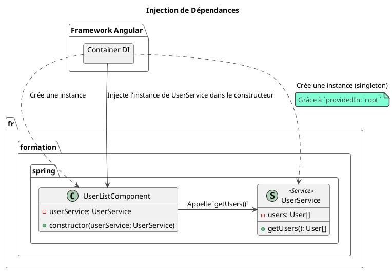

# Module 6 : L'essentiel - Services et Injection de Dépendances

### Objectifs pédagogiques

À la fin de ce chapitre, vous serez capable de :

* **Expliquer** le rôle et l'importance des services dans une architecture Angular.
* **Créer** un service en utilisant le décorateur `@Injectable`.
* **Comprendre** la signification de `providedIn: 'root'` pour créer des services singletons.
* **Utiliser** l'injection de dépendances par constructeur pour fournir un service à un composant.
* **Appliquer** le Principe de Responsabilité Unique (SRP) en déplaçant la logique métier hors des composants.

### Introduction : Organiser la logique de votre application

Jusqu'à présent, nous avons mis toutes nos données et notre logique directement dans les composants. Pour nos petits
exemples, c'était parfait. Mais imaginez une application réelle :

* Le `UserListComponent` a besoin de la liste des utilisateurs.
* Le `UserProfileComponent` a besoin des détails d'un utilisateur spécifique.
* Le `UserFormComponent` a besoin de créer un nouvel utilisateur.

Devons-nous dupliquer la logique pour récupérer, créer ou manipuler les utilisateurs dans chaque composant ? Absolument
pas. Ce serait un cauchemar à maintenir.

C'est là qu'interviennent les **Services**. Un service est une simple classe TypeScript dont le but est très précis :
fournir une fonctionnalité spécifique (la "logique métier") et être partageable entre plusieurs composants.

**Pour vous, développeurs Java, la transition est directe.** Pensez à un composant Angular comme à un `@RestController`
Spring. Son rôle est de gérer la présentation et de déléguer le travail à d'autres classes. Et ces autres classes, ce
sont les **`@Service`** en Spring, et les **`@Injectable`** en Angular. Ce module, c'est votre terrain de jeu.

### 1. Le Rôle des Services

Un service est le lieu idéal pour centraliser :

* La **logique métier** qui n'est pas liée à une vue spécifique (ex: des calculs complexes).
* La **communication avec une source de données externe** (une API REST, le `localStorage` du navigateur, un
  WebSocket...).
* Le **partage d'état** entre des composants qui n'ont pas de lien de parenté direct.

En extrayant cette logique dans un service, vous respectez le **Principe de Responsabilité Unique (Single Responsibility
Principle - SRP)** :

* **Le Composant :** Sa seule responsabilité est de présenter des données à l'utilisateur et de déléguer les actions de
  l'utilisateur. C'est un chef d'orchestre.
* **Le Service :** Sa responsabilité est de faire le "vrai" travail : aller chercher les données, les traiter, les
  sauvegarder. C'est l'expert spécialiste.

### 2. Créer un Service avec `@Injectable`

Un service n'est qu'une classe, mais pour qu'Angular puisse l'injecter dans d'autres classes, on utilise le décorateur
`@Injectable`.

<procedure title="Création d'un Service Utilisateur" id="create-user-service">
    <step>
        <b>Générer le service avec la CLI :</b>
        <p>Comme toujours, la CLI nous simplifie la vie.</p>
        <code>
        ng generate service shared/services/user
        # ou : ng g s shared/services/user
        </code>
        <p>Cela crée le fichier <code>user.service.ts</code>.</p>
    </step>
    <step>
        <b>Analyser le code généré :</b>
        <p>Ouvrez le fichier <code>user.service.ts</code>.</p>

```typescript
// Fichier: src/app/shared/services/user.service.ts
import { Injectable } from '@angular/core';

@Injectable({
  providedIn: 'root'
})
export class UserService {

  constructor() { }
}
```
<p>Le point clé est <code>@Injectable({ providedIn: 'root' })</code>.</p>
</step>

</procedure>

#### `providedIn: 'root'` : Le Singleton par Défaut

Cette petite ligne est extrêmement puissante. Elle dit à Angular :

1. "Ce service doit être fourni à la racine (`root`) de l'application."
2. "Crée une **unique instance (un singleton)** de ce service pour toute l'application."
3. "N'importe quel composant, service ou autre classe de l'application peut demander à se le faire injecter."

**Analogie Java : C'est l'équivalent exact d'une annotation `@Service` ou `@Component` sur une classe Spring.** Par
défaut, Spring crée aussi un bean singleton disponible dans tout le contexte de l'application. La philosophie est
identique.

Maintenant, ajoutons une méthode à notre service pour simuler la récupération de données.

```typescript
// Fichier: src/app/shared/services/user.service.ts
import {Injectable} from '@angular/core';
import {User} from '../models/user.model'; // Notre interface User

@Injectable({
    providedIn: 'root'
})
export class UserService {
    // Une liste d'utilisateurs "en dur" pour l'instant
    private users: User[] = [
        {id: 1, name: 'Alice', jobTitle: 'Dev', avatarUrl: '...'},
        {id: 2, name: 'Bob', jobTitle: 'PO', avatarUrl: '...'},
        {id: 3, name: 'Charlie', jobTitle: 'UX', avatarUrl: '...'}
    ];

    constructor() {
    }

    public getUsers(): User[] {
        console.log("UserService: Fourniture de la liste des utilisateurs.");
        return this.users;
    }

    public getUserById(id: number): User | undefined {
        return this.users.find(user => user.id === id);
    }
}
```

### 3. L'Injection de Dépendances

Maintenant que notre service est prêt et "fourni à la racine", comment un composant peut-il l'utiliser ? Grâce à l'*
*injection de dépendances par constructeur**.

C'est exactement comme en Spring : vous déclarez la dépendance comme un argument du constructeur, et le framework
s'occupe du reste.

Voyons comment `UserListComponent` peut utiliser `UserService`.

```typescript
// Fichier: src/app/user-list/user-list.component.ts
import {Component} from '@angular/core';
import {User} from '../shared/models/user.model';
import {UserService} from '../shared/services/user.service'; // 1. Importer le service

@Component({ /* ... */})
export class UserListComponent {
    public users: User[] = [];

    // 2. Injecter le service dans le constructeur.
    // La syntaxe "private userService: UserService" est le raccourci TypeScript
    // qui déclare et initialise la propriété "userService" en une seule fois.
    constructor(private userService: UserService) {
        // 3. Utiliser le service pour récupérer les données.
        this.users = this.userService.getUsers();
    }
}
```

C'est tout ! Le composant n'a plus à se soucier de *comment* les utilisateurs sont créés ou récupérés. Il fait
simplement confiance au `UserService` pour lui fournir les données. C'est propre, découplé et facile à tester.



### Exercice pratique

#### Exercice 1 : Refactoriser la ProductList

Reprenons notre `ProductListComponent` du module 5. Actuellement, la liste des produits est codée en dur à l'intérieur
du composant. Votre mission est de refactoriser ce code pour utiliser un service.

1. Générez un nouveau service nommé `ProductService`.
2. Déplacez le tableau de produits `products` depuis `ProductListComponent` vers `ProductService`. Rendez-le `private`.
3. Dans `ProductService`, créez une méthode publique `getProducts()` qui retourne ce tableau de produits.
4. Dans `ProductListComponent`, supprimez le tableau de produits en dur.
5. Injectez `ProductService` dans le constructeur de `ProductListComponent`.
6. Dans le constructeur (ou, mieux, dans une méthode de cycle de vie que nous verrons plus tard comme `ngOnInit`),
   appelez la méthode `getProducts()` du service pour peupler la liste des produits du composant.

#### Correction exercice 1 {collapsible='true'}

1. **Génération du service :**
   ```bash
   ng generate service shared/services/product
   ```

2. & 3. **Création du `ProductService` :**
   ```typescript
   // Fichier: src/app/shared/services/product.service.ts
   import { Injectable } from '@angular/core';

   // On pourrait mettre cette interface dans un fichier partagé
   interface Product {
     id: number;
     name: string;
     price: number;
     inStock: boolean;
     releaseDate: Date;
   }

   @Injectable({
     providedIn: 'root'
   })
   export class ProductService {
     private products: Product[] = [
       { id: 101, name: 'souris gamer', price: 49.99, inStock: true, releaseDate: new Date(2023, 5, 15) },
       { id: 102, name: 'clavier mécanique', price: 120.50, inStock: false, releaseDate: new Date(2022, 11, 1) },
       { id: 103, name: 'tapis de souris xxl', price: 25.00, inStock: true, releaseDate: new Date(2023, 8, 20) }
     ];

     constructor() { }

     public getProducts(): Product[] {
       return this.products;
     }
   }
   ```

4. & 5. & 6. **Refactorisation de `ProductListComponent` :**
   ```typescript
   // Fichier: src/app/product-list/product-list.component.ts
   import { Component } from '@angular/core';
   import { CommonModule } from '@angular/common';
   import { ProductService } from '../shared/services/product.service';

   // On a toujours besoin de l'interface pour le typage dans le template
   interface Product { /* ... */ }

   @Component({
     selector: 'app-product-list',
     standalone: true,
     imports: [CommonModule],
     templateUrl: './product-list.component.html'
   })
   export class ProductListComponent {
     // Le tableau est initialisé à vide
     public products: Product[] = [];

     // Injection du service
     constructor(private productService: ProductService) {
       // Appel au service pour récupérer les données
       this.products = this.productService.getProducts();
     }
   }
   ```
   Le template (`.html`) du composant n'a pas besoin d'être modifié, ce qui prouve la qualité de notre découplage !

### Auto-évaluation

1. **(Question ouverte)** En termes d'architecture, quelle est la responsabilité principale d'un service Angular par
   rapport à celle d'un composant ?
2. **(QCM)** Que signifie `providedIn: 'root'` dans le décorateur `@Injectable` ?
   a) Que le service ne peut être utilisé que par le composant racine (`AppComponent`).
   b) Que le service est un singleton disponible dans toute l'application.
   c) Que le service doit être importé dans le fichier `main.ts`.
   d) Que le service a des privilèges d'administrateur.
3. **(QCM)** Quelle est la manière standard d'obtenir une instance d'un service dans un composant ?
   a) En l'instanciant avec `new MyService()`.
   b) En l'important et en l'ajoutant au tableau `providers` du composant.
   c) En le déclarant comme un paramètre du constructeur avec un modificateur d'accès.
   d) En utilisant une méthode globale `getService(MyService)`.
4. **(Question ouverte)** Vous avez deux composants, `ComponentA` et `ComponentB`, qui ne sont pas liés (ni parent, ni
   enfant). Comment peuvent-ils partager une donnée commune (par exemple, le nom de l'utilisateur connecté) ?
5. **(QCM)** Quel principe de conception est le mieux respecté lorsque vous déplacez la logique d'appel à une API depuis
   un composant vers un service ?
   a) DRY (Don't Repeat Yourself)
   b) KISS (Keep It Simple, Stupid)
   c) SRP (Single Responsibility Principle)
   d) YAGNI (You Ain't Gonna Need It)

### Conclusion de cette partie

Félicitations ! Vous venez d'appliquer l'un des patterns d'architecture les plus importants du développement logiciel
moderne. Vous savez maintenant comment :

* **Centraliser** la logique métier dans des **services** réutilisables.
* **Découpler** vos composants de la source de données, les rendant plus simples et plus ciblés sur leur rôle de
  présentation.
* Utiliser la puissance de l'**injection de dépendances** d'Angular, un mécanisme qui vous est déjà très familier grâce
  à Spring.

Cette structure est la base d'une application saine, testable et évolutive.

Dans la partie "Pour aller plus loin", nous explorerons des concepts plus avancés de l'injection de dépendances, comme
les différents niveaux de fournisseurs (providers) et l'utilisation de `InjectionToken`. Et dans le module suivant, nous
connecterons enfin notre `UserService` à une véritable API REST grâce au `HttpClient`.