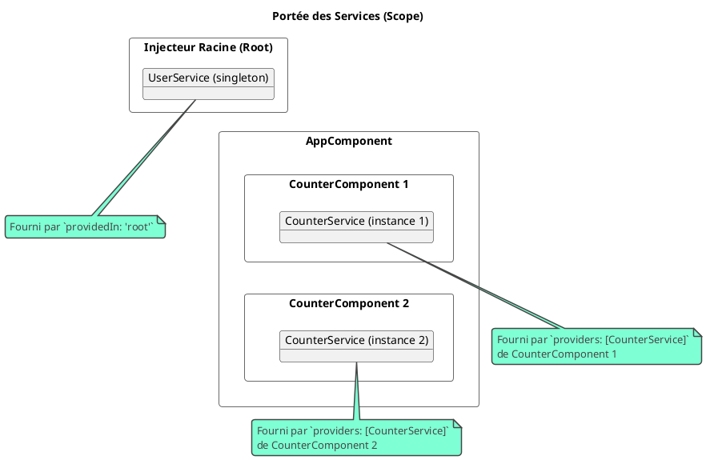

# Module 6 : Pour aller plus loin - Maîtrise de l'Injection de Dépendances

### Objectifs pédagogiques

À la fin de cette partie, vous serez en mesure de :

* **Différencier** les différentes portées (`scope`) d'un service : `root` ou au niveau d'un composant.
* **Fournir** un service au niveau d'un composant pour créer des instances multiples et isolées.
* **Utiliser** des "factory providers" (`useFactory`) pour créer des instances de service de manière conditionnelle.
* **Comprendre et utiliser** `InjectionToken` pour injecter des valeurs qui ne sont pas des classes (comme des objets de
  configuration).
* **Gérer** les cas où une dépendance pourrait ne pas exister avec le décorateur `@Optional`.

### Introduction : Au-delà du Singleton Global

Nous avons vu que `providedIn: 'root'` est la solution parfaite dans 90% des cas. C'est simple, efficace et crée un
singleton pour toute l'application. Mais que se passe-t-il dans les 10% restants ?

* Et si chaque instance d'un composant `UserCardComponent` avait besoin de sa propre instance d'un service de "
  logging" ?
* Et si le service à injecter dépendait d'une configuration qui n'est connue qu'au moment de l'exécution ?
* Et si vous vouliez injecter non pas une classe, mais une simple valeur de configuration, comme l'URL de base de votre
  API ?

Le système d'injection de dépendances d'Angular est bien plus flexible qu'il n'y paraît. Cette section va vous donner
les clés pour devenir un véritable maître de la DI. Vous apprendrez à contrôler précisément **où**, **quand** et *
*comment** vos dépendances sont créées. C'est une compétence d'architecte qui vous permettra de concevoir des systèmes
modulaires et hautement configurables.

### 1. La Portée des Services et les Fournisseurs de Composants

Si `providedIn: 'root'` ne convient pas, vous pouvez omettre cette propriété et déclarer le service dans le tableau
`providers` d'un composant.

**Effets de cette déclaration :**

* Une **nouvelle instance** du service sera créée pour **chaque instance** de ce composant.
* Cette instance sera partagée par le composant et tous ses enfants (dans le DOM).
* Quand le composant est détruit, l'instance du service l'est aussi.

**Scénario :** Un `CounterComponent` qui a son propre `CounterService` pour gérer son état. Si on affiche trois
`CounterComponent`, chacun aura son propre compteur indépendant.

```typescript
// Fichier: src/app/counter/counter.service.ts
import {Injectable} from '@angular/core';

// PAS de providedIn: 'root' ici !
@Injectable()
export class CounterService {
    private count = 0;

    public increment(): void {
        this.count++;
    }

    public getCount(): number {
        return this.count;
    }
}

// Fichier: src/app/counter/counter.component.ts
import {Component} from '@angular/core';
import {CounterService} from './counter.service';

@Component({
    selector: 'app-counter',
    standalone: true,
    // On déclare ici que CE composant et ses enfants ont leur propre
    // instance de CounterService.
    providers: [CounterService],
    template: `
    <div style="border: 1px solid blue; padding: 10px; margin: 5px;">
      <button (click)="increment()">Incrémenter ce compteur</button>
      <p>Compteur local : {{ getCount() }}</p>
    </div>
  `
})
export class CounterComponent {
    constructor(private counterService: CounterService) {
    }

    public increment(): void {
        this.counterService.increment();
    }

    public getCount(): number {
        return this.counterService.getCount();
    }
}
```

Si vous placez `<app-counter></app-counter><app-counter></app-counter>` dans votre `AppComponent`, chaque compteur sera
indépendant.



### 2. Les Différents Types de Fournisseurs (Providers)

Le tableau `providers` est très puissant et accepte des objets de configuration plus détaillés que le simple nom de la
classe.

<tabs>
<tab title="useClass (défaut)">
Indique quelle classe instancier pour un `token` donné.
```typescript
// Fournir MyRealService quand on demande ILogger
providers: [{ provide: ILogger, useClass: MyRealService }]
```
</tab>
<tab title="useValue">
Lie un `token` à une valeur statique (objet, chaîne, nombre...). Idéal pour les constantes de configuration.
```typescript
// Fournir une chaîne de caractères quand on demande API_URL
providers: [{ provide: 'API_URL', useValue: 'https://api.monsite.com' }]
```
</tab>
<tab title="useFactory">
Le plus puissant. Permet de définir une fonction "usine" qui créera l'instance du service. Parfait pour la logique conditionnelle.
**Analogie Java:** Pensez à une méthode annotée `@Bean` dans une classe `@Configuration` de Spring.
```typescript
// Crée un LoggerService différent si on est en mode debug.
providers: [
  {
    provide: LoggerService,
    useFactory: (configService: ConfigService) => {
      return configService.isDebugMode() 
        ? new VerboseLoggerService() 
        : new SimpleLoggerService();
    },
    deps: [ConfigService] // Les dépendances de la factory elle-même
  }
]
```
</tab>
<tab title="useExisting">
Permet de créer un alias. Demander `OldLogger` renverra l'instance existante de `NewLogger`.
```typescript
// Pour la rétrocompatibilité
providers: [NewLogger, { provide: OldLogger, useExisting: NewLogger }]
```
</tab>
</tabs>

### 3. `InjectionToken` : Injecter plus que des Classes

Dans l'exemple `useValue` ci-dessus, nous avons utilisé une chaîne de caractères `'API_URL'` comme "clé" (token)
d'injection. C'est possible, mais ce n'est pas une bonne pratique car cela peut créer des collisions.

La solution propre est d'utiliser un `InjectionToken`. C'est un objet unique qui sert de clé d'injection sécurisée pour
les valeurs qui ne sont pas des classes.

**Scénario :** Injecter un objet de configuration de thème.

<procedure title="Utilisation d'un InjectionToken" id="use-injection-token">
    <step>
        <b>Créer le token :</b>
        <p>On crée une constante exportée dans un fichier dédié.</p>
        
```typescript
 // Fichier: src/app/shared/theme.config.ts
 import { InjectionToken } from '@angular/core';

 export interface ThemeConfig {
   primaryColor: string;
   fontSize: number;
 }

 export const THEME_CONFIG = new InjectionToken<ThemeConfig>('Application Theme Configuration');
 ```

</step>
<step>
        <b>Fournir la valeur avec le token :</b>
        <p>Dans la configuration de l'application (<code>app.config.ts</code>), on utilise le token comme <code>provide</code>.</p>
        
```typescript
// Fichier: src/app/app.config.ts
import { ApplicationConfig } from '@angular/core';
import { THEME_CONFIG, ThemeConfig } from './shared/theme.config';

export const appConfig: ApplicationConfig = {
  providers: [
    // ... autres providers
    {
      provide: THEME_CONFIG,
      useValue: { primaryColor: 'blue', fontSize: 16 }
    }
  ]
};
```
</step>
<step>
        <b>Injecter la valeur :</b>
        <p>Pour injecter, on ne peut pas utiliser le type, on doit utiliser le décorateur <code>@Inject()</code> avec le token.</p>
        
```typescript
// Fichier: some.component.ts
import { Component, Inject } from '@angular/core';
import { THEME_CONFIG, ThemeConfig } from '../shared/theme.config';

@Component({ /* ... */ })
export class SomeComponent {
  constructor(@Inject(THEME_CONFIG) private theme: ThemeConfig) {
    console.log(this.theme.primaryColor); // Affiche "blue"
  }
}
```
</step>

</procedure>

### 4. Dépendances Optionnelles avec `@Optional`

Par défaut, si Angular ne trouve pas de fournisseur pour une dépendance demandée, il lève une erreur `NullInjectorError`
et l'application ne démarre pas. Parfois, on veut qu'une dépendance soit... optionnelle.

Le décorateur `@Optional()` dit à l'injecteur : "Essaie de trouver ce service. Si tu ne le trouves pas, ce n'est pas
grave, injecte simplement `null`."

```typescript
import {Component, Optional} from '@angular/core';
import {AnalyticsService} from './analytics.service';

@Component({ /* ... */})
export class FeatureComponent {
    // Si AnalyticsService n'est pas fourni, this.analytics sera null
    // au lieu de causer une erreur.
    constructor(@Optional() private analytics: AnalyticsService | null) {
        if (this.analytics) {
            this.analytics.track('FeatureComponent Initialized');
        }
    }
}
```

### Exercice pratique

#### Exercice 2 : Système de Thème Configurable

Mettez en pratique `InjectionToken` et les fournisseurs au niveau composant.

1. Créez l'interface `ThemeConfig` et le `InjectionToken` `THEME_CONFIG` comme dans l'exemple ci-dessus.
2. Fournissez une valeur **globale** pour ce token dans `app.config.ts` (ex: `primaryColor: 'blue'`, `fontSize: 16`).
3. Créez un composant `ThemedPanelComponent`. Ce composant doit injecter la configuration `THEME_CONFIG` et utiliser les
   valeurs pour styler un `div` (avec `[ngStyle]`).
4. Créez un autre composant "wrapper", `SpecialThemedAreaComponent`.
5. Dans `SpecialThemedAreaComponent`, **redéfinissez le fournisseur** pour `THEME_CONFIG` au niveau du composant (dans
   son tableau `providers`) avec des valeurs différentes (ex: `'red'`, `20`).
6. Placez un `ThemedPanelComponent` à l'intérieur du template de ce `SpecialThemedAreaComponent` pour voir s'il prend
   bien le thème local plutôt que le thème global.

#### Correction exercice 2 {collapsible='true'}

1. & 2. **Interface et InjectionToken (déjà fait dans l'exemple) :**
   ```typescript
   // Fichier: src/app/shared/theme.config.ts
   import { InjectionToken } from '@angular/core';

   export interface ThemeConfig {
     primaryColor: string;
     fontSize: number;
   }

   export const THEME_CONFIG = new InjectionToken<ThemeConfig>('Theme Configuration');
   ```

   **Fournisseur Global (`app.config.ts`) :**
   ```typescript
   // Fichier: src/app/app.config.ts
   import { ApplicationConfig } from '@angular/core';
   import { THEME_CONFIG } from './shared/theme.config';

   export const appConfig: ApplicationConfig = {
     providers: [
       {
         provide: THEME_CONFIG,
         useValue: { primaryColor: 'blue', fontSize: 16 }
       }
     ]
   };
   ```

3. **`ThemedPanelComponent` :**

   ```typescript
   // Fichier: src/app/themed-panel/themed-panel.component.ts
   import { Component, Inject } from '@angular/core';
   import { CommonModule } from '@angular/common';
   import { ThemeConfig, THEME_CONFIG } from '../shared/theme.config';

   @Component({
     selector: 'app-themed-panel',
     standalone: true,
     imports: [CommonModule],
     template: `
       <div [ngStyle]="{
         'color': config.primaryColor,
         'font-size.px': config.fontSize,
         'border': '1px solid ' + config.primaryColor,
         'padding': '10px'
       }">
         Ce panneau est stylé par la configuration injectée !
       </div>
     `
   })
   export class ThemedPanelComponent {
     constructor(@Inject(THEME_CONFIG) public config: ThemeConfig) {}
   }
   ```

4. & 5. & 6. **`SpecialThemedAreaComponent` :**
   ```typescript
   // Fichier: src/app/special-themed-area/special-themed-area.component.ts
   import { Component } from '@angular/core';
   import { ThemedPanelComponent } from '../themed-panel/themed-panel.component';
   import { THEME_CONFIG } from '../shared/theme.config';

   @Component({
     selector: 'app-special-themed-area',
     standalone: true,
     imports: [ThemedPanelComponent],
     template: `
       <div style="background-color: #f5f5f5; padding: 15px;">
         <h3>Zone avec Thème Spécial</h3>
         <app-themed-panel></app-themed-panel>
       </div>
     `,
     // Fournisseur au niveau du composant qui surcharge le global !
     providers: [
       {
         provide: THEME_CONFIG,
         useValue: { primaryColor: 'red', fontSize: 20 }
       }
     ]
   })
   export class SpecialThemedAreaComponent {}
   ```
   Si vous placez `<app-themed-panel>` et `<app-special-themed-area>` dans votre `AppComponent`, le premier sera bleu et
   le second contiendra un panneau rouge, car le fournisseur local a la priorité sur le fournisseur global pour ses
   enfants.

### Auto-évaluation

1. **(Question ouverte)** Quand est-il approprié de fournir un service au niveau d'un composant plutôt qu'à la racine (
   `root`) ? Donnez un exemple concret.
2. **(QCM)** Vous voulez fournir un objet de configuration simple `{ version: '1.0' }` via l'injection de dépendances.
   Quel type de fournisseur est le plus adapté ?
   a) `useClass`
   b) `useValue`
   c) `useFactory`
   d) `useExisting`
3. **(QCM)** Pour injecter une valeur fournie par un `InjectionToken` nommé `MY_TOKEN`, quelle est la syntaxe correcte
   dans le constructeur ?
   a) `constructor(private value: MY_TOKEN)`
   b) `constructor(private value: any)`
   c) `constructor(@Optional() private value: any, token: MY_TOKEN)`
   d) `constructor(@Inject(MY_TOKEN) private value: any)`
4. **(Question ouverte)** Expliquez à quoi sert un fournisseur `useFactory`. Donnez un exemple de situation où il serait
   plus utile que `useClass` ou `useValue`.
5. **(QCM)** Un composant a une dépendance `@Optional() private service: MyService | null;`. Si `MyService` n'est fourni
   nulle part dans l'application, que se passera-t-il lors de la création du composant ?
   a) Angular lèvera une erreur `NullInjectorError`.
   b) Le composant ne sera pas créé.
   c) Le composant sera créé et la propriété `service` sera `null`.
   d) Le composant sera créé et la propriété `service` sera `undefined`.

### Conclusion de ce chapitre

Un grand bravo ! Vous êtes allé bien au-delà de la simple utilisation des services. Vous avez exploré les rouages
internes du système d'injection de dépendances d'Angular, ce qui vous donne un contrôle d'architecte sur vos
applications.

Vous savez désormais instancier des services avec **différentes portées**, fournir des **valeurs complexes** ou des *
*factories**, et utiliser des **`InjectionToken`** pour des cas de DI avancés. Ces compétences sont essentielles pour
construire des applications vastes, modulaires et hautement configurables.

Nous avons maintenant une structure solide pour notre logique métier. La prochaine étape est de la faire communiquer
avec le monde extérieur. Dans le module suivant, nous allons aborder la navigation entre les différentes "pages" de
notre SPA avec le **Router Angular**.