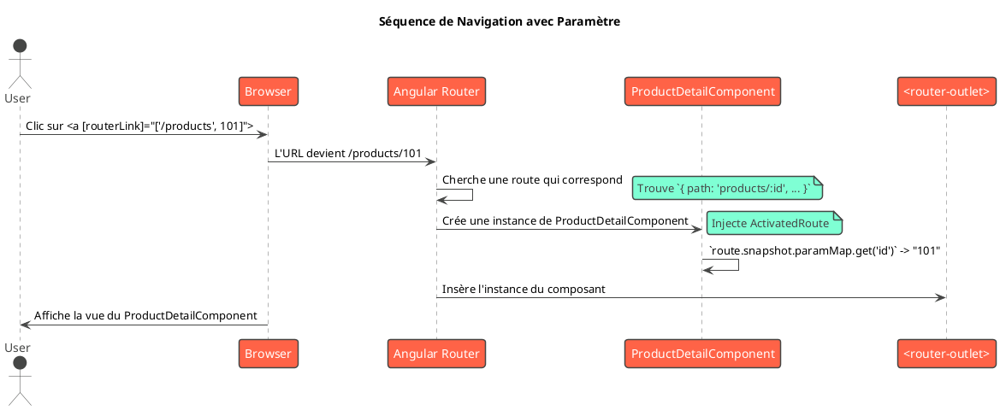

# Module 7 : L'essentiel - Navigation avec le Router Angular

### Objectifs pédagogiques

À la fin de ce chapitre, vous serez capable de :

* **Expliquer** le rôle du routage dans une Single Page Application (SPA).
* **Configurer** un ensemble de routes de base dans le fichier `app.routes.ts`.
* **Utiliser** les outils du `Router` : `<router-outlet>` pour afficher les composants et `routerLink` pour naviguer.
* **Définir** des routes paramétrées pour afficher des détails spécifiques (ex: un utilisateur par son ID).
* **Lire** les paramètres d'une URL en utilisant le service `ActivatedRoute`.

### Introduction : Le GPS de votre application

Jusqu'à présent, notre application ressemble à une maison avec une seule grande pièce. Tout se passe dans
`AppComponent`. C'est un bon début, mais une véritable application a besoin de plusieurs pièces : une entrée (la page
d'accueil), un salon (la liste des utilisateurs), une chambre (le profil d'un utilisateur), une cuisine (les
paramètres)...

Comment passer d'une pièce à l'autre sans démolir et reconstruire la maison à chaque fois (c'est-à-dire, sans recharger
la page) ? C'est le travail du **Router Angular**.

Pensez au Router comme au GPS de votre application. L'utilisateur tape une adresse dans la barre d'URL (ex:
`/users/123`), et le Router, en se basant sur les "cartes" que vous lui avez fournies, sait exactement quel composant
afficher et à quel endroit. Il permet de créer l'illusion d'une navigation multi-pages tout en conservant la fluidité et
la rapidité d'une SPA.

### 1. Principes du Routage dans une SPA

Dans une application web traditionnelle, chaque URL correspond à une page HTML différente renvoyée par le serveur.
Dans une SPA Angular :

1. Le serveur envoie une seule page HTML (la "coquille").
2. L'URL dans le navigateur devient la **source de vérité** de ce que l'utilisateur doit voir.
3. Le Router Angular surveille les changements de l'URL.
4. Quand l'URL change (via un clic sur un lien ou une saisie manuelle), le Router ne recharge pas la page. Il intercepte
   l'action, trouve le composant qui correspond à la nouvelle URL, et l'affiche dynamiquement dans un emplacement
   prédéfini.

### 2. Configuration des Routes (`app.routes.ts`)

Lorsque nous avons créé notre projet, nous avons répondu "Yes" à la question "Would you like to add Angular routing?".
La CLI a alors créé deux fichiers essentiels : `app.routes.ts` pour définir les routes, et a configuré `app.config.ts`
pour utiliser ce fichier.

Le fichier `app.routes.ts` contient simplement un tableau d'objets `Route`.

<procedure title="Configuration des routes de base" id="configure-routes">
    <step>
        <b>Créer des composants pour nos pages :</b>
        <p>Pour avoir des destinations, il nous faut des composants. Générons-en deux :</p>
        <code>
        ng g c pages/home
        ng g c pages/contact
        ng g c pages/not-found
        </code>
    </step>
    <step>
        <b>Définir les routes :</b>
        <p>Ouvrez <code>src/app/app.routes.ts</code>. Nous allons le remplir.</p>

```typescript
// Fichier: src/app/app.routes.ts
import { Routes } from '@angular/router';
import { HomeComponent } from './pages/home/home.component';
import { ContactComponent } from './pages/contact/contact.component';
import { NotFoundComponent } from './pages/not-found/not-found.component';

export const routes: Routes = [
  // Redirection : si l'URL est vide, redirige vers /home
  { path: '', redirectTo: '/home', pathMatch: 'full' },

  // Route pour la page d'accueil
  { path: 'home', component: HomeComponent },
  
  // Route pour la page de contact
  { path: 'contact', component: ContactComponent },
  
  // Route "wildcard" : si aucune autre route ne correspond,
  // affiche le composant NotFoundComponent.
  // Doit toujours être la dernière route de la liste !
  { path: '**', component: NotFoundComponent }
];
```
    
</step>

</procedure>

### 3. Les Outils du Router

Définir les routes ne suffit pas. Il faut dire à Angular **où** afficher les composants et **comment** y naviguer.

#### `<router-outlet>` : La Fenêtre d'Affichage

Ce sélecteur est une directive fournie par le module de routage. C'est l'emplacement, le "placeholder", où le Router va
dynamiquement insérer le composant correspondant à l'URL active.

Vous le placerez généralement dans votre `app.component.html`, en dessous de votre en-tête ou de votre barre de
navigation.

```html
<!-- Fichier: src/app/app.component.html -->
<app-header></app-header>

<nav>
    <!-- Barre de navigation -->
</nav>

<main>
    <!-- C'est ICI que HomeComponent, ContactComponent, etc., seront affichés -->
    <router-outlet></router-outlet>
</main>

<app-footer></app-footer>
```

#### `routerLink` : La Navigation sans Rechargement

Pour créer des liens de navigation, **n'utilisez pas l'attribut `href` standard**. `<a href="/contact">` provoquerait un
rechargement complet de la page, détruisant tout l'intérêt d'une SPA.

Utilisez plutôt la directive `routerLink`. Elle demande au Router de gérer la navigation en interne.

```html
<!-- Fichier: src/app/app.component.html (dans la nav, par exemple) -->
<ul>
    <li>
        <a [routerLink]="['/home']">Accueil</a>
    </li>
    <li>
        <a [routerLink]="['/contact']">Contact</a>
    </li>
    <li>
        <!-- Exemple d'un lien vers une page qui n'existe pas -->
        <a [routerLink]="['/profil']">Profil (inexistant)</a>
    </li>
</ul>
```

### 4. Passer des Paramètres dans l'URL

C'est un besoin très courant : afficher la page de détail d'un élément spécifique. L'URL doit contenir son identifiant.
Ex: `/users/42`.

**Analogie Java :** C'est l'équivalent parfait de `@GetMapping("/users/{id}")` et de l'utilisation de `@PathVariable` en
Spring MVC.

On définit une route paramétrée avec la syntaxe `:nom_du_parametre`.

```typescript
// Fichier: src/app/app.routes.ts
import {UserDetailComponent} from './pages/user-detail/user-detail.component';
// ...

export const routes: Routes = [
    // ... autres routes
    {path: 'users/:id', component: UserDetailComponent}, // Notre route paramétrée
    // ...
];
```

Maintenant, comment lire la valeur de `:id` depuis le `UserDetailComponent` ? En injectant le service `ActivatedRoute`.

```typescript
// Fichier: src/app/pages/user-detail/user-detail.component.ts
import {Component, OnInit} from '@angular/core';
import {ActivatedRoute} from '@angular/router';
import {UserService} from '../../shared/services/user.service'; // On suppose qu'on a un UserService
import {User} from '../../shared/models/user.model';

@Component({ /* ... */})
export class UserDetailComponent implements OnInit {
    public userId: string | null = null;
    public user: User | undefined;

    // On injecte le service ActivatedRoute
    constructor(
        private route: ActivatedRoute,
        private userService: UserService
    ) {
    }

    ngOnInit(): void {
        // On lit le paramètre 'id' depuis le "snapshot" de la route
        const idParam = this.route.snapshot.paramMap.get('id');

        // Le paramètre est une chaîne, on le convertit en nombre
        if (idParam) {
            const numericId = +idParam; // Le + est une astuce pour convertir en nombre
            this.user = this.userService.getUserById(numericId);
        }
    }
}
```

<tip>
`route.snapshot` est la façon la plus simple de lire un paramètre. Elle fonctionne parfaitement si votre composant est toujours détruit et recréé lorsque vous changez de page. Il existe une méthode plus avancée avec les Observables (`route.paramMap.subscribe`) pour les cas où vous naviguez d'un paramètre à l'autre sans quitter le composant (ex: de `user/1` à `user/2`).
</tip>

### Exercice pratique

#### Exercice 1 : Navigation et Détail Produit

Reprenons notre application e-commerce.

1. Générez deux composants de page : `ProductListComponent` et `ProductDetailComponent`.
2. Dans `app.routes.ts`, configurez les routes :
    * `/products` doit afficher `ProductListComponent`.
    * `/products/:id` doit afficher `ProductDetailComponent`.
    * Faites une redirection de la racine `''` vers `/products`.
3. Dans `AppComponent`, ajoutez des liens de navigation (`routerLink`) vers les pages existantes (Accueil, Contact) et
   une nouvelle vers "Produits" (`/products`). N'oubliez pas le `<router-outlet>`.
4. Dans `ProductListComponent`, affichez la liste de produits (en utilisant le `ProductService`). Pour chaque produit,
   créez un lien qui pointe vers sa page de détail. Ex: `<a [routerLink]="['/products', product.id]">Voir détail</a>`.
5. Dans `ProductDetailComponent`, injectez `ActivatedRoute` et `ProductService`. Récupérez l'ID du produit depuis l'URL,
   utilisez le service pour trouver le produit correspondant, et affichez son nom et son prix.

#### Correction exercice 1 {collapsible='true'}

1. **Génération des composants :** `ng g c pages/product-list`, `ng g c pages/product-detail`

2. **`app.routes.ts`**
   ```typescript
   import { Routes } from '@angular/router';
   import { ProductListComponent } from './pages/product-list/product-list.component';
   import { ProductDetailComponent } from './pages/product-detail/product-detail.component';
   
   export const routes: Routes = [
     { path: '', redirectTo: '/products', pathMatch: 'full' },
     // ... autres routes (home, contact)
     { path: 'products', component: ProductListComponent },
     { path: 'products/:id', component: ProductDetailComponent },
     // ... route wildcard
   ];
   ```

3. **`app.component.html`** (partie nav)
   ```html
   <nav>
     <a [routerLink]="['/home']">Accueil</a> |
     <a [routerLink]="['/products']">Produits</a> |
     <a [routerLink]="['/contact']">Contact</a>
   </nav>
   <router-outlet></router-outlet>
   ```

4. **`product-list.component.html`**
   ```html
   <h2>Nos Produits</h2>
   <ul>
     @for(product of products; track product.id) {
       <li>
         {{ product.name }}
         <a [routerLink]="['/products', product.id]">Voir le détail</a>
       </li>
     }
   </ul>
   ```
   (Le `.ts` du composant injecte `ProductService` pour obtenir la liste `products`)

5. **`product-detail.component.ts`**
   ```typescript
   import { Component, OnInit } from '@angular/core';
   import { ActivatedRoute } from '@angular/router';
   import { ProductService } from '../../shared/services/product.service';
   import { Product } from '../../shared/models/product.model'; // Assurez-vous d'avoir ce modèle

   @Component({ /* ... */ })
   export class ProductDetailComponent implements OnInit {
     public product: Product | undefined;

     constructor(
       private route: ActivatedRoute,
       private productService: ProductService
     ) {}

     ngOnInit(): void {
       const productId = this.route.snapshot.paramMap.get('id');
       if (productId) {
         this.product = this.productService.getProductById(+productId);
       }
     }
   }
   ```
   (Assurez-vous que votre `ProductService` a une méthode `getProductById(id: number)`).



### Auto-évaluation

---

**1. (Question ouverte)**  
Quel est le rôle de la directive `<router-outlet>` et où la place-t-on généralement ?

---

**2. (QCM)**  
Quelle est la directive correcte pour créer un lien de navigation vers la page `/about` ?

- a) `href="/about"`
- b) `[linkTo]="'/about'"`
- c) `(click)="/about"`
- d) `[routerLink]="['/about']"`

---

**3. (QCM)**  
Comment définiriez-vous une route pour capturer l'identifiant d'un livre (ex: `/books/abc-123`) ?

- a) `path: 'books/:isbn'`
- b) `path: 'books/#'`
- c) `path: 'books?id='`
- d) `path: 'books[isbn]'`

---

**4. (Question ouverte)**  
Pourquoi est-il préférable d'utiliser `routerLink` plutôt qu'un attribut `href` standard dans une application Angular ?

---

**5. (QCM)**  
Quel service devez-vous injecter dans un composant pour lire les paramètres de l'URL active ?

- a) `Router`
- b) `Route`
- c) `ActivatedRoute`
- d) `UrlService`

---


### Conclusion de cette partie

Vous venez d'ajouter une dimension essentielle à vos applications ! Vous n'êtes plus limité à un seul écran. Vous savez
désormais comment **structurer votre application en "pages"** distinctes, comment **définir les règles de navigation**
avec le fichier de routes, et comment permettre à l'utilisateur de se déplacer entre ces pages de manière fluide.

Plus important encore, vous maîtrisez la technique des **routes paramétrées**, qui est fondamentale pour construire des
applications de type "liste/détail", omniprésentes dans le monde du web.

Dans la partie "Pour aller plus loin", nous verrons des concepts de routage plus avancés comme les routes enfants (
nested routes), les "gardes" de navigation pour la sécurité, et le "lazy loading" pour des applications
ultra-performantes.