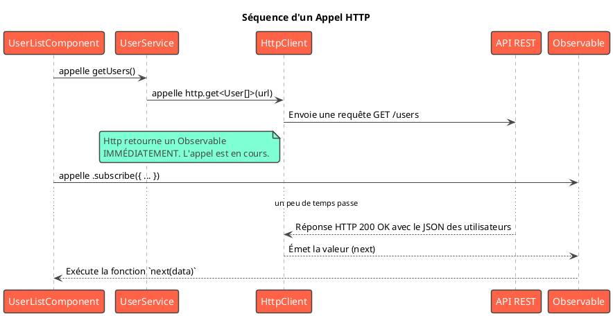

# Module 8 : L'essentiel - Communication avec le Backend : HttpClient et RxJS

### Objectifs pédagogiques

À la fin de ce chapitre, vous serez capable de :

* **Configurer** votre application pour utiliser le `HttpClient` d'Angular.
* **Comprendre** le concept fondamental d'un `Observable` de RxJS comme un flux de données dans le temps.
* **Distinguer** un `Observable` d'une `Promise` JavaScript classique.
* **Effectuer** des appels HTTP `GET` pour récupérer des données depuis une API REST.
* **Vous abonner** à un `Observable` avec la méthode `.subscribe()` pour traiter les données, les erreurs et la
  complétion.

### Introduction : Le dialogue entre le Client et le Serveur

Votre application Angular est magnifique, bien structurée, mais pour l'instant, elle vit dans une bulle. Toutes ses
données sont "en dur", codées dans des services. Or, une application digne de ce nom doit interagir avec le monde
extérieur, et plus particulièrement avec le backend robuste que vous avez (ou que vous pourriez) développer en Java avec
Spring Boot.

Comment établir ce dialogue ? Via le protocole **HTTP**. Angular nous fournit un outil formidable pour cela : le
`HttpClient`. Mais ce service ne retourne pas de simples données. Il retourne un **`Observable`**.

C'est le concept clé de ce module. Un `Observable` est la pierre angulaire de la programmation réactive avec la
bibliothèque **RxJS**. C'est une façon de gérer les événements asynchrones (comme une réponse HTTP qui peut prendre du
temps à arriver) de manière élégante et puissante.

**Analogie Java :** Pensez à un `Observable` comme à un `Stream` ou un `CompletableFuture` surpuissant. Il peut émettre
zéro, une, ou même une infinité de valeurs au fil du temps.

Ce module vous apprendra à commander et à recevoir des données de votre backend, en posant les bases de la programmation
réactive qui est au cœur d'Angular.

### 1. Mise en Place de `HttpClient`

Pour pouvoir utiliser le `HttpClient`, nous devons le "fournir" à notre application. Avec l'approche standalone moderne,
cela se fait très simplement dans le fichier `app.config.ts`.

<procedure title="Configuration du HttpClient" id="setup-httpclient">
    <step>
        <b>Modifier `app.config.ts` :</b>
        <p>Ouvrez le fichier <code>src/app/app.config.ts</code> et ajoutez le fournisseur <code>provideHttpClient()</code>.</p>

```typescript
// Fichier: src/app/app.config.ts
import { ApplicationConfig } from '@angular/core';
import { provideRouter } from '@angular/router';
import { provideHttpClient } from '@angular/common/http'; // 1. Importer

import { routes } from './app.routes';

export const appConfig: ApplicationConfig = {
  providers: [
    provideRouter(routes),
    provideHttpClient() // 2. Ajouter le fournisseur ici
  ]
};
```
    
</step>
    <step>
        <b>C'est tout !</b>
        <p>Grâce à cette simple ligne, vous pouvez maintenant injecter le service <code>HttpClient</code> dans n'importe lequel de vos services ou composants.</p>
    </step>

</procedure>

### 2. RxJS et le concept d'Observable

Avant de faire un appel HTTP, comprenons ce qu'est un `Observable`.

Imaginez que vous commandez une pizza.

* **Approche classique (Promise) :** Vous passez commande. Le livreur vous fait une **promesse** : "Je vous livrerai une
  pizza". Vous attendez, et à un moment donné, vous recevez **une seule chose** : la pizza (ou un message d'erreur si la
  pizzeria est fermée). La transaction est terminée.
* **Approche réactive (Observable) :** Vous vous **abonnez** à un service de livraison de repas. Ce service peut vous
  envoyer **plusieurs choses au fil du temps** :
    1. Une notification "Votre commande est acceptée" (`next`).
    2. Une notification "Le livreur est en route" (`next`).
    3. Une notification "Le livreur est arrivé avec votre pizza" (`next`).
    4. Un message d'erreur si votre paiement est refusé (`error`).
    5. Une notification "Votre commande est terminée" (`complete`).

Un `Observable` est ce flux de notifications. Il est "paresseux" : il ne fait rien tant que personne ne s'y **abonne** (
`.subscribe()`).

Pour un appel HTTP, l'Observable est plus simple : il n'émettra qu'**une seule valeur** (la réponse HTTP) puis se
terminera (`complete`), ou il émettra une **erreur**. Mais le modèle reste le même.

### 3. Effectuer des Appels HTTP

Modifions notre `UserService` pour qu'il aille chercher les données sur une véritable API REST (nous
utiliserons [JSONPlaceholder](https://jsonplaceholder.typicode.com/), un excellent service d'API factice pour les
tests).

```typescript
// Fichier: src/app/shared/services/user.service.ts
import {Injectable} from '@angular/core';
import {HttpClient} from '@angular/common/http'; // 1. Importer HttpClient
import {Observable} from 'rxjs'; // 2. Importer Observable
import {User} from '../models/user.model';

@Injectable({
    providedIn: 'root'
})
export class UserService {
    private apiUrl = 'https://jsonplaceholder.typicode.com/users';

    // 3. Injecter HttpClient dans le constructeur
    constructor(private http: HttpClient) {
    }

    // 4. La méthode ne retourne plus un User[] mais un Observable<User[]>
    public getUsers(): Observable<User[]> {
        console.log("UserService: Appel de l'API pour récupérer les utilisateurs...");
        // 5. Utiliser http.get(). Le typage <User[]> aide TypeScript
        //    à savoir à quoi s'attendre dans la réponse.
        return this.http.get<User[]>(this.apiUrl);
    }
}
```

### 4. S'abonner (`.subscribe()`) pour recevoir la réponse

Le `UserService` nous donne maintenant un `Observable`. Mais rien ne se passe tant que personne ne dit "je veux les
données". C'est le rôle du composant de s'abonner.

La méthode `.subscribe()` peut prendre jusqu'à trois fonctions en argument :

* `next(data)` : La fonction à exécuter quand les données arrivent.
* `error(err)` : La fonction à exécuter si une erreur se produit.
* `complete()` : La fonction à exécuter quand le flux est terminé (optionnel).

```typescript
// Fichier: src/app/pages/user-list/user-list.component.ts
import {Component, OnInit} from '@angular/core';
import {UserService} from '../../shared/services/user.service';
import {User} from '../../shared/models/user.model';

@Component({ /* ... */})
export class UserListComponent implements OnInit {
    public users: User[] = [];
    public isLoading: boolean = true;
    public errorMessage: string | null = null;

    constructor(private userService: UserService) {
    }

    ngOnInit(): void {
        // On appelle la méthode du service qui retourne un Observable
        this.userService.getUsers().subscribe({
            // Cas 1: Succès ! Les données sont arrivées.
            next: (data) => {
                this.users = data;
                this.isLoading = false;
                console.log("UserListComponent: Données reçues !", data);
            },
            // Cas 2: Erreur ! L'appel a échoué.
            error: (err) => {
                this.errorMessage = "Impossible de charger les utilisateurs.";
                this.isLoading = false;
                console.error("Une erreur est survenue :", err);
            },
            // Cas 3: Complétion (optionnel pour les appels HTTP)
            complete: () => {
                console.log("L'observable des utilisateurs est complété.");
            }
        });
    }
}
```



### Exercice pratique

#### Exercice 1 : Récupérer les "Todos" depuis l'API

Votre mission est de créer un `TodoListComponent` qui récupère et affiche une liste de tâches depuis l'API
JSONPlaceholder.

1. Assurez-vous que `provideHttpClient()` est bien dans votre `app.config.ts`.
2. Créez un `TodoService` qui injecte `HttpClient`.
3. Dans `TodoService`, créez une méthode `getTodos()` qui fait un appel `GET` à l'URL
   `https://jsonplaceholder.typicode.com/todos` et retourne un `Observable<Todo[]>`. (N'oubliez pas de créer une
   interface `Todo` correspondante : `id`, `userId`, `title`, `completed`).
4. Créez un `TodoListComponent`.
5. Dans ce composant, injectez `TodoService`.
6. Dans la méthode `ngOnInit`, appelez `todoService.getTodos()` et abonnez-vous à l'observable.
7. Dans le callback `next`, assignez les données reçues à une propriété `todos` du composant.
8. Dans le template, utilisez `@for` pour afficher la liste des titres des tâches. Affichez aussi un message de
   chargement tant que les données ne sont pas arrivées.

#### Correction exercice 1 {collapsible='true'}

1. **`app.config.ts`** est déjà configuré.

2. & 3. **`todo.service.ts`**
   ```typescript
   // Fichier: src/app/shared/services/todo.service.ts
   import { Injectable } from '@angular/core';
   import { HttpClient } from '@angular/common/http';
   import { Observable } from 'rxjs';

   // On peut mettre cette interface dans un fichier models/todo.model.ts
   export interface Todo {
     id: number;
     userId: number;
     title: string;
     completed: boolean;
   }

   @Injectable({
     providedIn: 'root'
   })
   export class TodoService {
     private apiUrl = 'https://jsonplaceholder.typicode.com/todos';

     constructor(private http: HttpClient) { }

     public getTodos(): Observable<Todo[]> {
       return this.http.get<Todo[]>(this.apiUrl);
     }
   }
   ```

4. à 8. **`todo-list.component.ts` et `.html`**
   ```typescript
   // Fichier: src/app/pages/todo-list/todo-list.component.ts
   import { Component, OnInit } from '@angular/core';
   import { TodoService, Todo } from '../../shared/services/todo.service';

   @Component({
     selector: 'app-todo-list',
     templateUrl: './todo-list.component.html',
     // ...
   })
   export class TodoListComponent implements OnInit {
     public todos: Todo[] = [];
     public isLoading = true;

     constructor(private todoService: TodoService) {}

     ngOnInit(): void {
       this.todoService.getTodos().subscribe({
         next: (data) => {
           this.todos = data;
           this.isLoading = false;
         },
         error: (err) => {
           console.error(err);
           this.isLoading = false;
         }
       });
     }
   }
   ```

   ```html
   <!-- Fichier: src/app/pages/todo-list/todo-list.component.html -->
   <h2>Liste de Tâches</h2>

   @if (isLoading) {
     <p>Chargement en cours...</p>
   } @else {
     <ul>
       @for (todo of todos; track todo.id) {
         <li>{{ todo.title }}</li>
       }
     </ul>
   }
   ```

### Auto-évaluation

1. **(Question ouverte)** Quelle est la différence majeure entre une `Promise` et un `Observable` en termes de valeurs
   émises ?
2. **(QCM)** Quelle fonction devez-vous appeler dans `app.config.ts` pour pouvoir utiliser `HttpClient` ?
   a) `importProvidersFrom(HttpClientModule)`
   b) `provideHttp()`
   c) `provideHttpClient()`
   d) `enableHttp()`
3. **(QCM)** Une méthode de service fait un appel `http.get()`. Que se passe-t-il si aucun composant n'appelle
   `.subscribe()` sur l'Observable retourné ?
   a) L'appel HTTP est fait, mais la réponse est ignorée.
   b) L'appel HTTP n'est jamais fait.
   c) L'appel HTTP est fait et réessayé jusqu'à ce qu'il y ait une souscription.
   d) Angular lève une erreur.
4. **(Question ouverte)** Dans un appel `.subscribe()`, quels sont les trois "canaux" (ou callbacks) que vous pouvez
   écouter ?
5. **(QCM)** Votre méthode `getUsers()` retourne un `Observable<User[]>`. Dans le callback `next` de `subscribe`, quel
   sera le type du paramètre `data` ?
   a) `Observable<User[]>`
   b) `User`
   c) `User[]`
   d) `any`

### Conclusion de cette partie

Félicitations, vous avez franchi une étape décisive ! Vous savez maintenant comment faire communiquer votre application
Angular avec un backend. Vous avez découvert le concept fondamental d'**`Observable`**, qui est au cœur de la gestion de
l'asynchronisme dans Angular, et vous savez comment vous y **abonner** pour traiter les données, les erreurs et la
complétion.

Vous avez mis en pratique le cycle complet :
**Composant -> Service -> HttpClient -> API -> HttpClient -> Service -> Composant**

C'est la base de toute application connectée. Dans la partie "Pour aller plus loin" et dans les modules suivants, nous
allons explorer la puissance de RxJS avec ses opérateurs (`map`, `filter`, `switchMap`...) pour transformer et combiner
ces flux de données avant même de s'y abonner, ce qui rendra notre code encore plus puissant et déclaratif.