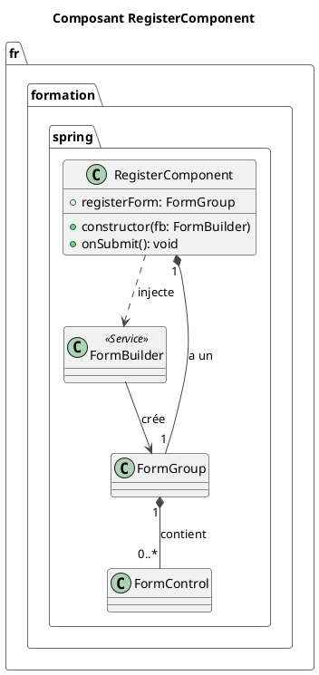

# Module 9 : L'essentiel - Les Formulaires Réactifs

### Objectifs pédagogiques

À la fin de ce chapitre, vous serez capable de :

* **Comprendre** l'approche des Formulaires Réactifs et pourquoi elle est privilégiée pour les applications complexes.
* **Construire** un modèle de formulaire dans votre classe de composant en utilisant `FormGroup`, `FormControl` et le
  `FormBuilder`.
* **Lier** votre modèle de formulaire au template HTML avec les directives `[formGroup]` et `formControlName`.
* **Mettre en place** des règles de validation intégrées (`Validators.required`, `email`, `minLength`...).
* **Afficher** des messages d'erreur de manière conditionnelle et ergonomique.
* **Gérer** la soumission du formulaire pour récupérer les données saisies.

### Introduction : Le dialogue structuré avec l'utilisateur

Jusqu'à présent, nos interactions étaient simples : un clic sur un bouton, un lien de navigation. Mais le cœur de
nombreuses applications réside dans la capacité de l'utilisateur à nous fournir des données structurées : un formulaire
d'inscription, une page de création d'article, un panneau de configuration...

Angular propose deux approches pour gérer les formulaires. Nous allons nous concentrer sur les **Formulaires Réactifs (
Reactive Forms)**, car leur philosophie est extraordinairement proche de ce que vous connaissez en Java.

L'idée est simple : au lieu de définir la logique du formulaire dans le HTML, nous allons construire un **modèle de
données du formulaire** directement dans notre classe TypeScript. C'est comme créer un DTO (Data Transfer Object) ou un
objet de commande en Java *avant même d'écrire la moindre ligne de HTML*. Vous définissez la structure, les règles de
validation, les valeurs par défaut, tout cela de manière programmatique. La vue (le HTML) ne fait ensuite que se "
synchroniser" avec ce modèle que vous contrôlez entièrement. C'est une approche robuste, testable et parfaitement
adaptée aux applications complexes.

### 1. Introduction aux Formulaires Réactifs

| Formulaires Réactifs (notre choix)                    | Formulaires par Template (Template-Driven)                      |
|-------------------------------------------------------|-----------------------------------------------------------------|
| **Modèle défini en TS** (dans la classe du composant) | Modèle implicite, défini dans le HTML avec des directives       |
| **Explicite et structuré**                            | Implicite et moins structuré                                    |
| **Prédictible et synchrone**                          | Asynchrone (peut y avoir des délais de mise à jour)             |
| **Facile à tester unitairement**                      | Plus difficile à tester                                         |
| **Idéal pour les formulaires complexes**              | Idéal pour les formulaires très simples (ex: un champ de login) |

### 2. Les Briques de Base : `FormControl`, `FormGroup` et `FormBuilder`

Pour construire notre modèle de formulaire, nous avons trois outils principaux. Il faut les importer depuis
`@angular/forms`.

* `FormControl` : Représente **un seul champ** de formulaire. Il traque sa valeur, son état de validation, et si
  l'utilisateur y a touché (`touched`).
* `FormGroup` : Représente **un groupe de `FormControl`s**. C'est le formulaire dans son ensemble. Il agrège la valeur
  et l'état de validation de tous ses enfants.
* `FormBuilder` : Un service "assistant" qui fournit une syntaxe courte et pratique pour créer des instances de
  `FormGroup` et `FormControl`. C'est la manière la plus courante et la plus lisible de construire des formulaires.

<procedure title="Mise en place et création d'un formulaire" id="setup-reactive-forms">
    <step>
        <b>Importer `ReactiveFormsModule` :</b>
        <p>Pour utiliser les Formulaires Réactifs, le <code>ReactiveFormsModule</code> doit être disponible. On l'importe dans le composant qui en a besoin (ou globalement).</p>


```typescript
// Fichier: login.component.ts
import { ReactiveFormsModule } from '@angular/forms';

@Component({
  // ...
  imports: [ReactiveFormsModule],
})
export class LoginComponent { /* ... */ }
```

</step>
    <step>
        <b>Construire le modèle avec `FormBuilder` :</b>
        <p>On injecte <code>FormBuilder</code> (souvent abrégé en <code>fb</code>) et on l'utilise pour créer notre <code>FormGroup</code>.</p>

```typescript
// Fichier: login.component.ts
import { Component } from '@angular/core';
import { FormBuilder, FormGroup, Validators } from '@angular/forms';

@Component({ /* ... */ })
export class LoginComponent {
  // Déclaration de notre propriété de formulaire
  public loginForm: FormGroup;

  // On injecte le FormBuilder
  constructor(private fb: FormBuilder) {
    this.loginForm = this.fb.group({
      // Crée un FormControl pour 'email'
      // 1er élément du tableau : valeur par défaut
      // 2ème élément : validateur(s)
      email: ['', [Validators.required, Validators.email]],
      
      // Crée un FormControl pour 'password'
      password: ['', Validators.required],
    });
  }
}
```
</step>

</procedure>

### 3. Lier le Modèle au Template

Maintenant que notre modèle existe dans le `.ts`, il faut le connecter au HTML.

* `[formGroup]` : Appliqué à la balise `<form>`, il lie le formulaire HTML à notre instance de `FormGroup`.
* `formControlName` : Appliqué à un `<input>`, il le lie au `FormControl` correspondant dans le `FormGroup`.

```html
<!-- Fichier: login.component.html -->

<!-- 1. On lie la balise form à notre 'loginForm' -->
<form [formGroup]="loginForm">
    <div class="form-field">
        <label for="email">Email</label>
        <!-- 2. On lie cet input au control 'email' -->
        <input id="email" type="email" formControlName="email">
    </div>

    <div class="form-field">
        <label for="password">Mot de passe</label>
        <!-- 3. On lie cet input au control 'password' -->
        <input id="password" type="password" formControlName="password">
    </div>

    <button type="submit">Se connecter</button>
</form>
```

### 4. La Validation et les Messages d'Erreur

Le point le plus important est d'indiquer à l'utilisateur ce qui ne va pas. Pour cela, on accède à l'état de chaque
`FormControl`. Un contrôle a plusieurs propriétés utiles :

* `valid` / `invalid` : Le contrôle est-il valide ?
* `touched` / `untouched` : L'utilisateur a-t-il cliqué dans le champ puis en est-il sorti ? (Très utile pour n'afficher
  les erreurs qu'après une interaction).
* `dirty` / `pristine` : La valeur a-t-elle été modifiée ?
* `errors` : Un objet contenant les erreurs de validation (ex: `{ required: true }`).

```html
<!-- Fichier: login.component.html (version améliorée) -->
<form [formGroup]="loginForm">
    <div class="form-field">
        <label for="email">Email</label>
        <input id="email" type="email" formControlName="email">

        <!-- Section des messages d'erreur -->
        @if (loginForm.get('email')?.invalid && loginForm.get('email')?.touched) {
        <div class="error-messages">
            @if (loginForm.get('email')?.hasError('required')) {
            <small>L'email est requis.</small>
            }
            @if (loginForm.get('email')?.hasError('email')) {
            <small>Le format de l'email est invalide.</small>
            }
        </div>
        }
    </div>
    <!-- ... faire de même pour le mot de passe ... -->
</form>
```

<tip>
L'opérateur `?.` (optional chaining) est utilisé pour éviter les erreurs si `loginForm.get('email')` est `null` (ce qui n'arrive pas dans ce cas, mais c'est une bonne pratique).
</tip>

### 5. Soumettre le Formulaire

Pour gérer la soumission, on utilise l'événement `(ngSubmit)` sur la balise `<form>`. Cela prévient le comportement par
défaut du navigateur (qui est de recharger la page) et appelle notre méthode.

```html
<!-- Fichier: login.component.html -->
<form [formGroup]="loginForm" (ngSubmit)="onSubmit()">
    <!-- ... champs ... -->

    <!-- On peut désactiver le bouton si le formulaire est invalide -->
    <button type="submit" [disabled]="loginForm.invalid">
        Se connecter
    </button>
</form>
```

```typescript
// Fichier: login.component.ts
export class LoginComponent {
    // ...

    public onSubmit(): void {
        // On vérifie une dernière fois si le formulaire est valide
        if (this.loginForm.invalid) {
            // On peut marquer tous les champs comme 'touched' pour afficher
            // toutes les erreurs si l'utilisateur essaie de soumettre sans rien toucher.
            this.loginForm.markAllAsTouched();
            return;
        }

        // loginForm.value contient un objet avec les données du formulaire
        // ex: { email: 'test@test.com', password: '123' }
        console.log("Formulaire soumis !");
        console.log(this.loginForm.value);

        // Ici, on appellerait un service pour envoyer ces données au backend
        // this.authService.login(this.loginForm.value).subscribe(...);
    }
}
```

### Exercice pratique

#### Exercice 1 : Formulaire d'Inscription Utilisateur

Créez un composant `RegisterComponent` avec un formulaire d'inscription.

1. Le formulaire doit contenir les champs : `username` (string), `email` (string), et `password` (string).
2. Utilisez `FormBuilder` pour créer le modèle de formulaire.
3. Appliquez les validateurs suivants :
    * `username` : requis (`required`) et longueur minimale de 3 caractères (`minLength(3)`).
    * `email` : requis (`required`) et doit être un email valide (`email`).
    * `password` : requis (`required`) et longueur minimale de 8 caractères (`minLength(8)`).
4. Liez ce modèle au template HTML.
5. Pour chaque champ, affichez les messages d'erreur appropriés uniquement si le champ est invalide ET a été "touché".
6. Le bouton "S'inscrire" doit être désactivé tant que le formulaire est invalide.
7. Quand le formulaire est soumis et valide, affichez les données dans la console.

#### Correction exercice 1 {collapsible='true'}

**`register.component.ts`**

```typescript
import {Component} from '@angular/core';
import {CommonModule} from '@angular/common';
import {FormBuilder, FormGroup, Validators, ReactiveFormsModule} from '@angular/forms';

@Component({
    selector: 'app-register',
    standalone: true,
    imports: [CommonModule, ReactiveFormsModule],
    templateUrl: './register.component.html',
    styleUrl: './register.component.css'
})
export class RegisterComponent {
    public registerForm: FormGroup;

    constructor(private fb: FormBuilder) {
        this.registerForm = this.fb.group({
            username: ['', [Validators.required, Validators.minLength(3)]],
            email: ['', [Validators.required, Validators.email]],
            password: ['', [Validators.required, Validators.minLength(8)]],
        });
    }

    public onSubmit(): void {
        if (this.registerForm.invalid) {
            this.registerForm.markAllAsTouched();
            return;
        }
        console.log("Inscription réussie avec les données :", this.registerForm.value);
    }
}
```

**`register.component.html`**

```html
<h2>Inscription</h2>

<form [formGroup]="registerForm" (ngSubmit)="onSubmit()">
    <!-- Champ Username -->
    <div class="form-field">
        <label for="username">Nom d'utilisateur</label>
        <input id="username" type="text" formControlName="username">
        @if (registerForm.get('username')?.invalid && registerForm.get('username')?.touched) {
        <div class="error-messages">
            @if (registerForm.get('username')?.hasError('required')) {
            <small>Le nom d'utilisateur est requis.</small>
            }
            @if (registerForm.get('username')?.hasError('minlength')) {
            <small>Doit contenir au moins 3 caractères.</small>
            }
        </div>
        }
    </div>

    <!-- Champ Email -->
    <div class="form-field">
        <label for="email">Email</label>
        <input id="email" type="email" formControlName="email">
        @if (registerForm.get('email')?.invalid && registerForm.get('email')?.touched) {
        <div class="error-messages">
            @if (registerForm.get('email')?.hasError('required')) {
            <small>L'email est requis.</small>
            }
            @if (registerForm.get('email')?.hasError('email')) {
            <small>Format d'email invalide.</small>
            }
        </div>
        }
    </div>

    <!-- Champ Password -->
    <div class="form-field">
        <label for="password">Mot de passe</label>
        <input id="password" type="password" formControlName="password">
        @if (registerForm.get('password')?.invalid && registerForm.get('password')?.touched) {
        <div class="error-messages">
            @if (registerForm.get('password')?.hasError('required')) {
            <small>Le mot de passe est requis.</small>
            }
            @if (registerForm.get('password')?.hasError('minlength')) {
            <small>Doit contenir au moins 8 caractères.</small>
            }
        </div>
        }
    </div>

    <button type="submit" [disabled]="registerForm.invalid">S'inscrire</button>
</form>
```



### Auto-évaluation

---

**1. (Question ouverte)**  
Pourquoi l'approche des Formulaires Réactifs est-elle particulièrement bien adaptée aux développeurs ayant une expérience en Java/backend ?

---

**2. (QCM)**  
Quel module devez-vous importer pour utiliser les Formulaires Réactifs ?

- a) `FormsModule`
- b) `CommonModule`
- c) `BrowserModule`
- d) `ReactiveFormsModule`

---

**3. (QCM)**  
Quelle directive lie une balise `<input>` à un `FormControl` spécifique dans un `FormGroup` ?

- a) `[formGroup]`
- b) `formControlName`
- c) `[ngModel]`
- d) `formName`

---

**4. (Question ouverte)**  
Expliquez la différence entre les états `touched` et `dirty` d'un `FormControl`.  
Dans quel cas utiliseriez-vous l'un plutôt que l'autre ?

---

**5. (QCM)**  
Quel est le rôle principal du service `FormBuilder` ?

- a) Gérer la soumission du formulaire au backend.
- b) Fournir une syntaxe simplifiée pour créer des instances de `FormGroup` et `FormControl`.
- c) Valider les données du formulaire.
- d) Lier le modèle de formulaire au template HTML.

---


### Conclusion de cette partie

Excellent travail ! Vous avez maîtrisé l'un des aspects les plus puissants et les plus structurants d'Angular. Vous
savez désormais comment construire des **formulaires robustes et maintenables** en définissant un modèle de données
clair dans votre code TypeScript.

Vous savez lier ce modèle à la vue, y appliquer des **règles de validation** complexes, fournir un **feedback clair à
l'utilisateur** et gérer la **soumission des données**. Cette compétence est absolument essentielle pour la
quasi-totalité des applications web.

Dans la partie "Pour aller plus loin", nous explorerons des sujets avancés comme la création de validateurs
personnalisés, la gestion de formulaires dynamiques (où des champs peuvent être ajoutés ou supprimés) et la manière de
structurer des formulaires imbriqués.