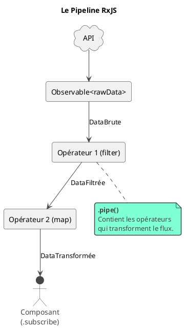

# Module 10 : L'essentiel - RxJS, Penser en Flux de Données

### Objectifs pédagogiques

À la fin de ce chapitre, vous serez capable de :

* **Adopter** une mentalité de "flux de données" (streams) pour le traitement asynchrone.
* **Utiliser** la méthode `.pipe()` pour créer des chaînes de traitement de données (pipelines).
* **Maîtriser** les opérateurs fondamentaux :
    * `map` pour transformer les données.
    * `filter` pour filtrer les données (au sein d'un `map`).
    * `tap` pour effectuer des actions sans modifier le flux (effets de bord).
* **Exploiter** le pipe `async` dans les templates pour une gestion automatique et sécurisée des abonnements.

### Introduction : De la plomberie simple à l'usine de traitement

Imaginez que votre appel HTTP est un tuyau qui amène de l'eau brute (la réponse de l'API) à votre maison (le composant).
Dans le module précédent, nous avons appris à ouvrir le robinet (`.subscribe()`) et à récupérer cette eau.

Mais que faire si cette eau n'est pas tout à fait comme nous la voulons ? Si elle est trouble ? Si nous ne voulons que
l'eau chaude ? Si nous voulons l'analyser avant de l'utiliser ?

C'est là qu'intervient la puissance de RxJS. Au lieu d'un simple tuyau, vous allez construire une véritable **usine de
traitement**. Vous allez installer des filtres, des stations d'enrichissement, des points de contrôle... tout cela *
*dans le tuyau lui-même**. Votre composant, à la fin, ne recevra plus de l'eau brute, mais une eau parfaitement
purifiée, à la bonne température et prête à l'emploi. Cette usine, c'est le `.pipe()`, et ses stations, ce sont les *
*opérateurs**.

### 1. Penser en "Streams" avec `.pipe()`

La méthode `.pipe()` d'un Observable est votre chaîne de montage. Elle vous permet d'enchaîner des opérateurs, qui sont
des fonctions pures qui prennent un Observable en entrée et en retournent un nouveau, modifié.

Chaque donnée émise par l'Observable source va passer à travers chaque opérateur du `pipe`, l'un après l'autre, avant
d'arriver au `subscribe` final.




### 2. Opérateurs de Transformation et de Filtrage

Ce sont les outils que vous utiliserez le plus souvent.

#### `map()` : Transformer chaque valeur émise

`map` prend la valeur émise par l'Observable et la transforme en autre chose. C'est une station de "peinture" sur votre
chaîne de montage.

**Scénario :** Notre API nous retourne une liste d'utilisateurs (`User[]`), mais notre composant n'a besoin que d'une
liste de noms (`string[]`).

```typescript
// Fichier: user.service.ts
import {map} from 'rxjs/operators';
import {Observable} from 'rxjs';

public getUserNames(): Observable < string[] > {
    return this.http.get<User[]>(this.apiUrl).pipe(
        // map reçoit le tableau de User[]
        map(users => {
            // On utilise le .map() des tableaux JS pour transformer chaque user
            return users.map(user => user.name);
        })
        // Ce qui sort du map est maintenant un tableau de string[]
    );
}
```

Le composant qui s'abonne à `getUserNames()` recevra directement un `string[]`, sans jamais voir la structure complète
de l'objet `User`.

#### `filter()` : Laisser passer ou bloquer

L'opérateur `filter` permet de décider si une valeur doit continuer son chemin dans le pipeline.

<warning>
`filter` est plus utile pour les flux qui émettent plusieurs valeurs (ex: clics). Pour un appel HTTP, qui n'émet qu'une seule valeur (le tableau entier), on utilise plutôt la méthode `.filter()` des tableaux **à l'intérieur** d'un `map` pour filtrer les *éléments du tableau*.
</warning>

**Scénario :** Récupérer uniquement les utilisateurs dont l'ID est supérieur à 5.

```typescript
// Fichier: user.service.ts
import {map} from 'rxjs/operators';

public getHighIdUsers(): Observable < User[] > {
    return this.http.get<User[]>(this.apiUrl).pipe(
        // On utilise map pour transformer le tableau
        map(users =>
            // Et le .filter() des tableaux JS pour filtrer son contenu
            users.filter(user => user.id > 5)
        )
    );
}
```

#### `tap()` : L'observateur discret

`tap` (anciennement `do`) est votre outil de débogage. Il vous permet d'"espionner" le flux à un certain point,
d'exécuter une action (comme un `console.log`), **sans modifier la donnée qui passe**. C'est la caméra de surveillance
sur votre chaîne de montage.

```typescript
// Fichier: user.service.ts
import {map, tap} from 'rxjs/operators';

public getUsers(): Observable < User[] > {
    return this.http.get<User[]>(this.apiUrl).pipe(
        tap(users => console.log(`[TAP] Avant transformation: ${users.length} utilisateurs`)),
        map(users => users.filter(user => user.id > 5)),
        tap(users => console.log(`[TAP] Après transformation: ${users.length} utilisateurs`))
    );
}
```

### 3. Le Pipe `async` : La Magie de la Désinscription Automatique

**Le Problème :** Chaque fois que vous faites un `.subscribe()` dans un composant, vous créez un abonnement. Si vous ne
vous désabonnez pas manuellement lorsque le composant est détruit, cet abonnement continue de vivre en mémoire. C'est ce
qu'on appelle une **fuite de mémoire**.

La solution manuelle est fastidieuse :

```typescript
// La "vieille" manière, à éviter si possible
export class UserListComponent implements OnInit, OnDestroy {
    private subscription: Subscription = new Subscription();

    ngOnInit(): void {
        this.subscription = this.userService
                                .getUsers()
                                .subscribe(
                                    users =...
                                );
    }

    ngOnDestroy(): void {
        // Il ne faut JAMAIS oublier de se désabonner !
        this.subscription.unsubscribe();
    }
}
```

**La Solution Magique : `| async`**
Angular nous offre un Pipe `async` qui fait tout le travail pour nous.

1. Il s'abonne à l'Observable à notre place.
2. Il retourne la dernière valeur émise.
3. Il se désabonne automatiquement lorsque le composant est détruit.

C'est la **meilleure pratique** pour consommer des Observables dans un template.

<tabs>
<tab title="Avant (avec .subscribe())">
```typescript
// Fichier: user-list.component.ts
export class UserListComponent implements OnInit {
  public users: User[] = [];
  public isLoading = true;

constructor(private userService: UserService) {}

ngOnInit(): void {
this.userService.getUsers().subscribe(data => {
this.users = data;
this.isLoading = false;
});
}
}

```
```html
<!-- Fichier: user-list.component.html -->
@if(!isLoading) {
  <ul>
    @for(user of users; track user.id) {
      <li>{{ user.name }}</li>
    }
  </ul>
}
```

</tab>
<tab title="Après (avec le pipe async)">

```typescript
// Fichier: user-list.component.ts
export class UserListComponent {
  // On ne s'abonne plus ! On stocke juste l'Observable.
  // Le '$' à la fin est une convention pour indiquer une variable Observable.
  public users$: Observable<User[]>;

constructor(private userService: UserService) {
this.users$ = this.userService.getUsers();
}
}

```

```html
<!-- Fichier: user-list.component.html -->
<!-- Le pipe 'async' gère le 'isLoading' et la donnée -->
@if (users$ | async; as users) {
  <ul>
    <!-- On utilise la variable 'users' créée par le @if -->
    @for(user of users; track user.id) {
      <li>{{ user.name }}</li>
    }
  </ul>
} @else {
  <p>Chargement...</p>
}
```

Le code est plus simple, plus déclaratif, et surtout, plus sûr !
</tab>
</tabs>

### Exercice pratique

#### Exercice 1 : Préparer des Données pour l'Affichage

Créez une méthode dans votre `ProductService` qui récupère des produits et les prépare pour une carte de "Produits en
promotion".

1. Créez une méthode `getFeaturedProducts()` qui retourne un `Observable<FeaturedProduct[]>`.
2. L'interface `FeaturedProduct` sera plus simple : `{ id: number, name: string, discountedPrice: number }`.
3. Dans cette méthode, faites un appel `GET` à votre API de produits.
4. Dans le `.pipe()`, enchaînez les opérateurs pour :
   a. Filtrer les produits pour ne garder que ceux qui ont un prix supérieur à 50.
   b. Transformer (`map`) le tableau de `Product[]` restant en un tableau de `FeaturedProduct[]`. Le `discountedPrice`
   sera le prix original moins 10%.
   c. Utilisez `tap` pour afficher dans la console le nombre de produits en promotion trouvés.
5. Dans un composant, utilisez le pipe `async` pour afficher le résultat.

#### Correction exercice 1 {collapsible='true'}

**`product.service.ts`**

```typescript
import {map, tap} from 'rxjs/operators';
import {Observable} from 'rxjs';

// Le modèle de données simplifié
export interface FeaturedProduct {
    id: number;
    name: string;
    discountedPrice: number;
}

// ... dans la classe ProductService
public getFeaturedProducts(): Observable < FeaturedProduct[] > {
    return this.http.get<Product[]>(this.apiUrl).pipe(
        // 1. Transformer le tableau de produits
        map(products =>
            // 1a. D'abord, on filtre
            products.filter(p => p.price > 50)
                // 1b. Ensuite, on transforme chaque produit filtré
                .map(p => ({
                    id: p.id,
                    name: p.name.toUpperCase(),
                    discountedPrice: p.price * 0.9
                }))
        ),
        // 2. Observer le résultat final
        tap(featured => console.log(`${featured.length} produits en promotion trouvés.`))
    );
}
```

**`featured-products.component.ts`**

```typescript
import {Component} from '@angular/core';
import {ProductService, FeaturedProduct} from '...';
import {Observable} from 'rxjs';

@Component({ /* ... */})
export class FeaturedProductsComponent {
    public featuredProducts$: Observable<FeaturedProduct[]>;

    constructor(private productService: ProductService) {
        this.featuredProducts$ = this.productService.getFeaturedProducts();
    }
}
```

**`featured-products.component.html`**

```html
<h2>Produits en Promotion</h2>
@if (featuredProducts$ | async; as products) {
<ul>
    @for(product of products; track product.id) {
    <li>
        {{ product.name }} -
        <strong>{{ product.discountedPrice | currency:'EUR' }}</strong>
    </li>
    }
</ul>
}
```

### Auto-évaluation

---

**1. (Question ouverte)**  
Quel est le rôle principal de la méthode `.pipe()` sur un Observable ?

---

**2. (QCM)**  
Vous recevez un `Observable<string>` et vous voulez le transformer en `Observable<number>` qui émet la longueur de la chaîne.  
Quel opérateur utiliser ?

- a) `tap(str => str.length)`
- b) `map(str => str.length)`
- c) `filter(str => str.length > 0)`
- d) `switchMap(str => of(str.length))`

---

**3. (QCM)**  
Quel est le principal avantage du pipe `async` par rapport à un appel manuel à `.subscribe()` ?

- a) Il rend le code plus rapide.
- b) Il gère automatiquement la désinscription, prévenant les fuites de mémoire.
- c) Il gère automatiquement les erreurs HTTP.
- d) Il permet d'utiliser plusieurs Observables à la fois.

---

**4. (Question ouverte)**  
Vous voulez afficher un message dans la console chaque fois qu'un Observable émet une valeur, sans changer cette valeur.  
Quel opérateur est le plus approprié et pourquoi ?

---

**5. (QCM)**  
Comment se nomme la convention de nommage pour une variable qui contient un Observable ?

- a) On la préfixe avec `obs_`.
- b) On la met en majuscules.
- c) On la suffixe avec un `$`.
- d) Il n'y a pas de convention.

---


### Conclusion de cette partie

Vous venez de faire un pas de géant dans la maîtrise d'Angular. Vous ne voyez plus les données comme une simple valeur à
recevoir, mais comme un **flux que vous pouvez sculpter**. Vous savez utiliser les opérateurs de base comme `map`,
`filter` et `tap` pour nettoyer et préparer vos données avant même qu'elles n'atteignent vos composants.

Plus important encore, vous avez adopté la pratique la plus moderne et la plus sûre pour afficher des données
asynchrones grâce au pipe `async`, rendant votre code plus déclaratif et moins sujet aux erreurs.

Dans la partie "Pour aller plus loin" de ce module, nous allons aborder les opérateurs plus complexes qui gèrent les
scénarios les plus difficiles : les appels HTTP en chaîne avec `switchMap`.