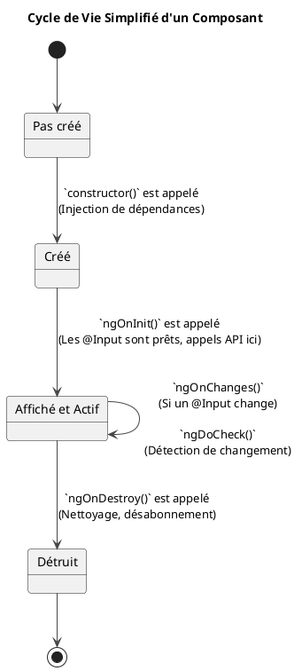

# Module 11 : L'essentiel - Sujets Complémentaires et Bonnes Pratiques

### Objectifs pédagogiques

À la fin de ce chapitre, vous serez capable de :

* **Comprendre** le cycle de vie d'un composant Angular et ses principaux "hooks" (points d'ancrage).
* **Utiliser** `ngOnInit` pour la logique d'initialisation et `ngOnDestroy` pour le nettoyage.
* **Lancer** un build de production avec la commande `ng build`.
* **Identifier** les principales optimisations effectuées par le build de production.
* **Appliquer** des bonnes pratiques générales pour écrire un code Angular propre et maintenable.

### Introduction : De l'atelier de développement à l'application livrée

Jusqu'à présent, nous avons construit toutes les pièces de notre application. Nous savons comment elles fonctionnent et
comment elles communiquent. Mais il nous reste deux questions fondamentales :

1. **Le cycle de vie :** Comment un composant "naît-il", "vit-il" et "meurt-il" ? Angular nous offre des "moments-clés"
   dans la vie d'un composant où nous pouvons brancher notre propre logique. Comprendre ce cycle est crucial pour une
   initialisation et un nettoyage corrects.
2. **La livraison :** Notre application qui tourne avec `ng serve` est une version de développement, pleine d'outils de
   débogage et non optimisée. Comment la transformer en un paquet de fichiers légers, rapides et prêts à être déployés
   sur un serveur web ?

Ce module finalise votre formation en vous donnant les clés pour gérer le cycle de vie de vos créations et pour les
emballer proprement afin de les livrer au monde.

### 1. Cycle de Vie d'un Composant

Chaque composant et directive Angular a un cycle de vie géré par le framework. Angular crée le composant, le rend, le
vérifie pour des changements, et le détruit. Vous pouvez vous "brancher" sur ces moments clés en implémentant des
interfaces spécifiques.

**Analogie Java :** Dans Spring, vous avez les annotations `@PostConstruct` et `@PreDestroy` pour exécuter du code à des
moments précis du cycle de vie d'un bean. Les "hooks" de cycle de vie d'Angular sont l'équivalent direct.

Les deux hooks les plus importants sont `ngOnInit` et `ngOnDestroy`.

#### `ngOnInit()` : Le Point d'Initialisation

* **Quand ?** Appelé **une seule fois** par Angular après que le composant a été créé et que ses `@Input()` ont été
  initialisés.
* **Pourquoi ?** C'est le meilleur endroit pour mettre votre logique d'initialisation complexe. En particulier, **c'est
  ici que l'on doit faire les appels API initiaux**, et non dans le `constructor`.
* **Pourquoi pas dans le `constructor` ?** Le `constructor` doit rester simple. Son rôle est l'injection de dépendances.
  Au moment où il s'exécute, les liaisons de données (comme les `@Input`) ne sont pas encore disponibles. `ngOnInit`
  garantit que tout est en place.

```typescript
import {Component, OnInit, Input} from '@angular/core';

@Component({ /* ... */})
export class UserProfileComponent implements OnInit { // 1. Implémenter l'interface
    @Input() userId!: number; // Reçoit l'ID de l'utilisateur
    public user: User | undefined;

    constructor(private userService: UserService) {
        // Mauvais endroit pour utiliser this.userId, il pourrait être encore undefined !
    }

    // 2. Implémenter la méthode
    ngOnInit(): void {
        // Bon endroit ! this.userId est garanti d'être défini ici.
        console.log(`Initialisation du profil pour l'utilisateur ${this.userId}`);
        this.userService.getUserById(this.userId).subscribe(user => {
            this.user = user;
        });
    }
}
```

#### `ngOnDestroy()` : Le Nettoyage

* **Quand ?** Appelé **juste avant** que le composant ne soit détruit et retiré du DOM (ex: quand on quitte la page).
* **Pourquoi ?** C'est l'endroit **crucial** pour faire le nettoyage et éviter les fuites de mémoire. La tâche la plus
  importante ici est de se **désabonner manuellement des Observables** auxquels on s'est abonné avec `.subscribe()` (si
  on n'utilise pas le pipe `async`).

```typescript
import {Component, OnInit, OnDestroy} from '@angular/core';
import {Subscription} from 'rxjs';

@Component({ /* ... */})
export class RealTimeDataComponent implements OnInit, OnDestroy {
    private dataSubscription: Subscription | undefined;

    constructor(private realTimeService: RealTimeService) {
    }

    ngOnInit(): void {
        // On s'abonne à un observable qui émet des valeurs en continu
        this.dataSubscription = this.realTimeService.getDataStream().subscribe(data => {
            console.log("Nouvelle donnée reçue:", data);
        });
    }

    ngOnDestroy(): void {
        // Si on ne fait pas ça, l'abonnement continue de vivre même si
        // le composant n'est plus affiché -> fuite de mémoire !
        console.log("Composant détruit. Désabonnement du flux de données.");
        if (this.dataSubscription) {
            this.dataSubscription.unsubscribe();
        }
    }
}
```



### 2. Le Build de Production

La commande `ng serve` est fantastique pour le développement, mais elle n'est pas faite pour la production. Pour
préparer votre application à être déployée, vous devez la "construire".

`ng build`

Cette commande lance un processus sophistiqué qui va transformer votre projet en un ensemble de fichiers statiques
optimisés dans un nouveau dossier `dist/nom-de-votre-app/`.

**Que fait `ng build` ?**

* **Compilation Ahead-of-Time (AOT) :** Le code de vos templates HTML est pré-compilé en JavaScript. C'est beaucoup plus
  rapide que de le faire dans le navigateur de l'utilisateur.
* **Bundling :** Regroupe vos nombreux fichiers JavaScript en quelques "bundles" (paquets). Moins de fichiers à
  télécharger pour le navigateur.
* **Minification :** Supprime les espaces, les commentaires et raccourcit les noms de variables pour rendre les fichiers
  les plus petits possible.
* **"Tree Shaking" (Secouage d'arbre) :** Analyse votre code et supprime les parties d'Angular ou des bibliothèques que
  vous n'utilisez pas.
* **Optimisation du CSS :** Regroupe et minimise également les fichiers CSS.

Le résultat est une application beaucoup plus petite et plus rapide, prête à être servie par n'importe quel serveur
web (Nginx, Apache, Tomcat...).

<tip>
Pour voir votre build de production en action localement, vous pouvez utiliser un simple serveur HTTP. Une fois le build terminé, exécutez ces commandes :
`cd dist/nom-de-votre-app`
`npx http-server -o`
Cela lancera un serveur web local et ouvrira votre application de production dans le navigateur.
</tip>

### 3. Autres Bonnes Pratiques

* **Structure de projet :** Organisez votre code par fonctionnalité (feature). Au lieu de dossiers `/components`,
  `/services`, `/pipes`, préférez des dossiers `/users`, `/products`, `/orders`, chacun contenant ses propres
  composants, services, etc. Cela rend l'application plus modulaire.
* **Modèles de données (`interface`) :** Définissez toujours des `interface` TypeScript pour la structure des données
  que vous manipulez (ex: `User`, `Product`). Ne travaillez jamais avec des `any`.
* **Le dossier `shared` :** Créez un dossier `src/app/shared` pour tout ce qui est réutilisable à travers
  l'application : les pipes personnalisés, les directives, les modèles de données, etc.
* **Variables d'environnement :** Pour des choses comme l'URL de votre API, ne la codez pas en dur. Utilisez les
  fichiers d'environnement (`src/environments/environment.ts`) qu'Angular fournit. `ng build` utilisera automatiquement
  le fichier de production.

### Exercice pratique

#### Exercice 1 : Nettoyer un abonnement

Reprenons notre `UserPostsComponent` du module 10, qui s'abonnait à un `Observable` pour récupérer des posts.

1. Modifiez le composant pour qu'il implémente `OnInit` et `OnDestroy`.
2. Stockez l'abonnement (`.subscribe()`) dans une propriété `private` de la classe (de type `Subscription`).
3. Dans `ngOnDestroy`, vérifiez que la souscription existe et appelez `.unsubscribe()` dessus.
4. Ajoutez des `console.log` dans `ngOnInit` et `ngOnDestroy` pour visualiser le cycle de vie.
5. Pour tester, créez un bouton dans `AppComponent` qui affiche ou cache le `UserPostsComponent` en utilisant `@if`.
   Observez la console lorsque vous affichez et masquez le composant.

#### Correction exercice 1 {collapsible='true'}

**`user-posts.component.ts` (modifié)**

```typescript
import {Component, OnInit, OnDestroy} from '@angular/core';
import {Subscription} from 'rxjs';
import {switchMap} from 'rxjs/operators';

// ... autres imports

@Component({ /* ... */})
export class UserPostsComponent implements OnInit, OnDestroy {
    public posts: Post[] = [];
    private postsSubscription: Subscription | undefined;

    constructor(
        private userService: UserService,
        private postService: PostService
    ) {
    }

    ngOnInit(): void {
        console.log("UserPostsComponent a été initialisé !");
        this.postsSubscription = this.userService.getFirstUser().pipe(
            // ...
        ).subscribe(posts => {
            this.posts = posts;
        });
    }

    ngOnDestroy(): void {
        console.log("UserPostsComponent va être détruit. Nettoyage...");
        if (this.postsSubscription) {
            this.postsSubscription.unsubscribe();
            console.log("Abonnement aux posts nettoyé !");
        }
    }
}
```

**`app.component.ts` (pour le test)**

```typescript

@Component({ /* ... */})
export class AppComponent {
    public showPosts = false;
}
```

**`app.component.html` (pour le test)**

```html

<button (click)="showPosts = !showPosts">
    Afficher/Cacher les posts de l'utilisateur
</button>

@if(showPosts) {
<app-user-posts></app-user-posts>
}
```

En cliquant sur le bouton, vous verrez les logs d'initialisation et de destruction apparaître dans la console, prouvant
que votre nettoyage fonctionne.

### Auto-évaluation

1. **(Question ouverte)** Pourquoi est-il considéré comme une mauvaise pratique de mettre la logique d'appel API dans le
   `constructor` d'un composant ? Où devrait-elle être placée ?
2. **(QCM)** Quel hook de cycle de vie est idéal pour se désabonner d'un Observable et éviter les fuites de mémoire ?
   a) `ngOnInit`
   b) `ngOnChanges`
   c) `ngOnDestroy`
   d) `ngAfterViewInit`
3. **(QCM)** Quelle est la commande pour créer une version optimisée de votre application pour le déploiement ?
   a) `ng serve --prod`
   b) `ng build`
   c) `ng deploy`
   d) `ng package`
4. **(Question ouverte)** Citez trois optimisations réalisées par la commande `ng build`.
5. **(QCM)** Si vous avez un composant `ButtonComponent` et une directive `HighlightDirective` qui sont utilisés dans de
   nombreuses parties de votre application, dans quel dossier serait-il le plus logique de les placer ?
   a) `src/app/core`
   b) `src/app/common`
   c) `src/app/shared`
   d) `src/app/utils`

### Conclusion de cette partie

Vous avez maintenant une vue d'ensemble complète du développement d'une application Angular, de sa conception à sa
livraison. Vous comprenez le **cycle de vie** de ses briques fondamentales, les composants, et vous savez interagir avec
aux moments clés pour une initialisation et un nettoyage propres.

Vous savez également comment transformer votre projet de développement en une **application de production optimisée**,
prête à être déployée et à servir des milliers d'utilisateurs de manière performante.

Ces connaissances, combinées à tout ce que vous avez appris précédemment, vous donnent les bases solides nécessaires
pour aborder des projets Angular professionnels avec confiance.