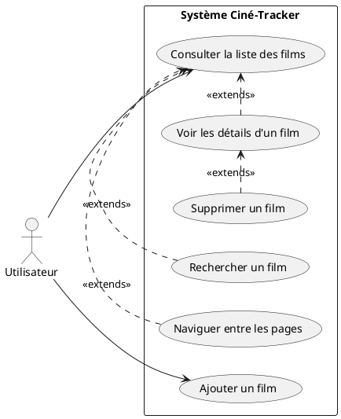
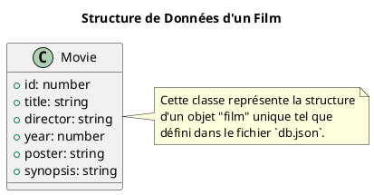

# Projet final

### 1. Description du projet

**Ciné-Tracker** est une application web monopage (SPA) développée avec Angular. Elle permet aux utilisateurs de gérer
leur collection de films. Les utilisateurs peuvent voir une liste paginée de leurs films, rechercher un film spécifique,
consulter les détails de chaque film, en ajouter de nouveaux et en supprimer.

Toutes les données des films sont gérées via un backend simulé avec `json-server`, et l'application Angular communique
avec ce backend en utilisant le module `HttpClient`.

**Stack technique :**

* **Frontend :** Angular, RxJS pour la recherche réactive.
* **Backend :** `json-server` (pour simuler une API RESTful).
* **Styling :** CSS simple.

---

### 2. Analyse fonctionnelle

#### La demande du client

"Je suis un cinéphile et j'ai une collection de films qui grandit. J'aimerais une petite application web privée pour
lister mes films. **Comme la liste devient longue, je voudrais que les films soient affichés par page**. J'aimerais
aussi **pouvoir rechercher un film rapidement**. Je veux pouvoir voir rapidement leurs affiches et leurs titres. En
cliquant sur un film, j'aimerais voir plus de détails comme le réalisateur, l'année de sortie et un petit synopsis. J'ai
aussi besoin de pouvoir ajouter de nouveaux films que j'achète et d'en supprimer si je m'en sépare. L'interface doit
être simple et claire."

#### Le diagramme de cas d'utilisation



---

### 3. Le backend (`db.json` pour json-server)

Voici un fichier `db.json` enrichi avec 45 films pour tester la pagination et la recherche.

**Comment l'utiliser :**

1. Installez `json-server` globalement : `npm install -g json-server`
2. Enregistrez le contenu ci-dessous dans un fichier nommé `db.json`.
3. Lancez le serveur : `json-server --watch db.json`
4. Votre API sera disponible sur `http://localhost:3000`.

#### Diagramme



#### Contenu json {collapsible="true"}
```json
{
  "movies": [
    {
      "id": 1,
      "title": "Inception",
      "director": "Christopher Nolan",
      "year": 2010,
      "poster": "https://m.media-amazon.com/images/I/912AErFSBHL._AC_SL1500_.jpg",
      "synopsis": "Un voleur qui s'approprie des secrets d'entreprise via une technologie de partage de rêves se voit offrir une tâche inverse : implanter une idée dans l'esprit d'un PDG."
    },
    {
      "id": 2,
      "title": "The Matrix",
      "director": "Lana & Lilly Wachowski",
      "year": 1999,
      "poster": "https://m.media-amazon.com/images/I/51EG732BV3L._AC_.jpg",
      "synopsis": "Un pirate informatique découvre que sa réalité est une simulation créée par une intelligence artificielle malveillante."
    },
    {
      "id": 3,
      "title": "Parasite",
      "director": "Bong Joon Ho",
      "year": 2019,
      "poster": "https://m.media-amazon.com/images/I/91S+nGNyWSL._AC_SL1500_.jpg",
      "synopsis": "L'avidité et la discrimination de classe menacent la relation symbiotique nouvellement formée entre la riche famille Park et le clan démuni des Kim."
    },
    {
      "id": 4,
      "title": "The Godfather",
      "director": "Francis Ford Coppola",
      "year": 1972,
      "poster": "https://m.media-amazon.com/images/I/714hR8j4JSL._AC_SL1000_.jpg",
      "synopsis": "Le patriarche vieillissant d'une dynastie de la pègre new-yorkaise passe le contrôle de son empire clandestin à son fils réticent."
    },
    {
      "id": 5,
      "title": "Pulp Fiction",
      "director": "Quentin Tarantino",
      "year": 1994,
      "poster": "https://m.media-amazon.com/images/I/81zxtgS0asL._AC_SL1500_.jpg",
      "synopsis": "Les vies de deux tueurs à gages, d'un boxeur, de la femme d'un gangster et d'un couple de braqueurs s'entremêlent dans quatre histoires de violence et de rédemption."
    },
    {
      "id": 6,
      "title": "The Dark Knight",
      "director": "Christopher Nolan",
      "year": 2008,
      "poster": "https://m.media-amazon.com/images/I/81AJdVO0oVL._AC_SL1500_.jpg",
      "synopsis": "Lorsque le Joker émerge de son passé mystérieux, il sème le chaos à Gotham. Batman doit accepter l'un des plus grands tests psychologiques et physiques pour combattre l'injustice."
    },
    {
      "id": 7,
      "title": "Forrest Gump",
      "director": "Robert Zemeckis",
      "year": 1994,
      "poster": "https://m.media-amazon.com/images/I/71wP22rJ64L._AC_SL1000_.jpg",
      "synopsis": "Les présidences de Kennedy et Johnson, le Vietnam, Watergate et d'autres événements historiques se déroulent à travers la perspective d'un homme de l'Alabama avec un QI de 75."
    },
    {
      "id": 8,
      "title": "Fight Club",
      "director": "David Fincher",
      "year": 1999,
      "poster": "https://m.media-amazon.com/images/I/81D+KJkO4SL._AC_SL1500_.jpg",
      "synopsis": "Un employé de bureau insomniaque et un vendeur de savon diabolique créent un club de combat clandestin qui évolue en quelque chose de beaucoup, beaucoup plus grand."
    },
    {
      "id": 9,
      "title": "Interstellar",
      "director": "Christopher Nolan",
      "year": 2014,
      "poster": "https://m.media-amazon.com/images/I/A1JVqNMI7UL._AC_SL1500_.jpg",
      "synopsis": "Une équipe d'explorateurs voyage à travers un trou de ver dans l'espace pour tenter d'assurer la survie de l'humanité."
    },
    {
      "id": 10,
      "title": "Le Seigneur des Anneaux : La Communauté de l'Anneau",
      "director": "Peter Jackson",
      "year": 2001,
      "poster": "https://m.media-amazon.com/images/I/813dE205P-L._AC_SL1417_.jpg",
      "synopsis": "Un humble Hobbit de la Comté et huit compagnons se lancent dans un voyage pour détruire le puissant Anneau Unique et sauver la Terre du Milieu du Seigneur des Ténèbres Sauron."
    },
    {
      "id": 11,
      "title": "Star Wars: Episode V - L'Empire contre-attaque",
      "director": "Irvin Kershner",
      "year": 1980,
      "poster": "https://m.media-amazon.com/images/I/81w4D423iEL._AC_SL1500_.jpg",
      "synopsis": "Après la défaite de l'Alliance Rebelle, Luke Skywalker suit une formation Jedi avec Maître Yoda, tandis que ses amis sont poursuivis par Dark Vador."
    },
    {
      "id": 12,
      "title": "Le Voyage de Chihiro",
      "director": "Hayao Miyazaki",
      "year": 2001,
      "poster": "https://m.media-amazon.com/images/I/81i8o1n2lHL._AC_SL1500_.jpg",
      "synopsis": "Au cours du déménagement de sa famille vers la banlieue, une fillette de 10 ans erre dans un monde gouverné par des dieux, des sorcières et des esprits."
    },
    {
      "id": 13,
      "title": "Gladiator",
      "director": "Ridley Scott",
      "year": 2000,
      "poster": "https://m.media-amazon.com/images/I/71L-8S9-9GL._AC_SL1000_.jpg",
      "synopsis": "Un ancien général romain cherche à se venger de l'empereur corrompu qui a assassiné sa famille et l'a envoyé en esclavage."
    },
    {
      "id": 14,
      "title": "Le Silence des Agneaux",
      "director": "Jonathan Demme",
      "year": 1991,
      "poster": "https://m.media-amazon.com/images/I/81SVDO6s6xL._AC_SL1500_.jpg",
      "synopsis": "Une jeune stagiaire du FBI doit se confier à un tueur manipulateur emprisonné pour recevoir son aide afin d'attraper un autre tueur en série."
    },
    {
      "id": 15,
      "title": "Se7en",
      "director": "David Fincher",
      "year": 1995,
      "poster": "https://m.media-amazon.com/images/I/81xG1T3J1SL._AC_SL1500_.jpg",
      "synopsis": "Deux détectives, un novice et un vétéran, traquent un tueur en série qui utilise les sept péchés capitaux comme motifs."
    },
    {
      "id": 16,
      "title": "La Ligne Verte",
      "director": "Frank Darabont",
      "year": 1999,
      "poster": "https://m.media-amazon.com/images/I/71Y9gM2GZ1L._AC_SL1000_.jpg",
      "synopsis": "La vie des gardiens du couloir de la mort est affectée par l'un de leurs détenus : un homme noir accusé de meurtre et de viol d'enfants, mais doté d'un don mystérieux."
    },
    {
      "id": 17,
      "title": "Il faut sauver le soldat Ryan",
      "director": "Steven Spielberg",
      "year": 1998,
      "poster": "https://m.media-amazon.com/images/I/8172jLMX13L._AC_SL1500_.jpg",
      "synopsis": "Après le débarquement en Normandie, un groupe de soldats américains part derrière les lignes ennemies pour récupérer un parachutiste dont les frères ont été tués au combat."
    },
    {
      "id": 18,
      "title": "Retour vers le futur",
      "director": "Robert Zemeckis",
      "year": 1985,
      "poster": "https://m.media-amazon.com/images/I/71pW+A6uSLL._AC_SL1500_.jpg",
      "synopsis": "Marty McFly, un lycéen de 17 ans, est accidentellement envoyé trente ans dans le passé dans une DeLorean, une voiture qui voyage dans le temps."
    },
    {
      "id": 19,
      "title": "Le Roi Lion",
      "director": "Roger Allers, Rob Minkoff",
      "year": 1994,
      "poster": "https://m.media-amazon.com/images/I/81C65S0Fp6L._AC_SL1500_.jpg",
      "synopsis": "Le prince lionceau Simba est chassé de sa fierté par son oncle cruel, qui prétend qu'il a causé la mort de son père."
    },
    {
      "id": 20,
      "title": "Blade Runner 2049",
      "director": "Denis Villeneuve",
      "year": 2017,
      "poster": "https://m.media-amazon.com/images/I/81yA7i4iLpL._AC_SL1500_.jpg",
      "synopsis": "Le jeune Blade Runner K découvre un secret enfoui depuis longtemps qui le mène à la recherche de l'ancien Blade Runner Rick Deckard, porté disparu depuis 30 ans."
    },
    {
      "id": 21,
      "title": "Joker",
      "director": "Todd Phillips",
      "year": 2019,
      "poster": "https://m.media-amazon.com/images/I/71Hhd2G4LSL._AC_SL1500_.jpg",
      "synopsis": "À Gotham City, le comédien mentalement troublé Arthur Fleck est ignoré et maltraité par la société. Il se lance alors dans une spirale descendante de révolution et de crime sanglant."
    },
    {
      "id": 22,
      "title": "Whiplash",
      "director": "Damien Chazelle",
      "year": 2014,
      "poster": "https://m.media-amazon.com/images/I/81m6m2p2SML._AC_SL1500_.jpg",
      "synopsis": "Un jeune batteur de jazz prometteur s'inscrit dans un conservatoire de musique où ses rêves de grandeur sont mis à l'épreuve par un instructeur féroce."
    },
    {
      "id": 23,
      "title": "The Prestige",
      "director": "Christopher Nolan",
      "year": 2006,
      "poster": "https://m.media-amazon.com/images/I/81rF2-S3sOL._AC_SL1500_.jpg",
      "synopsis": "Après un tragique accident, deux magiciens de la scène des années 1890 s'engagent dans une bataille pour créer l'illusion ultime tout en sacrifiant tout ce qu'ils ont."
    },
    {
      "id": 24,
      "title": "Django Unchained",
      "director": "Quentin Tarantino",
      "year": 2012,
      "poster": "https://m.media-amazon.com/images/I/71c8sB+gWFL._AC_SL1500_.jpg",
      "synopsis": "Avec l'aide d'un chasseur de primes allemand, un esclave libéré entreprend de sauver sa femme d'un propriétaire de plantation brutal au Mississippi."
    },
    {
      "id": 25,
      "title": "Mad Max: Fury Road",
      "director": "George Miller",
      "year": 2015,
      "poster": "https://m.media-amazon.com/images/I/81nC2GgI+ML._AC_SL1500_.jpg",
      "synopsis": "Dans un désert post-apocalyptique, une femme se rebelle contre un dirigeant tyrannique à la recherche de sa patrie avec l'aide d'un groupe de prisonnières et d'un vagabond."
    },
    {
      "id": 26,
      "title": "Coco",
      "director": "Lee Unkrich, Adrian Molina",
      "year": 2017,
      "poster": "https://m.media-amazon.com/images/I/81s9sV2C-OL._AC_SL1500_.jpg",
      "synopsis": "Le jeune musicien en herbe Miguel, confronté à l'interdiction ancestrale de la musique par sa famille, entre dans le Pays des Morts pour trouver son arrière-arrière-grand-père."
    },
    {
      "id": 27,
      "title": "Jurassic Park",
      "director": "Steven Spielberg",
      "year": 1993,
      "poster": "https://m.media-amazon.com/images/I/81ryxG-r6hL._AC_SL1500_.jpg",
      "synopsis": "Un paléontologue pragmatique visitant un parc à thème presque complet est chargé de protéger quelques enfants après une panne de courant qui a permis aux dinosaures clonés de se déchaîner."
    },
    {
      "id": 28,
      "title": "Le Loup de Wall Street",
      "director": "Martin Scorsese",
      "year": 2013,
      "poster": "https://m.media-amazon.com/images/I/8106a2v3aOL._AC_SL1500_.jpg",
      "synopsis": "Basé sur l'histoire vraie de Jordan Belfort, de son ascension à un riche courtier en bourse vivant la grande vie à sa chute impliquant le crime, la corruption et le gouvernement fédéral."
    },
    {
      "id": 29,
      "title": "WALL·E",
      "director": "Andrew Stanton",
      "year": 2008,
      "poster": "https://m.media-amazon.com/images/I/81XUylG1wsL._AC_SL1500_.jpg",
      "synopsis": "Dans un avenir lointain, un petit robot collecteur de déchets se lance par inadvertance dans un voyage spatial qui décidera du sort de l'humanité."
    },
    {
      "id": 30,
      "title": "Toy Story",
      "director": "John Lasseter",
      "year": 1995,
      "poster": "https://m.media-amazon.com/images/I/81p9PUIso-L._AC_SL1500_.jpg",
      "synopsis": "Un cow-boy jouet se sent profondément menacé et jaloux lorsqu'une nouvelle figurine d'astronaute le supplante en tant que jouet préféré dans la chambre d'un garçon."
    },
    {
      "id": 31,
      "title": "No Country for Old Men",
      "director": "Joel Coen, Ethan Coen",
      "year": 2007,
      "poster": "https://m.media-amazon.com/images/I/81a+xhDoh+L._AC_SL1500_.jpg",
      "synopsis": "La violence et le chaos s'ensuivent après qu'un chasseur tombe sur des trafiquants de drogue morts et plus de deux millions de dollars en espèces près du Rio Grande."
    },
    {
      "id": 32,
      "title": "Citizen Kane",
      "director": "Orson Welles",
      "year": 1941,
      "poster": "https://m.media-amazon.com/images/I/71Y8w4y-i-L._AC_SL1000_.jpg",
      "synopsis": "Après le décès du magnat de l'édition Charles Foster Kane, un groupe de journalistes tente de déchiffrer la signification de son dernier mot : 'Rosebud'."
    },
    {
      "id": 33,
      "title": "Shining",
      "director": "Stanley Kubrick",
      "year": 1980,
      "poster": "https://m.media-amazon.com/images/I/81kAl4m6yQL._AC_SL1500_.jpg",
      "synopsis": "Une famille se dirige vers un hôtel isolé pour l'hiver où une présence sinistre influence le père vers la violence, tandis que son fils psychique a des prémonitions."
    },
    {
      "id": 34,
      "title": "Apocalypse Now",
      "director": "Francis Ford Coppola",
      "year": 1979,
      "poster": "https://m.media-amazon.com/images/I/81GZajWAIjL._AC_SL1500_.jpg",
      "synopsis": "Un capitaine de l'armée américaine servant au Vietnam est chargé de retrouver et d'assassiner un colonel des forces spéciales renégat qui s'est proclamé dieu."
    },
    {
      "id": 35,
      "title": "Alien",
      "director": "Ridley Scott",
      "year": 1979,
      "poster": "https://m.media-amazon.com/images/I/81aA7hI+TOL._AC_SL1500_.jpg",
      "synopsis": "L'équipage d'un vaisseau spatial commercial rencontre une forme de vie mortelle après avoir enquêté sur une transmission inconnue."
    },
    {
      "id": 36,
      "title": "2001: L'Odyssée de l'espace",
      "director": "Stanley Kubrick",
      "year": 1968,
      "poster": "https://m.media-amazon.com/images/I/81S2W911DGL._AC_SL1500_.jpg",
      "synopsis": "Après avoir découvert un mystérieux artefact enfoui sous la surface lunaire, l'humanité se lance dans une quête pour le retrouver avec l'aide de l'ordinateur intelligent H.A.L. 9000."
    },
    {
      "id": 37,
      "title": "Blade Runner",
      "director": "Ridley Scott",
      "year": 1982,
      "poster": "https://m.media-amazon.com/images/I/81vTHL+zRPL._AC_SL1500_.jpg",
      "synopsis": "Un Blade Runner doit poursuivre et terminer quatre réplicants qui ont volé un vaisseau dans l'espace et sont revenus sur Terre pour trouver leur créateur."
    },
    {
      "id": 38,
      "title": "Inglourious Basterds",
      "director": "Quentin Tarantino",
      "year": 2009,
      "poster": "https://m.media-amazon.com/images/I/81s+b3n3V9L._AC_SL1500_.jpg",
      "synopsis": "Dans la France occupée par les nazis pendant la Seconde Guerre mondiale, un plan visant à assassiner les dirigeants nazis par un groupe de soldats juifs américains coïncide avec les plans vengeurs d'une propriétaire de cinéma."
    },
    {
      "id": 39,
      "title": "Goodfellas",
      "director": "Martin Scorsese",
      "year": 1990,
      "poster": "https://m.media-amazon.com/images/I/71R4gYmD2CL._AC_SL1000_.jpg",
      "synopsis": "L'histoire de Henry Hill et de sa vie dans la mafia, couvrant sa relation avec sa femme Karen Hill et ses partenaires mafieux Jimmy Conway et Tommy DeVito."
    },
    {
      "id": 40,
      "title": "The Thing",
      "director": "John Carpenter",
      "year": 1982,
      "poster": "https://m.media-amazon.com/images/I/81y4w5K3LPL._AC_SL1500_.jpg",
      "synopsis": "Une équipe de recherche en Antarctique est traquée par un extraterrestre qui change de forme et prend l'apparence de ses victimes."
    },
    {
      "id": 41,
      "title": "Les Dents de la mer",
      "director": "Steven Spielberg",
      "year": 1975,
      "poster": "https://m.media-amazon.com/images/I/81Wp6+2pCBL._AC_SL1500_.jpg",
      "synopsis": "Lorsqu'un grand requin blanc mangeur d'hommes commence à s'attaquer à la communauté balnéaire d'Amity Island, un chef de la police, un biologiste marin et un chasseur de requins se lancent à sa poursuite."
    },
    {
      "id": 42,
      "title": "Taxi Driver",
      "director": "Martin Scorsese",
      "year": 1976,
      "poster": "https://m.media-amazon.com/images/I/81vTp-fl+2L._AC_SL1500_.jpg",
      "synopsis": "Un vétéran du Vietnam mentalement instable travaille comme chauffeur de taxi de nuit à New York, où la décadence et la corruption perçues alimentent son besoin urgent d'action violente."
    },
    {
      "id": 43,
      "title": "Eternal Sunshine of the Spotless Mind",
      "director": "Michel Gondry",
      "year": 2004,
      "poster": "https://m.media-amazon.com/images/I/81kF9iF+yHL._AC_SL1500_.jpg",
      "synopsis": "Lorsqu'ils apprennent que leurs ex ont subi une procédure pour les effacer de leur mémoire, un couple décide de faire de même, mais redécouvre ce qu'ils avaient commencé à perdre."
    },
    {
      "id": 44,
      "title": "Scarface",
      "director": "Brian De Palma",
      "year": 1983,
      "poster": "https://m.media-amazon.com/images/I/81Vd0gX1aLL._AC_SL1500_.jpg",
      "synopsis": "En 1980 à Miami, un réfugié cubain déterminé prend le contrôle d'un cartel de la drogue et succombe à la cupidité."
    },
    {
      "id": 45,
      "title": "Amélie Poulain",
      "director": "Jean-Pierre Jeunet",
      "year": 2001,
      "poster": "https://m.media-amazon.com/images/I/81fCpr2u3-L._AC_SL1500_.jpg",
      "synopsis": "Amélie est une serveuse innocente et naïve à Paris avec son propre sens de la justice. Elle décide d'aider ceux qui l'entourent et, en cours de route, découvre l'amour."
    }
  ]
}
```

---

### 4. User stories

#### US #1 : Affichage de la liste des films

* **Texte :** En tant qu'utilisateur, je veux voir une première page de mes films sur la page d'accueil afin d'avoir une
  vue d'ensemble de ma collection sans être submergé.
* **Critères d'acceptance :**
    * Quand j'arrive sur l'application, la page principale affiche une grille contenant un nombre limité de films (ex:12
      par page).
    * Pour chaque film dans la grille, je vois son affiche et son titre.
* **Tâches techniques :**
    * Créer un `MovieService` avec une méthode `getMovies(page: number, limit: number)` qui fait un appel GET à
      `http://localhost:3000/movies?_page={page}&_limit={limit}`.
    * `json-server` retourne le nombre total d'éléments dans le header `X-Total-Count`. Le service doit récupérer ce
      header pour connaître le nombre total de pages.
    * Créer un composant `MovieListComponent`.
    * Dans `MovieListComponent`, appeler `getMovies()` dans le `ngOnInit` avec la page 1.
    * Dans le template, utiliser `*ngFor` pour afficher la liste paginée de films.

#### US #2 : Consultation des détails d'un film

* **Texte :** En tant qu'utilisateur, je veux pouvoir cliquer sur un film de la liste pour voir sa page de détails, afin
  de connaître son synopsis, son réalisateur et son année de sortie.
* **Critères d'acceptance :**
    * Quand je clique sur une carte de film, je suis redirigé vers une nouvelle page.
    * L'URL doit contenir l'ID du film (ex: `/movies/1`).
    * La page de détail affiche l'affiche, le titre, l'année, le réalisateur et le synopsis.
    * Un bouton "Retour à la liste" est présent.
* **Tâches techniques :**
    * Configurer le module de routing avec une route `movies/:id` pointant vers un `MovieDetailComponent`.
    * Dans `MovieService`, ajouter une méthode `getMovieById(id: number)`.
    * Dans `MovieDetailComponent`, récupérer l'ID depuis l'URL (`ActivatedRoute`), appeler le service et afficher les
      détails.
    * Modifier `MovieListComponent` pour que chaque carte soit un lien `routerLink`.

#### US #3 : Ajout d'un nouveau film

* **Texte :** En tant qu'utilisateur, je veux pouvoir ajouter un nouveau film à ma collection via un formulaire, afin de
  garder ma liste à jour.
* **Critères d'acceptance :**
    * Un bouton "Ajouter un film" est visible sur la page d'accueil.
    * Le clic sur ce bouton mène à une page avec un formulaire.
    * Après soumission, le nouveau film est ajouté et l'utilisateur est redirigé vers la page d'accueil.
* **Tâches techniques :**
    * Créer un `MovieAddComponent` avec un `ReactiveForm`.
    * Ajouter une route `/movies/add`.
    * Dans `MovieService`, ajouter une méthode `addMovie(movie: Movie)` qui fait un appel `POST`.
    * Lier le formulaire au service et utiliser le `Router` pour la redirection.

#### US #4 : Suppression d'un film

* **Texte :** En tant qu'utilisateur, je veux pouvoir supprimer un film depuis sa page de détail.
* **Critères d'acceptance :**
    * Sur la page de détail d'un film, un bouton "Supprimer" est présent.
    * Une boîte de dialogue de confirmation apparaît au clic.
    * Si je confirme, le film est supprimé et je suis redirigé vers la page d'accueil.
* **Tâches techniques :**
    * Dans `MovieService`, ajouter une méthode `deleteMovie(id: number)` qui fait un appel `DELETE`.
    * Dans `MovieDetailComponent`, ajouter un bouton qui appelle cette méthode après une confirmation (
      `window.confirm()`) et gère la redirection.

#### US #5 : Recherche d'un film

* **Texte :** En tant qu'utilisateur, je veux pouvoir rechercher un film par son titre afin de le trouver rapidement
  dans ma grande collection.
* **Critères d'acceptance :**
    * Un champ de recherche est présent sur la page de la liste des films.
    * Pendant que je saisis du texte, la liste des films se met à jour pour n'afficher que les résultats correspondants.
    * La recherche se déclenche après un court délai (ex: 300ms) pour ne pas surcharger le serveur.
    * Si je vide le champ de recherche, la liste paginée initiale réapparaît.
* **Tâches techniques :**
    * Dans `MovieService`, modifier la méthode `getMovies` pour accepter un terme de recherche optionnel. L'appel HTTP
      devient : `http://localhost:3000/movies?q={searchTerm}&_page=1&_limit={limit}`. La recherche doit réinitialiser la
      pagination à la première page.
    * Dans `MovieListComponent`, ajouter un `FormControl` pour le champ de recherche.
    * S'abonner à `valueChanges` de ce `FormControl`.
    * Utiliser les opérateurs RxJS `debounceTime(300)` et `distinctUntilChanged()` sur l'observable `valueChanges` avant
      d'appeler le service.

#### US #6 : Navigation entre les pages

* **Texte :** En tant qu'utilisateur, je veux pouvoir naviguer entre les différentes pages de ma liste de films afin de
  pouvoir consulter l'intégralité de ma collection.
* **Critères d'acceptance :**
    * Des boutons "Précédent" et "Suivant" sont affichés sous la liste des films.
    * Le bouton "Précédent" est désactivé si je suis sur la première page.
    * Le bouton "Suivant" est désactivé si je suis sur la dernière page.
    * Cliquer sur ces boutons charge la page correspondante de films.
* **Tâches techniques :**
    * Dans `MovieListComponent`, stocker le numéro de la page actuelle et le nombre total de films (obtenu via le header
      `X-Total-Count`).
    * Créer des méthodes `nextPage()` et `previousPage()` qui incrémentent/décrémentent le numéro de page et rappellent
      `movieService.getMovies()`.
    * Dans le template, lier l'attribut `[disabled]` des boutons aux conditions (page actuelle === 1 pour "Précédent",
      et page actuelle >= totalPages pour "Suivant").